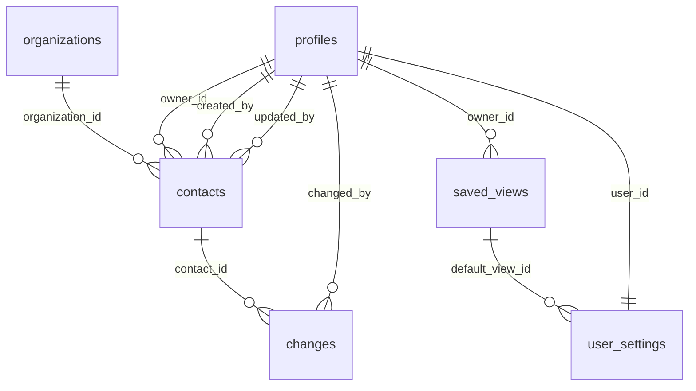

# Datenmodell Versorgungs-Kompass

Stand: abgeleitet aus `supabase/schema.sql` und `data/data-service.js`.

## Ueberblick

Der produktive Datenbestand liegt in Supabase im Schema `public`. Die App nutzt aktuell diese Tabellen:

- `profiles`
- `contacts`
- `organizations`
- `changes`
- `saved_views`
- `user_settings`

Nicht im aktuellen Schema vorhanden sind eigene Tabellen fuer `imports`, `activities`, `topics` oder `contact_topics`. Importereignisse werden im Aenderungsverlauf protokolliert, Themen liegen direkt als Array im Kontakt.

## Beziehungen

## Tabelle `profiles`

Zweck:

- Nutzerprofile fuer angemeldete Supabase-Auth-Nutzer.
- Rollensteuerung fuer Admin, Editor und Viewer.
- Owner-Auswahl in Kontakten.

Wichtigste Felder:

| Feld | Bedeutung |
| --- | --- |
| `id` | UUID, entspricht `auth.users.id`, Primaerschluessel. |
| `email` | Login-/Kontaktadresse. |
| `display_name` | Anzeigename in App und Owner-Auswahl. |
| `initials` | Kurzlabel/Avatar. |
| `role` | `admin`, `editor` oder `viewer`. |
| `avatar_url` | Oeffentliche URL zum Profilfoto im Storage-Bucket `profile-images`. |
| `team` | Optionaler Team-/Bereichshinweis fuer das Nutzerprofil. |
| `bio` | Optionale Kurzbeschreibung im Nutzerprofil. |
| `active` | Nur aktive Profile werden in der App geladen. |
| `created_at`, `updated_at` | Zeitstempel. |

UI-Nutzung:

- Login-/Profilanzeige.
- Rollenhinweise.
- Owner-Auswahl in Kontaktformularen.
- Anzeige im Aenderungsverlauf.
- Profilfoto in Sidebar, Nutzerbereich und Owner-Badges.

Kritische Felder:

- `role`, weil sie Schreibrechte steuert.
- `active`, weil inaktive Nutzer nicht als aktive Profile erscheinen.
- `display_name` und `email`, weil sie Owner-Zuordnung und Nachvollziehbarkeit beeinflussen.

Automatisch gesetzt:

- Neues Profil wird durch Trigger `handle_new_user()` nach erstem Auth-Login angelegt.
- `created_at` und `updated_at` haben Defaults.

Duerfen Nutzer bearbeiten:

- Nutzer duerfen das eigene Profil fuer `display_name`, `initials`, `avatar_url`, `team` und `bio` aktualisieren.
- `email`, `role` und `active` sind nicht durch die Profil-UI editierbar.
- Admins pflegen Rollen weiterhin ausserhalb der Profilseite in Supabase.

## Tabelle `contacts`

Zweck:

- Zentrale Tabelle fuer Versorgungskontakte.
- Grundlage fuer Liste, Detailprofil, Suche, Filter, Karte, Auswertung, Datenqualitaet und Archiv.

Wichtigste Felder:

| Feld | Bedeutung |
| --- | --- |
| `id` | Text-ID, Primaerschluessel, bleibt ueber Imports stabil. |
| `name` | Kontaktname, Pflichtfeld. |
| `organization_id` | Optionaler Verweis auf `organizations.id`. MVP-Verknuepfung Kontakt zu Organisation. |
| `organization` | Organisation/Einrichtung als bestehender Freitext-Fallback. Bleibt erhalten. |
| `sector` | Kategorie/Sektor, im UI als `category`. |
| `specialty` | Fachrichtung. |
| `priority` | `Hoch`, `Mittel`, `Niedrig`; Default `Mittel`. |
| `owner_id` | Verweis auf `profiles.id`. |
| `postal_code`, `city`, `federal_state` | Standortdaten. |
| `latitude`, `longitude` | Koordinaten fuer Kartenansicht. |
| `email`, `phone`, `linkedin` | Kontaktdaten. |
| `topics` | Themen als Textarray. |
| `notes` | Notizen. |
| `source` | Quellen/Importhinweise als Text. |
| `image_url` | Bildpfad oder URL. |
| `image_source_url` | Optional dokumentierte URL der Bildquelle. |
| `image_source_label` | Menschlich lesbare Bildquellenbezeichnung. |
| `image_rights_note` | Kurzer Hinweis zur geprueften Quelle/Nutzung; keine Rechtsbewertung. |
| `image_updated_at` | Zeitpunkt der letzten Bild-/Bildquellenpflege. |
| `image_updated_by` | Profil, das Bild-/Bildquellenfelder zuletzt gepflegt hat. |
| `status` | `active` oder `archived`. |
| `created_by`, `updated_by` | Verweise auf bearbeitende Profile. |
| `created_at`, `updated_at` | Zeitstempel. |

UI-Nutzung:

- Kontaktliste, Suche und Filter.
- Detailprofil und Bearbeitungsformular.
- Kontaktbild und Abschnitt `Bild & Quelle`; ohne Bild zeigt die UI Initialen.
- Klickbare Organisation im Kontaktprofil, sofern `organization_id` oder passender Freitext vorhanden ist.
- Kartenansicht ueber Koordinaten.
- Auswertung und Datenqualitaets-Ansicht.
- Archivansicht fuer Admins.
- CSV-Export der sichtbaren/geladenen Kontakte.

Kritische Felder:

- `id`: darf nicht versehentlich veraendert werden.
- `name`: Pflichtfeld und zentrale Suche.
- `status`: steuert Archiv/aktive Sichtbarkeit.
- `owner_id`: fachliche Verantwortung und Filter.
- `organization_id`: neue CRM-Beziehung zur Organisation; Freitext bleibt Fallback.
- `latitude`/`longitude`: Karte.
- `priority`, `sector`, `specialty`, `federal_state`: Filter und Auswertung.
- `image_url` und Bildquellenfelder: rein manuelle Dokumentation, keine automatische Bilduebernahme.

Automatisch gesetzt:

- `created_at` per Default.
- `updated_at` per Trigger `contacts_touch_updated_at`.
- `created_by` und `updated_by` werden vom Data-Service beim Erstellen gesetzt.
- `updated_by` wird beim Speichern gesetzt.

Duerfen Nutzer bearbeiten:

- Editor/Admin: aktive Kontakte.
- Admin: Archivieren und Wiederherstellen.
- Viewer: keine Bearbeitung.

## Tabelle `organizations`

Zweck:

- Eigene CRM-Entitaet fuer Einrichtungen, Institutionen und Unternehmen hinter Versorgungskontakten.
- Grundlage fuer den Hauptbereich "Organisationen", Organisationsliste und Organisationsprofil.
- Sichtbar machen, dass mehrere Personen einer Organisation zugeordnet sein koennen.

Wichtigste Felder:

| Feld | Bedeutung |
| --- | --- |
| `id` | UUID, Primaerschluessel. |
| `name` | Organisationsname, Pflichtfeld. |
| `normalized_name` | Normalisierter Vergleichswert fuer Suche, Migration und spaetere Dublettenpruefung. |
| `sector` | Sektor, z. B. Praxis, Krankenhaus, Apotheke, Pflege, Krankenkasse. |
| `organization_type` | Optionaler Organisationstyp, z. B. Universitaetsklinikum oder Pflegeeinrichtung. |
| `postal_code`, `city`, `federal_state` | Standortdaten. |
| `latitude`, `longitude` | Optionale Koordinaten fuer spaetere Kartenintegration. |
| `website`, `phone`, `email` | Kontaktwege der Organisation. |
| `notes` | Organisationsnotiz. |
| `source` | Quelle des Organisationsdatensatzes. |
| `status` | `active` oder `archived`. |
| `created_by`, `updated_by` | Bearbeitende Profile. |
| `created_at`, `updated_at` | Zeitstempel. |

UI-Nutzung:

- Neuer Sidebar-Tab "Organisationen".
- Organisationsliste mit Suche, Sektor-/Bundeslandfilter, Standort, Kontaktanzahl und Aktualisierung.
- Organisationsprofil mit Stammdaten, Themen aus zugeordneten Kontakten, Notizen und Abschnitt "Zugeordnete Kontakte".
- Vom Organisationsprofil aus koennen Kontakte geoeffnet, zugeordnet oder neu fuer diese Organisation angelegt werden.

Migrationslogik:

- Migration `supabase/migrations/20260516_create_organizations.sql` legt `organizations` an und ergaenzt `contacts.organization_id`.
- Bestehende eindeutige `contacts.organization`-Freitextwerte werden getrimmt, mit zusammengefassten Leerzeichen normalisiert und als erste Organisationen angelegt.
- Unsichere Dubletten wie "UKB" und "Universitaetsklinikum Bonn" werden nicht automatisch zusammengefuehrt.
- Danach werden Kontakte per normalisiertem Freitext auf die neue Organisation verlinkt.

Duerfen Nutzer bearbeiten:

- Viewer: lesen.
- Editor/Admin: Organisationen anlegen und bearbeiten, Kontakte zuordnen.
- Admin: spaeter archivieren/zusammenfuehren; vollstaendige Dublettenpflege ist nicht Teil von Sprint 4.

## Tabelle `changes`

Zweck:

- Aenderungsverlauf je Kontakt.
- Nachvollziehbarkeit von Erstellen, Bearbeiten, Archivieren und Importen.

Wichtigste Felder:

| Feld | Bedeutung |
| --- | --- |
| `id` | Fortlaufende ID. |
| `contact_id` | Verweis auf `contacts.id`. |
| `action` | `create`, `update`, `archive` oder `import`. |
| `field_name` | Geaendertes Feld, falls feldbezogen. |
| `old_value` | Alter Wert als Text. |
| `new_value` | Neuer Wert als Text. |
| `changed_at` | Zeitpunkt der Aenderung. |
| `changed_by` | Verweis auf `profiles.id`. |

UI-Nutzung:

- Aenderungsverlauf im Kontakt-Detailprofil.
- Importereignisse werden als Historieneintraege sichtbar.
- Recovery einzelner falscher Bearbeitungen.

Kritische Felder:

- `contact_id`, `action`, `field_name`, `old_value`, `new_value`, `changed_by`.
- Ohne sauberen Verlauf ist Recovery deutlich schwieriger.

Automatisch gesetzt:

- `id` als Identity.
- `changed_at` per Default.
- App/Skripte schreiben Logeintraege nach Create, Update, Archive und Import.

Duerfen Nutzer bearbeiten:

- Die App fuegt Eintraege fuer Editor/Admin hinzu.
- Eintraege sollten nicht manuell geaendert oder geloescht werden.

## Tabelle `saved_views`

Zweck:

- Gespeicherte Ansichten/Sichten fuer Kontakte, Organisationen, Karte und Auswertung.
- Private Sichten und Team-Sichten.

Wichtigste Felder:

| Feld | Bedeutung |
| --- | --- |
| `id` | UUID, Primaerschluessel. |
| `owner_id` | Besitzerprofil. |
| `name`, `description` | Name und Beschreibung. |
| `scope` | `private` oder `team`. |
| `view_type` | `contacts`, `organizations`, `map` oder `analytics`. |
| `filters` | Filter als JSON. |
| `search_query` | Suchtext. |
| `sort_key`, `sort_direction` | Sortierung. |
| `page_size` | Tabellenlaenge. |
| `is_default` | Standardsicht. |
| `created_at`, `updated_at` | Zeitstempel. |

UI-Nutzung:

- Gespeicherte Ansichten werden ausserhalb des Filterpanels gefuehrt, z. B. im kompakten Ansichts-Dropdown `Ansicht: Alle Kontakte` oder im Einstellungsbereich.
- Eine gespeicherte Ansicht kann Suche, Filter, Sortierung, Seitengroesse und spaeter sichtbare Spalten enthalten.
- Das Filterpanel setzt nur aktuelle Filter; es verwaltet keine gespeicherten Ansichten.

Kritische Felder:

- `scope`: Team-Sichten sind fuer alle sichtbar.
- `filters`: bestimmt die fachliche Sicht.
- `owner_id`: steuert private Sichtbarkeit.

Automatisch gesetzt:

- `id`, `created_at`, `updated_at`.
- `updated_at` per Trigger.

Duerfen Nutzer bearbeiten:

- Nutzer koennen eigene Sichten verwalten.
- Admins koennen Team-Sichten verwalten.

## Tabelle `user_settings`

Zweck:

- Persoenliche Einstellungen pro Nutzer.

Wichtigste Felder:

| Feld | Bedeutung |
| --- | --- |
| `user_id` | Verweis auf `profiles.id`, Primaerschluessel. |
| `default_view_id` | Optionale Standardsicht. |
| `default_view_type` | `contacts`, `organizations`, `map` oder `analytics`. |
| `table_density` | `compact`, `comfortable`, `spacious`. |
| `theme` | `system`, `light`, `contrast`. |
| `font_scale` | Schriftgroesse zwischen 0.9 und 1.2. |
| `page_size` | Standard-Tabellenlaenge. |
| `preferences` | Weitere Einstellungen als JSON. |
| `created_at`, `updated_at` | Zeitstempel. |

UI-Nutzung:

- Tabellen- und Ansichtseinstellungen.
- Default-Sicht.
- Sprint 8 nutzt `preferences.defaultContactTab` und `preferences.notificationsEnabled` als einfache Vorbereitung.

Kritische Felder:

- `user_id`: Nutzer darf nur eigene Einstellungen lesen/schreiben.
- `default_view_id`: kann auf geloeschte/veraenderte Sichten zeigen, wird bei geloeschter Sicht auf `null` gesetzt.

Hinweis:

- `default_view_type` erlaubt `contacts`, `organizations`, `map` und `analytics`.
- `table_density = compact` reduziert die Tabellenhoehe.
- Benachrichtigungen sind nur als boolean `notificationsEnabled` vorbereitet; es gibt noch kein Notification-Center, keinen E-Mail-Versand und keine Push-Logik.

Automatisch gesetzt:

- `created_at`, `updated_at`.
- `updated_at` per Trigger.

Duerfen Nutzer bearbeiten:

- Jeder angemeldete Nutzer nur die eigenen Einstellungen.

## Views und Funktionen

| Objekt | Zweck |
| --- | --- |
| `public.current_profile_role()` | Liefert Rolle des aktuell angemeldeten aktiven Profils fuer RLS-Policies. |
| `public.touch_updated_at()` | Aktualisiert `updated_at` bei Updates. |
| `public.handle_new_user()` | Legt nach Supabase-Auth-Registrierung ein Profil an. |

## Storage `profile-images`

Zweck:

- Ablage von Profilbildern fuer angemeldete Nutzer.
- Dateipfad: `<auth.uid()>/avatar.<jpg|png|webp>`.
- Erlaubte Typen: `image/jpeg`, `image/png`, `image/webp`.
- Groessenlimit: 5 MB.

RLS/Policy-Hinweise:

- Authentifizierte Nutzer duerfen nur im eigenen Ordner hochladen, ersetzen und loeschen.
- Die aktuelle Umsetzung nutzt oeffentliche Bild-URLs, damit Avatare in der statischen App ohne signierte URL-Erneuerung stabil angezeigt werden.
- Risiko: Wer die URL kennt, kann das Profilbild abrufen. Keine sensiblen oder vertraulichen Fotos verwenden, solange kein privater Bucket mit signierten URLs umgesetzt ist.

## RLS- und Rechtehinweise

- RLS ist fuer alle genannten Tabellen aktiv.
- `authenticated` hat technische Grants, konkrete Aktionen werden durch Policies eingeschraenkt.
- Viewer duerfen nicht schreiben.
- Editor/Admin duerfen aktive Kontakte erstellen und bearbeiten.
- Admins duerfen archivieren/wiederherstellen und Profile verwalten.
- Service-Role darf fuer lokale Admin-Skripte alles, darf aber nie ins Frontend.

## Kontaktanlage Sprint E

Die Kontaktanlage verwendet weiterhin `contacts`; es gibt keine neue Datenquelle und kein neues Bulk-Datenmodell.

- Einzelkontakt und Online-Tabelle schreiben ueber `window.dataService.createContact()` nach Supabase.
- Pflichtfeld in der UI ist `name`.
- Defaults: `priority = Mittel`, `status = active`, `owner_id` wird gesetzt, wenn ein Profil ausgewaehlt ist; sonst bleibt Owner leer.
- Online-Tabelle validiert je Zeile: fehlender Name, ungueltige E-Mail, grob ungueltige Telefonnummer und unbekannter Sektor sind Fehler.
- Online-Tabelle warnt bei fehlender Organisation, fehlendem Ort/Bundesland, fehlendem Owner, fehlender Fachrichtung, moeglicher Dublette und fehlendem Kontaktweg.
- Dublettenpruefung ist nur eine UI-Warnung gegen den aktuell geladenen Kontaktbestand; sie ersetzt keine eindeutigen Datenbank-Constraints.
- Dateiimport bleibt CSV/Excel plus Mapping; Online-Tabelle ist manuelle tabellarische Anlage ohne Datei-Upload und ohne Importprofil.

## Hinweise fuer spaetere Features

- Organisationen sind seit Sprint 4 eigene Datensaetze. Eine spaetere Ausbaustufe kann Mehrfachzuordnungen ueber `contact_organizations` und Dubletten-Zusammenfuehrung ergaenzen.
- Aktivitaeten sollten nicht in `changes` vermischt werden; `changes` ist Audit/Recovery, nicht CRM-Aktivitaetsplanung.
- Importhistorie koennte spaeter eine eigene Tabelle bekommen; aktuell helfen `changes.action = 'import'`, Importberichte und Batch-Hinweise.
- Themen sind aktuell `contacts.topics`; bei wachsender Taxonomie koennen `topics` und `contact_topics` sinnvoll werden.
