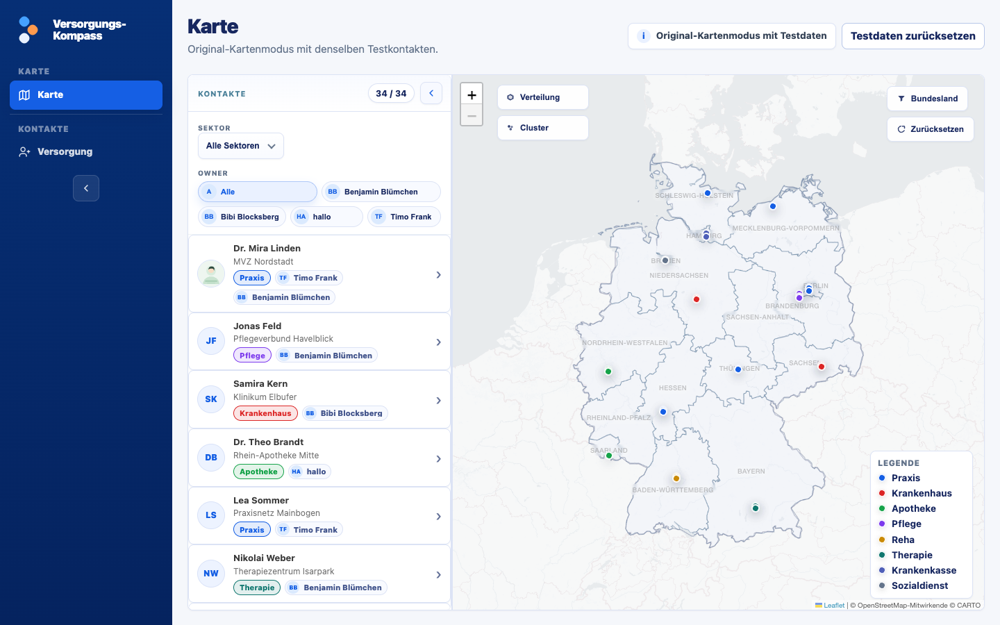

# Versorgungs-Kompass

Das gematik-Hospitationsnetzwerk sichtbar machen.

Der `Versorgungs-Kompass` ist ein interner Arbeits- und Orientierungskompass für das gematik-Hospitationsnetzwerk. Er bündelt Kontakte, Organisationen, Standorte und fachliche Einordnungen so, dass aus einzelnen Anknüpfungspunkten ein gemeinsames Lagebild entsteht: Wer gehört zu unserem Netzwerk? Wo sind Einrichtungen, Praxen, Kliniken, Kassen, Pflege- und Therapieangebote verortet? Welche Regionen sind bereits gut sichtbar und wo fehlen uns noch Perspektiven?

Im Mittelpunkt steht die `Karte`. Sie soll schnell erfassbar machen, wie unser Hospitations-Netzwerk im Raum verteilt ist. Statt Kontakte nur als Liste zu betrachten, zeigt die Karte Cluster, weiße Flecken, regionale Schwerpunkte und mögliche Nachbarschaften zwischen Akteuren. Damit wird sie zum Einstieg für Planung, Abstimmung und Reflexion: Wo können Hospitationen sinnvoll gebündelt werden? Welche Versorgungsbereiche sind in einer Region vertreten? Welche Kontakte liegen nahe beieinander und könnten gemeinsam gedacht werden?

Das Ziel ist eine lebendige Übersicht über unser Hospitations-Netzwerk: eine Karte, die Orientierung gibt, Gespräche vorbereitet, Lücken sichtbar macht und hilft, aus vielen Einzelkontakten ein belastbares Bild der Versorgungspraxis zu entwickeln.

## 1. Aktueller Release

- Version: [v0.16.0](https://github.com/TimoFrank/mitmachen/releases/tag/v0.16.0)
- Stand: 27. Juni 2026
- Kurznotiz: Erstes GitHub Release, harmonisiert mit dem App-Changelog bis Version 0.16.

## 2. Schnellstart

Kurz erklärt:

Das Repository enthält die Weboberfläche, Kartenansichten, Datenadapter, Backend-Anbindung und Unterlagen für Übergabe und Betrieb. Produktive Daten liegen nicht im Repository, sondern in einem geschützten Backend.

- Der Versorgungs-Kompass ist eine interne Webanwendung für das gematik-Hospitationsnetzwerk.
- Die Karte ist der Einstieg: Sie zeigt Kontakte, Organisationen, Standorte und regionale Lücken.
- Für Vorführung und Abstimmung gibt es die [öffentliche Demo mit Testdaten](https://versorgungs-kompass-gcp-demo-765190393967.europe-west3.run.app).
- Das aktuell nutzbare Tool im bestehenden Setup ist die [Live Demo](https://timofrank.github.io/mitmachen/versorgungs-kompass.html).
- Für Betrieb und Migration ist die [gematik-Deployment-Dokumentation](dokumentation/betrieb-und-deployment/DEPLOYMENT_GEMATIK_K8S.md) der wichtigste technische Startpunkt.

## 3. Wichtigste Ordner

| Ordner | Zweck |
| --- | --- |
| [`frontend/`](frontend/) | Oberfläche, Login, Karten, Datenadapter, Zusatzseiten und fiktive Demo |
| [`api/`](api/) | REST-API für produktionsnahe Backend-Zugriffe im Zielbild |
| [`supabase/`](supabase/) | Legacy- und Migrationsquelle bis zur abgeschlossenen Datenmigration |
| [`public/`](public/) | Logos, Icons und statische Assets |
| [`scripts/`](scripts/) | Prüf-, Sync- und Importskripte |
| [`tests/`](tests/) | Browser-Smoke-Tests |
| [`docs/`](docs/) | Publish-Kopie für die Live Demo, nicht direkt pflegen |
| [`dokumentation/`](dokumentation/) | Einstieg, Design, QA, Architektur, Betrieb und Deployment |

Wichtige Einstiege in die Dokumentation sind [`dokumentation/README.md`](dokumentation/README.md), [`dokumentation/architektur/`](dokumentation/architektur/) und [`dokumentation/betrieb-und-deployment/`](dokumentation/betrieb-und-deployment/).

## 4. Daten und Backend

Im Repository liegen Oberfläche, technische Adapter, Dokumentation und fiktive Demo-Daten. Produktive Daten werden im geschützten Backend geführt. So bleibt der gemeinsame Datenstand zentral, nachvollziehbar und getrennt vom öffentlichen Quellcode.

Administrative Schlüssel und andere sensible Betriebszugriffe werden im Zielbetrieb über das geschützte Secret-Management der jeweiligen Umgebung bereitgestellt.

Weitere Details:

- [`dokumentation/architektur/API_CONTRACT.md`](dokumentation/architektur/API_CONTRACT.md): API-Grenzen und Sicherheitsmodell.
- [`dokumentation/architektur/DATA_MODEL.md`](dokumentation/architektur/DATA_MODEL.md): fachliches Datenmodell.
- [`supabase/README.md`](supabase/README.md): Legacy-Backend und Quelle für die Datenmigration.

## 5. Deployment, Demos und Betrieb

Die drei Wege unterscheiden sich vor allem bei Zielgruppe, Datenstand und technischer Umgebung. Die Tabelle ordnet sie ein, danach folgen die konkreten Hinweise.

| Umgebung | Wofür gedacht | Hinweis |
| --- | --- | --- |
| [Demo](https://versorgungs-kompass-gcp-demo-765190393967.europe-west3.run.app) | Öffentliche Vorführung mit Testdaten | Läuft auf GCP Cloud Run mit eigenem Cloud-SQL-Backend |
| [Live Demo](https://timofrank.github.io/mitmachen/versorgungs-kompass.html) | Aktuell nutzbares Tool im bestehenden Setup | GitHub Pages liefert das Frontend, Supabase liefert Daten und Funktionen |
| gematik-Zielbetrieb | Übernahme in die gematik-Infrastruktur | Jenkins, Kubernetes, Helm, API, Datenbank und Secrets sind vorbereitet |

### 5.1 Demo

Die [Demo](https://versorgungs-kompass-gcp-demo-765190393967.europe-west3.run.app) ist der öffentliche Vorführstand mit Testdaten. Sie läuft auf Google Cloud Run und nutzt ein eigenes Cloud-SQL-Backend.

Sie ist der passende Link für Vorführung, Abstimmung und erste fachliche Rückmeldungen, wenn kein Zugriff auf das Repository oder die Live Demo besteht.

Die Demo enthält keine produktiven Daten und kann vom aktuellen Arbeitsstand der Live Demo abweichen.

### 5.2 Live Demo

Die [Live Demo](https://timofrank.github.io/mitmachen/versorgungs-kompass.html) ist das aktuell nutzbare Tool im bestehenden Setup. GitHub Pages liefert das Frontend aus dem Ordner [`docs/`](docs/) aus. Die Anwendung arbeitet mit der angebundenen Supabase-Konfiguration und ist dadurch mehr als eine statische Oberfläche.

Die Live Demo kann mit Anmeldung, Berechtigungen und Backend-Daten arbeiten, soweit die aktuelle Konfiguration dies zulässt. Sie ist damit der wichtigste laufende Stand vor dem gematik-Zielbetrieb.

Änderungen an der Oberfläche werden aus den Quellordnern nach [`docs/`](docs/) synchronisiert und danach über GitHub Pages sichtbar gemacht. Änderungen an Daten, Rechten oder Backend-Struktur müssen zusätzlich in der angebundenen Backend-Umgebung berücksichtigt werden.

### 5.3 Zielbetrieb

Im Zielbetrieb wird der Versorgungs-Kompass in der gematik-Infrastruktur betrieben. Dafür sind im Repository bereits konkrete Vorbereitungen vorhanden: Jenkins-Build, Kubernetes- und Helm-Artefakte, Frontend-Konfiguration, API-Anbindung, Datenbank-Vorbereitung, Secret-Handling und Preflight-Checks.

Der einfache Ablauf ist:

1. Jenkins-Build starten.
2. Helm-Chart und Kubernetes-Konfiguration anpassen.
3. Frontend-Konfiguration für die Zielumgebung vorbereiten.
4. API und Datenbank anbinden.
5. Secrets und Umgebungskonfiguration setzen.
6. Anmeldung, Navigation, Karte und Backend-Zugriffe testen.

Die wichtigsten Startpunkte für die Implementierung sind:

- [`dokumentation/betrieb-und-deployment/DEPLOYMENT_GEMATIK_K8S.md`](dokumentation/betrieb-und-deployment/DEPLOYMENT_GEMATIK_K8S.md)
- [`dokumentation/betrieb-und-deployment/BETRIEB.md`](dokumentation/betrieb-und-deployment/BETRIEB.md)
- [`dokumentation/betrieb-und-deployment/DEPLOYMENT_CHECKLIST.md`](dokumentation/betrieb-und-deployment/DEPLOYMENT_CHECKLIST.md)
- [`dokumentation/betrieb-und-deployment/DEPLOYMENT_UEBERSICHT.md`](dokumentation/betrieb-und-deployment/DEPLOYMENT_UEBERSICHT.md)
- [`dokumentation/betrieb-und-deployment/artefakte/Jenkinsfile.gematik`](dokumentation/betrieb-und-deployment/artefakte/Jenkinsfile.gematik)
- [`dokumentation/betrieb-und-deployment/artefakte/helm/versorgungs-kompass/`](dokumentation/betrieb-und-deployment/artefakte/helm/versorgungs-kompass/)
- [`scripts/prepare_target_frontend_config.mjs`](scripts/prepare_target_frontend_config.mjs)
- [`scripts/preflight_target_deployment.mjs`](scripts/preflight_target_deployment.mjs)

Die aktuelle Einordnung der Auslieferungswege steht in der [Deployment-Übersicht](dokumentation/betrieb-und-deployment/DEPLOYMENT_UEBERSICHT.md).

## 6. Prüfungen

Das Repository enthält automatisierte Prüfungen. Sie helfen dabei, einfache Fehler früh zu finden und Änderungen verlässlich zu überprüfen. Die schnellen Prüfungen achten auf Syntax, fehlende Dateien und offensichtliche Formatprobleme. Die technischen Checks prüfen zum Beispiel öffentliche Assets, API-Regeln, wichtige Datenfelder und die Backend-Anbindung. Die Browser-Tests öffnen die Oberfläche wie ein Nutzer und prüfen typische Wege, etwa Navigation, Kartenaufruf, Tabellen, Detailansichten und mobile Ansichten.

Die detaillierten QA-Regeln stehen in [`dokumentation/entwicklung-und-qa/QA_WORKFLOW.md`](dokumentation/entwicklung-und-qa/QA_WORKFLOW.md).

## 7. Lizenz

Quellcode und technische Dokumentation stehen unter der [Apache License 2.0](LICENSE).

Fiktive Demo- und Beispieldaten dürfen für Entwicklung, Tests und Demonstrationen genutzt werden, sofern in einer Datei nichts anderes angegeben ist. Echte Daten aus angebundenen Systemen, Marken, Logos, Profilbilder, Drittinhalte und andere externe Assets sind nicht Teil dieser Repository-Lizenz. Weitere Hinweise stehen in [NOTICE](dokumentation/rechtliches/NOTICE.md) und [DATA_NOTICE.md](dokumentation/rechtliches/DATA_NOTICE.md).
