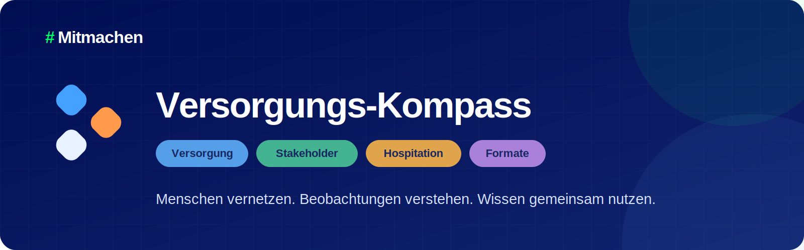
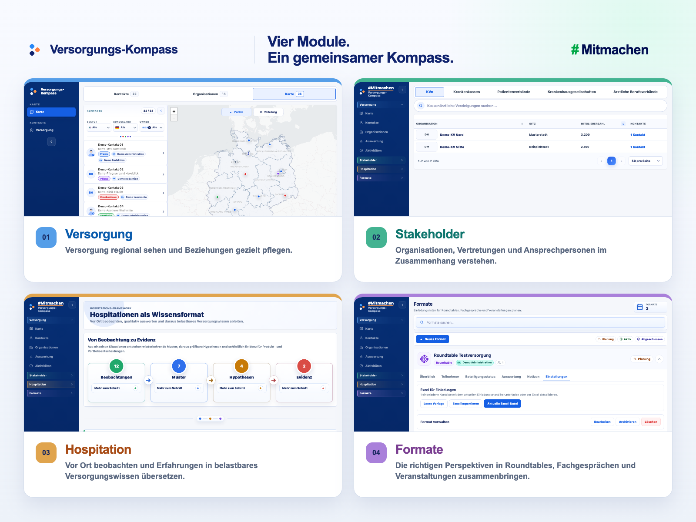

<p align="center">
  
</p>

<p align="center">
  <a href="https://timofrank.github.io/mitmachen/demo/"><strong>Öffentliche Demo ansehen</strong></a>
  · <a href="dokumentation/betrieb-und-deployment/POC_GEMATIK_DURCHSTICH.md">gematik-PoC vorbereiten</a>
  · <a href="dokumentation/produkt-und-design/MARKENARCHITEKTUR.md">Markenkit</a>
  · <a href="CHANGELOG.md">Änderungshistorie</a>
</p>

<p align="center">
  <a href="README.md"><strong>Ueberblick</strong></a>
  · <a href="dokumentation/betrieb-und-deployment/DEMO.md">Demo</a>
  · <a href="dokumentation/betrieb-und-deployment/DEPLOYMENT_UEBERSICHT.md">Deployment</a>
  · <a href="dokumentation/betrieb-und-deployment/POC_GEMATIK_DURCHSTICH.md">PoC</a>
  · <a href="SECURITY.md">Security</a>
  · <a href="dokumentation/README.md">Dokumentation</a>
</p>

> [!IMPORTANT]
> **Demos klar getrennt:** Die öffentliche Produktdemo arbeitet mit fiktiven Beispieldaten. Die Registrierungsseite im Repo ist eine eigenständige Demoidee und weder Kopie noch Bestandteil des offiziellen gematik-Angebots; Eingaben werden nicht übermittelt oder gespeichert. Verbindliche Informationen stehen bei [#Mitmachen](https://www.gematik.de/mitmachen) und dem [Versorgungs-Netzwerk](https://www.gematik.de/mitmachen/versorgungs-netzwerk) auf gematik.de.

<p align="center">
  
</p>

<p align="center"><sub>Vier Module, ein gemeinsamer Arbeitsraum. Sämtliche dargestellten Personen, Organisationen und Fachdaten sind fiktiv.</sub></p>

**Versorgungs-Kompass** verbindet Kontakte, Organisationen, Hospitationen und Formate in einem gemeinsamen Arbeitsraum. So werden regionale Perspektiven sichtbar, Erfahrungen nachvollziehbar und Erkenntnisse für die gemeinsame Arbeit nutzbar.

Die Markenarchitektur ist bewusst mehrstufig: **gematik** ist der institutionelle Absender, **#Mitmachen** das Beteiligungsdach und **Versorgungs-Kompass** die Produktmarke. Verbindliche Texte, Logoquellen, Modulfarben, Demo-Begriffe und Regeln für einen späteren Namenswechsel stehen im [Markenkit](dokumentation/produkt-und-design/MARKENARCHITEKTUR.md).

## Was der Versorgungs-Kompass moeglich macht

- **Versorgung sehen:** Karte und Filter zeigen regionale Schwerpunkte, Luecken und nahe Kontakte.
- **Beziehungen verstehen:** Kontakte, Organisationen und Stakeholder bleiben mit ihrem fachlichen Kontext verbunden.
- **Gemeinsam arbeiten:** Profile, Teams, Zustaendigkeiten und Aktivitaeten machen Beitraege nachvollziehbar.
- **Hospitationen begleiten:** Termine, Kalender und Fragebogen fuehren von der Vorbereitung bis zur Dokumentation.
- **Wissen aufbauen:** Das Framework verdichtet Beobachtungen zu Mustern, Hypothesen und Evidenz.
- **Naechste Schritte gestalten:** Dashboards, Roundtables und Fachgespraeche bringen Erkenntnisse in die gemeinsame Arbeit.

## Zugaenge und Betriebsstatus

| Zugang | Status | Wofuer geeignet |
| --- | --- | --- |
| [Öffentliche Demo](https://timofrank.github.io/mitmachen/demo/) | Demo | Schneller Produkteinblick mit fiktiven Beispieldaten. |
| [#Mitmachen Modulstart](frontend/pages/mitmachen/index.html) | Anwendungsstart | Führt in die vier Module des geschützten Versorgungs-Kompasses. |
| [Demo zum Versorgungs-Netzwerk](frontend/pages/mitmachen/versorgungs-netzwerk.html) | Demo | Eigenständige Interaktionsidee; keine Datenübermittlung und nicht das offizielle gematik-Formular. |
| Gematik-interner Versorgungs-Kompass | PoC in Vorbereitung | Befristeter technischer Durchstich mit Gateway/SSO, API im Non-Prod-Namespace, kleiner PostgreSQL-Datenbank und synthetischen Testdaten. |

GitHub Pages liefert nur die öffentliche Demo mit fiktiven Beispieldaten. Der gematik-interne PoC wird separat aus einem festgelegten Release Candidate gebaut und greift ausschließlich über `/api` auf synthetische Testdaten zu. Pages ist keine Vorstufe des PoC-Deployments. Die GCP-Autopilot-Umgebung `pre-gematik` ist eine temporäre technische Pre-Integration und keine Produktivumgebung.

Weitere Bilder und Hinweise stehen auf der Seite [Demo und Screenshots](dokumentation/betrieb-und-deployment/DEMO.md).

## Aktueller Stand

- Stand: 21. Juli 2026
- Öffentlicher Kanal: [GitHub-Pages-Demo mit fiktiven Beispieldaten](https://timofrank.github.io/mitmachen/demo/)
- Naechster geschuetzter Kanal: befristeter gematik-interner PoC ueber Gateway, Anmeldung, API und kleine PostgreSQL-Ressource; noch keine Produktivfreigabe
- Release-Historie: [CHANGELOG](CHANGELOG.md)

## Repository auf einen Blick

```text
.github/                  GitHub Actions, Dependabot und aktive CODEOWNERS-Regeln
api/                      serverseitige Logik fuer Pre-Integration, PoC und Target-Pfad
config/
  pages-demo/             Vertrag fuer die oeffentliche Demo
  pre-gematik/            Vertrag und Variablennamen fuer die GKE-Pre-Integration
  target/                 technisches Buildprofil fuer gematik-PoC und spaeteren Zielpfad
  security/               Semgrep- und Gitleaks-Konfiguration
deploy/
  helm/                   Kubernetes-Ressourcen
  terraform/              temporaere GCP-Pre-Integrationsinfrastruktur
  jenkins/                Referenzpipeline fuer die Software Factory
  postgres/               Datenbankvertrag der Pre-Integration
dist/                     generierte, nicht versionierte Build- und Pruefergebnisse
dokumentation/            Produkt-, Architektur-, Betriebs- und QA-Unterlagen
frontend/                 gemeinsame fuehrende Browser-Quellen
public/                   gemeinsame statische Quellassets
scripts/                  Build-, Test- und Betriebswerkzeuge
supabase/                 geschuetztes Schema, Migrationen und Betriebsnachweise
tests/                    Browser- und Integrationspruefungen
```

`dist/` ist auf GitHub durch seine README sichtbar; alle erzeugten Inhalte darin bleiben ignoriert. Die fruehere versionierte `docs/`-Publish-Kopie ist entfallen, weil GitHub Actions das Pages-Artefakt direkt und reproduzierbar aus `frontend/` und `public/` baut. Lokale Codex-Pet-, Export-, Test- und Office-Dateien sind ebenfalls kein Teil des Produkt-Repositories.

### Warum einige Namen mit einem Punkt beginnen

| Eintrag | Warum er im Root bleibt |
| --- | --- |
| `.github/` | GitHub erwartet Workflows und Dependabot hier; auch die aktive CODEOWNERS-Datei liegt an diesem festen Ort. |
| `.gitignore` | verhindert repo-weit, dass lokale Builds, Secrets und Testausgaben committed werden. |
| `.gitattributes` | legt fuer Git die Behandlung von Binaerdateien und Vendor-Code fest. |
| `.dockerignore` | begrenzt den Inhalt von `docker build .` auf die fuer das API-Image benoetigten Dateien. |
| `.semgrepignore` | wird von Semgrep an diesem festen Projektort automatisch gelesen. |

Diese Dateien sind technische Steuerdateien, keine zusaetzlichen Anwendungen oder Umgebungen.

## Technik und Uebergabe

Die fuehrenden Frontend-Quellen liegen in `frontend/`. Builds erzeugen getrennte, nicht gegenseitig wiederverwendete Ausgaben:

- `dist/pages/` fuer GitHub Pages,
- `dist/target/` fuer Pre-Integration, gematik-PoC und einen spaeteren Zielpfad.

GitHub Actions veroeffentlicht `dist/pages/` direkt. Der gematik-PoC baut ausschliesslich `dist/target/` und das API-Image aus einem unveraenderlichen RC-Tag; Target-Artefakte verwenden `/api`, enthalten keine direkten Supabase-Zugriffe und werden unabhaengig vom Pages-Release freigegeben. Die verbindlichen Profile stehen unter [`config/`](config/README.md), die ausfuehrbaren Zielartefakte unter [`deploy/`](deploy/README.md).

Der Einstieg fuer IT-Kollegen steht im [gematik-internen PoC-Durchstich](dokumentation/betrieb-und-deployment/POC_GEMATIK_DURCHSTICH.md). Die [Release-Candidate-Strategie](dokumentation/betrieb-und-deployment/RELEASE_CANDIDATE_STRATEGIE.md) erklaert, wie dieser stabile Stand bereitgestellt wird, waehrend `main`, lokale Entwicklung und Pages weiterlaufen. Vertiefend folgen [Deployment-Uebersicht](dokumentation/betrieb-und-deployment/DEPLOYMENT_UEBERSICHT.md), [Security](SECURITY.md), [technische Dokumentation](dokumentation/README.md) und [Hinweise zum Mitwirken](CONTRIBUTING.md). Das [Betriebshandbuch](dokumentation/betrieb-und-deployment/BETRIEB.md) ist eine Referenz fuer einen moeglichen spaeteren Regelbetrieb und kein PoC-Freigabetor.

Historische lokale Kontakt- und Arbeitsdateien sind aus dem Hauptstand entfernt. `main` besitzt eine neue, datenschutzbereinigte Historie; alte normale Branches, Tags, Releases, Actions-Laeufe, Artefakte, Caches und Deployment-Datensaetze wurden entfernt und Pages wurde sauber neu veroeffentlicht. Fuer nicht selbst loeschbare GitHub-interne Pull-Request-Refs und alte Pages-Build-Datensaetze bleibt eine Betreiberanfrage erforderlich. Der genaue, bewusst vorsichtige Status steht im [Datenschutz-Bereinigungsnachweis](dokumentation/betrieb-und-deployment/DATENSCHUTZ_BEREINIGUNGSNACHWEIS.md) und im [Datenschutz-Runbook](dokumentation/betrieb-und-deployment/GIT_HISTORY_DATENSCHUTZBEREINIGUNG.md).

Der Quellcode und die technische Dokumentation stehen unter der [Apache License 2.0](LICENSE). Die Demo nutzt fiktive Daten. Fuer echte Daten und externe Inhalte gelten eigene Regeln; mehr dazu steht im [Data Notice](dokumentation/rechtliches/DATA_NOTICE.md).
