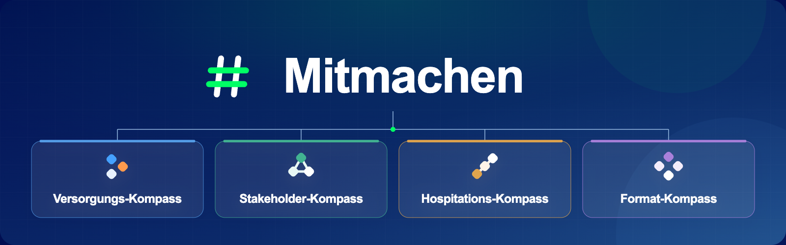
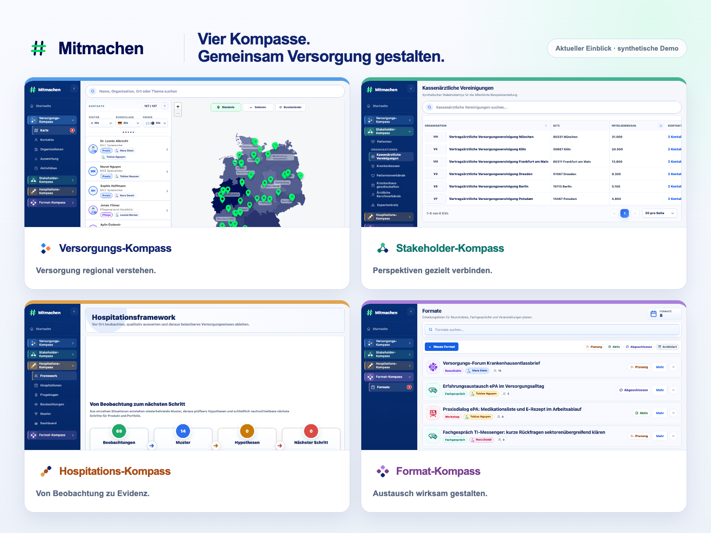

<p align="center">
  
</p>

<p align="center">
  <a href="https://timofrank.github.io/mitmachen/"><strong>Öffentliche Demo ansehen</strong></a>
  · <a href="dokumentation/betrieb-und-deployment/POC_GEMATIK_DURCHSTICH.md">Gematik-PoC</a>
</p>

<p align="center">
  <a href="README.md"><strong>Überblick</strong></a>
  · <a href="dokumentation/betrieb-und-deployment/DEPLOYMENT_GEMATIK_K8S.md">Deployment</a>
  · <a href="SECURITY.md">Security</a>
  · <a href="dokumentation/README.md">Dokumentation</a>
</p>

> [!IMPORTANT]
> Diese öffentliche Demo arbeitet mit fiktiven Daten. Verbindliche Informationen zu [#Mitmachen](https://www.gematik.de/mitmachen) und dem [Versorgungs-Netzwerk](https://www.gematik.de/mitmachen/versorgungs-netzwerk) stehen auf gematik.de.

## Vier Kompasse

**#Mitmachen** verbindet vier gleichrangige Kompasse.

<table>
  <tr>
    <td width="50%" align="center">
      
      <br /><sub>Versorgung regional verstehen.</sub>
    </td>
    <td width="50%" align="center">
      
      <br /><sub>Perspektiven gezielt verbinden.</sub>
    </td>
  </tr>
  <tr>
    <td width="50%" align="center">
      
      <br /><sub>Von Beobachtung zu Evidenz.</sub>
    </td>
    <td width="50%" align="center">
      
      <br /><sub>Austausch wirksam gestalten.</sub>
    </td>
  </tr>
</table>

## Aktueller Einblick

<p align="center">
  
</p>

<p align="center"><sub>Vier Kompasse, eine gemeinsame Anwendung. Sämtliche dargestellten Personen, Organisationen und Fachdaten sind fiktiv.</sub></p>

**#Mitmachen** verbindet Versorgungs-Kompass, Stakeholder-Kompass, Hospitations-Kompass und Format-Kompass in einer gemeinsamen Anwendung. So werden regionale Perspektiven sichtbar, Erfahrungen nachvollziehbar und Erkenntnisse für die gemeinsame Arbeit nutzbar.

## Funktionsumfang

- **Versorgung sehen:** Karte und Filter zeigen regionale Schwerpunkte, Lücken und Kontakte.
- **Beziehungen verstehen:** Kontakte, Organisationen und Stakeholder bleiben mit ihrem fachlichen Kontext verbunden.
- **Gemeinsam arbeiten:** Profile, Teams, Zuständigkeiten und Aktivitäten machen Beiträge nachvollziehbar.
- **Hospitationen begleiten:** Termine, Kalender und Fragebogen führen von der Vorbereitung bis zur Dokumentation.
- **Wissen aufbauen:** Beobachtungen werden zu Mustern, Hypothesen und Evidenz verdichtet.
- **Nächste Schritte gestalten:** Dashboards, Roundtables und Fachgespräche unterstützen die gemeinsame Arbeit.

## Zugänge und aktueller Stand

Der Zielpfad ist eine interne Anwendung für gematik-Mitarbeitende. Er ist keine
TI-Anwendung und besitzt keinen TI-Zulassungskontext. Gesundheits-, Patienten-
und identifizierende Falldaten sind für diesen Nutzungspiloten ausgeschlossen.

| Zugang | Status | Inhalt |
| --- | --- | --- |
| [GitHub-Pages-Demo](https://timofrank.github.io/mitmachen/) | Demo | Fiktive Beispieldaten, öffentlich verfügbar |
| [GKE-Demo](https://versorgungs-kompass.de/) | Interner PoC | CI/CD Deployment aus Artifcat Regsitry von Helm Charts auf GKE-Cluster, mit IAM |
| Zielbetrieb | In Vorbereitung | Nächster PoC-Schritt in der gematik-Infrastruktur |

GitHub Pages veröffentlicht die öffentliche Demo. Die GKE-Demo läuft getrennt unter versorgungs-kompass.de; die bisherige Adresse mitmachen.timo-frank.de bleibt als HTTPS-Weiterleitung erhalten. Für den Zielbetrieb wird ein festgelegter Release Candidate gebaut und ein freigegebener Datenstand aus der geschützten Anwendung übernommen. Die Veröffentlichungswege können unabhängig voneinander weiterentwickelt werden. Der aktuelle PoC-Umfang und die benötigten Ressourcen stehen im [PoC-Durchstich](dokumentation/betrieb-und-deployment/POC_GEMATIK_DURCHSTICH.md).

Die geschützte GCP-Anwendung nutzt ausschließlich PostgreSQL in Cloud SQL als Datenbank und private GCS-Buckets als Objektspeicher. Supabase-Laufzeitcode, Schemaquellen und Migrationswerkzeuge gehören nicht mehr zum aktuellen Repository. Das Inventarisieren, Sperren und Löschen eventuell noch vorhandener Supabase-Projekte, Edge Functions, Schlüssel oder Sicherungen ist ein separater, protokollierter Betriebsvorgang; das Entfernen aus Git nimmt diese Provider-Ressourcen nicht automatisch außer Betrieb.

## Repository

```text
.github/                  GitHub Actions, Dependabot und CODEOWNERS
api/                      serverseitige Logik für Pre-Integration und PoC
config/
  pages-demo/             Konfiguration der öffentlichen Demo
  pre-gematik/            Konfiguration der GCP-Pre-Integration
  target/                 Buildprofil für den Gematik-PoC
  security/               Semgrep- und Gitleaks-Konfiguration
deploy/
  helm/                   Kubernetes-Ressourcen
  jenkins/                Referenzpipeline für die Software Factory
  postgres/               PostgreSQL-Schema, Rollen und Datenbank-Runbooks
  terraform/              GCP-Pre-Integrationsinfrastruktur
dokumentation/            Produkt-, Architektur-, Deployment- und QA-Unterlagen
frontend/                 führende Browser-Quellen
public/                   gemeinsame statische Quellassets
scripts/                  Build-, Test- und Betriebswerkzeuge
tests/                    Browser- und Integrationsprüfungen
```

## Build- und Release-Trennung

```text
Pages:   frontend/ + public/ -> dist/pages/  -> GitHub Pages
PoC:     frontend/ + public/ -> dist/target/ -> internes Hosting
API:     api/                -> Image-Digest -> Kubernetes
```

Ein PoC-Release wird durch einen unveränderlichen RC-Tag festgelegt. Weitere Änderungen auf `main`, in lokalen Arbeitsständen oder für GitHub Pages verändern diesen Stand nicht. Ein Fehler wird in einem neuen RC behoben; bestehende Tags und Image-Digests bleiben unverändert.

Öffentliche Produkt-Releases werden freitags automatisiert über [GitHub Releases](https://github.com/TimoFrank/mitmachen/releases) bereitgestellt, sofern seit dem letzten Stand Änderungen vorliegen. Ablauf, Versionsregeln, Artefakte und Benachrichtigung beschreibt der [Produkt-Release-Prozess](dokumentation/betrieb-und-deployment/PRODUKT_RELEASE_PROZESS.md).

Der technische Ablauf des PoC steht im [Deployment-Runbook](dokumentation/betrieb-und-deployment/DEPLOYMENT_GEMATIK_K8S.md). Ausführbare Artefakte sind unter [`deploy/`](deploy/README.md) beschrieben. Weitere Referenzen: [Security](SECURITY.md), [Dokumentationsindex](dokumentation/README.md) und [Mitwirken](CONTRIBUTING.md).

Der Quellcode und die technische Dokumentation stehen unter der [Apache License 2.0](LICENSE). Für Daten und externe Inhalte gelten die Hinweise im [Data Notice](dokumentation/rechtliches/DATA_NOTICE.md).

## Aktueller Release

- Version: [v0.22.0](https://github.com/TimoFrank/mitmachen/releases/tag/v0.22.0)
- Stand: 31. Juli 2026
- Kurznotiz: Mehr Überblick. Mehr Verbindung.
- Demo-Kanal: [GitHub Pages](https://timofrank.github.io/mitmachen/)
