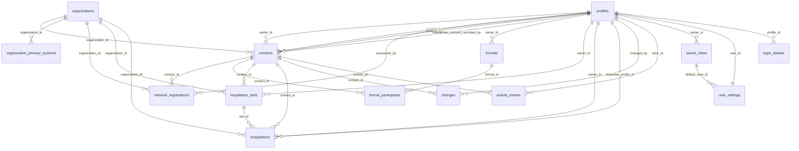

# Datenmodell Versorgungs-Kompass

Stand: abgeleitet aus `supabase/schema.sql`, `frontend/data/sector-registry.js`, `frontend/data/data-service.js` und `api/care-sector-model.mjs`. Historische Postgres-Migrationsentwürfe liegen nur noch im Archiv.

Zielbild-Hinweis: Supabase bleibt in diesem Dokument als Ursprungsschema und Migrationsquelle sichtbar. Die neue gematik-Zielarchitektur führt das relationale Modell in Shared PostgreSQL weiter.

## Überblick

Der produktive Ziel-Datenbestand liegt in Shared PostgreSQL. Das bisherige Supabase-Schema `public` bleibt die wichtigste Migrationsquelle. Die App nutzt fachlich diese Tabellen:

- `profiles`
- `contacts`
- `organizations`
- `organization_primary_systems`
- `network_registrations`
- `network_registration_rate_limits`
- `formats`
- `format_participants`
- `hospitation_slots`
- `hospitations`
- `changes`
- `activity_events`
- `saved_views`
- `user_settings`
- `login_aliases`
- `stakeholder_types`
- `stakeholder_organizations`
- `stakeholder_people`

Nicht im aktuellen Schema vorhanden sind eigene Tabellen für `imports`, `topics`, `contact_topics`, Befragungsantworten oder Einladungen. Fachliche Aktivitäten liegen in `activity_events`; Importläufe bleiben über ihre Herkunft am Ereignis erkennbar. Themen liegen direkt als Array im Kontakt.

## Beziehungen

## Fachmodell Versorgungssektoren

Der Sektorkatalog ist ein kontrolliertes Fachmodell für `contacts.sector` (im Frontend `category`) und `organizations.sector`. Seine kanonische Quelle ist `frontend/data/sector-registry.js`; `api/care-sector-model.mjs` setzt denselben Vertrag serverseitig durch. Die Datenbankfelder bleiben aus Migrations- und Importkompatibilität Textfelder und bilden keine eigene relationale Entität.

Die Auswahl eines Sektors ist nicht von vorhandenen Kontakten oder Organisationen abhängig. Filter, Karte und Formulare müssen immer den vollständigen Katalog anbieten. Ein Sektor ohne Kontakt ist deshalb ein gültiger sichtbarer Zustand und kein Grund, ihn aus der Anwendung auszublenden.

| ID | Kanonischer Wert | Wichtige kompatible Aliase | Abdeckungsziel |
| --- | --- | --- | --- |
| `praxis` | Praxis | Arztpraxis, MVZ, Zahnmedizin, Psychotherapie | ja |
| `krankenhaus` | Krankenhaus | Klinik, Fachklinik, Akutkrankenhaus | ja |
| `apotheke` | Apotheke | Vor-Ort-Apotheke | ja |
| `pflege` | Pflege | Pflegeeinrichtung, Pflegedienst | ja |
| `krankenkasse` | Krankenkasse | Kasse, Kostenträger, GKV, PKV | ja |
| `labor` | Labor | Medizinisches Labor, Labordiagnostik | ja |
| `physio-heilmittel` | Physio / Heilmittel | Therapie, Physio/Heilmittel, Physiotherapie, Ergo-, Logo- und Podologie, Heilmittelpraxis | ja |
| `hebammen` | Hebammen | Hebamme, Geburtshilfe | ja |
| `notfallversorgung` | Notfallversorgung | Rettungsdienst, Notaufnahme, Krankentransport, ärztlicher Bereitschaftsdienst | ja |
| `reha` | Reha | Rehabilitation, Rehaklinik | ja |
| `hilfsmittel` | Hilfsmittel | Hilfsmittelerbringer, Sanitätshaus, Homecare | ja |
| `sozialdienst` | Sozialdienst | Beratungsstelle, Sozialberatung | nein |
| `oegd` | ÖGD | ÖGD, Öffentlicher Gesundheitsdienst, Gesundheitsamt | nein |

`Abdeckungsziel = ja` bedeutet, dass der Sektor in der Lückenanalyse als angestrebte Versorgungsperspektive zählt. Werte mit `nein` bleiben vollwertig auswählbar und sichtbar, werden aber nicht als verpflichtende Mindestabdeckung bewertet.

Regeln für Lesen und Schreiben:

- Die API kanonisiert bekannte Aliase, zum Beispiel `Therapie` zu `Physio / Heilmittel` und `Rettungsdienst` zu `Notfallversorgung`.
- Ein leerer Sektor bleibt leer; er wird nicht stillschweigend als `Praxis` klassifiziert.
- Neue unbekannte Werte werden mit HTTP `400` abgelehnt. Legacy-Freitext kann lesbar bleiben, bis er fachlich bereinigt wird, darf aber nicht erneut als neuer Sektor gespeichert werden.
- `Digital Health` ist ausdrücklich kein Versorgungssektor. Es gehört je nach Datensatz in Themen, Rolle/Berufsgruppe, Organisationstyp oder einen Digitalisierungskontext. Bestehende Vorkommen werden nicht als Sektor ausgeliefert und müssen bei der nächsten Datenpflege fachlich zugeordnet werden.
- Kontakt und Organisation dürfen unterschiedliche Sektoren tragen. Beim Anlegen kann die Organisation den Kontakt vorbelegen; eine spätere Änderung wird nicht automatisch auf die jeweils andere Entität kaskadiert.
- Gleichnamige Felder in Hospitationen, Stakeholder-Modellen oder Befragungen beschreiben ihren jeweiligen Kontext und sind nicht automatisch an diesen Versorgungskatalog gebunden.

## Tabelle `profiles`

Zweck:

- Nutzerprofile für angemeldete Supabase-Auth-Nutzer.
- Rollensteuerung für Admin, Editor und Viewer.
- Owner-Auswahl in Kontakten.

Wichtigste Felder:

| Feld | Bedeutung |
| --- | --- |
| `id` | UUID, entspricht `auth.users.id`, Primärschlüssel. |
| `email` | Login-/Kontaktadresse. |
| `display_name` | Anzeigename in App und Owner-Auswahl. |
| `initials` | Kurzlabel/Avatar. |
| `role` | `admin`, `editor` oder `viewer`. |
| `avatar_url` | Geschützte Bildreferenz; die API liefert bei Bedarf eine kurzlebige, autorisierte Anzeige-URL. |
| `team` | Optionaler Team-/Bereichshinweis für das Nutzerprofil. |
| `bio` | Optionale Kurzbeschreibung im Nutzerprofil. |
| `active` | Nur aktive Profile werden in der App geladen. |
| `created_at`, `updated_at` | Zeitstempel. |

UI-Nutzung:

- Login-/Profilanzeige.
- Rollenhinweise.
- Owner-Auswahl in Kontaktformularen.
- Anzeige im Änderungsverlauf.
- Profilfoto in Sidebar, Nutzerbereich und Owner-Badges.

Kritische Felder:

- `role`, weil sie Schreibrechte steuert.
- `active`, weil inaktive Nutzer nicht als aktive Profile erscheinen.
- `display_name` und `email`, weil sie Owner-Zuordnung und Nachvollziehbarkeit beeinflussen.

Automatisch gesetzt:

- Neues Profil wird durch Trigger `handle_new_user()` nach erstem Auth-Login angelegt.
- `created_at` und `updated_at` haben Defaults.

Dürfen Nutzer bearbeiten:

- Nutzer dürfen das eigene Profil für `display_name`, `initials`, `avatar_url`, `team` und `bio` aktualisieren.
- `email`, `role` und `active` sind nicht durch die Profil-UI editierbar.
- Admins pflegen Rollen weiterhin außerhalb der Profilseite in Supabase.

## Tabelle `contacts`

Zweck:

- Zentrale Tabelle für Versorgungskontakte.
- Grundlage für Liste, Detailprofil, Suche, Filter, Karte, Auswertung, Datenqualität und Archiv.

Wichtigste Felder:

| Feld | Bedeutung |
| --- | --- |
| `id` | Text-ID, Primärschlüssel, bleibt über Imports stabil. |
| `name` | Kontaktname, Pflichtfeld. |
| `organization_id` | Optionaler Verweis auf `organizations.id`. MVP-Verknüpfung Kontakt zu Organisation. |
| `organization` | Organisation/Einrichtung als bestehender Freitext-Fallback. Bleibt erhalten. |
| `sector` | Kanonischer Versorgungssektor gemäß Abschnitt „Fachmodell Versorgungssektoren“, im UI als `category`; leer ist zulässig und hat keinen Praxis-Fallback. |
| `specialty` | Fachrichtung. |
| `role` | Funktion bzw. Rolle der Person in der Versorgung oder Organisation. |
| `priority` | `Hoch`, `Mittel`, `Niedrig`; Default `Mittel`. |
| `owner_id` | Verweis auf `profiles.id`. |
| `postal_code`, `city`, `federal_state` | Standortdaten. |
| `latitude`, `longitude` | Koordinaten für Kartenansicht. |
| `email`, `phone`, `linkedin` | Kontaktdaten. |
| `mitmachen_consent_status` | Status für den einheitlichen Zweck "#Mitmachen – Kontaktaufnahme für Beteiligungsformate": `granted`, `not_requested`, `declined`, `withdrawn` oder `clarification_needed`. |
| `mitmachen_consent_effective_at` | Zeitpunkt der Erklärung, Ablehnung oder des Widerrufs. |
| `mitmachen_consent_source` | Dokumentationsquelle: `online_form`, `email`, `written`, `verbal_confirmed` oder `manual_transfer`. |
| `mitmachen_consent_text_version` | Version des zugrunde liegenden Einwilligungstextes. |
| `mitmachen_consent_recorded_by` | Profil, das den Status nachvollziehbar erfasst hat. |
| `mitmachen_consent_note` | Nachweis- oder Klärungsvermerk; bei ausdrücklich mündlicher Einwilligung Pflicht. |
| `topics` | Themen als Textarray. |
| `notes` | Notizen. |
| `source` | Quellen/Importhinweise als Text. |
| `image_url` | Bildpfad oder URL. |
| `image_source_url` | Optional dokumentierte URL der Bildquelle. |
| `image_source_label` | Menschlich lesbare Bildquellenbezeichnung. |
| `image_rights_note` | Kurzer Hinweis zur geprüften Quelle/Nutzung; keine Rechtsbewertung. |
| `image_updated_at` | Zeitpunkt der letzten Bild-/Bildquellenpflege. |
| `image_updated_by` | Profil, das Bild-/Bildquellenfelder zuletzt gepflegt hat. |
| `status` | `active` oder `archived`. |
| `created_by`, `updated_by` | Verweise auf bearbeitende Profile. |
| `created_at`, `updated_at` | Zeitstempel. |

UI-Nutzung:

- Kontaktliste, Suche und Filter.
- Detailprofil und Bearbeitungsformular.
- Eigener Reiter `Einwilligung` für den #Mitmachen-Status; E-Health-Community-Mitgliedschaft oder Teilnahmehistorie erzeugen keine automatische Freigabe.
- Rolle in Schnellerfassung, Import, Profil und Datenqualität.
- Kontaktbild und Abschnitt `Bild & Quelle`; ohne Bild zeigt die UI Initialen.
- Klickbare Organisation im Kontaktprofil, sofern `organization_id` oder passender Freitext vorhanden ist.
- Kartenansicht über Koordinaten.
- Auswertung und Datenqualitäts-Ansicht.
- Archivansicht für Admins.
- CSV-Export der sichtbaren/geladenen Kontakte.

Kritische Felder:

- `id`: darf nicht versehentlich verändert werden.
- `name`: Pflichtfeld und zentrale Suche.
- `status`: steuert Archiv/aktive Sichtbarkeit.
- `owner_id`: fachliche Verantwortung und Filter.
- `organization_id`: neue CRM-Beziehung zur Organisation; Freitext bleibt Fallback.
- `latitude`/`longitude`: Karte.
- `priority`, `sector`, `specialty`, `federal_state`: Filter und Auswertung.
- `role`: fachliche Einordnung des Kontakts; kein Berechtigungs- oder Einwilligungsstatus.
- `mitmachen_consent_status` und seine Nachweisfelder: steuern, ob eine allgemeine #Mitmachen-Kontaktaufnahme dokumentiert freigegeben ist.
- `image_url` und Bildquellenfelder: rein manuelle Dokumentation, keine automatische Bildübernahme.

Automatisch gesetzt:

- `created_at` per Default.
- `updated_at` per Trigger `contacts_touch_updated_at`.
- `created_by` und `updated_by` werden vom Data-Service beim Erstellen gesetzt.
- `updated_by` wird beim Speichern gesetzt.
- Neue Kontakte starten mit `not_requested`. Die Einführungsmigration setzt den unbewerteten Altbestand einmalig auf `clarification_needed`.
- Optionale #Mitmachen-Einwilligungen aus dem Versorgungs-Netzwerk werden bei Übernahme strukturiert am Kontakt gespeichert.

Dürfen Nutzer bearbeiten:

- Editor/Admin: aktive Kontakte.
- Admin: Archivieren und Wiederherstellen.
- Viewer: keine Bearbeitung.

Fachliche Abgrenzung:

- Grundlage für den gemeinsamen Zweck ist die gematik-Datenschutzerklärung unter <https://www.gematik.de/datenschutz>.
- Die gesonderte Registrierung der E-Health Community unter <https://e-health-community.gematik.de/> wird nicht automatisch als allgemeine #Mitmachen-Einwilligung gewertet.
- Eine laufende bilaterale KOL-Zusammenarbeit ist keine pauschale Verteilerfreigabe. Ohne ausdrücklich dokumentierte Bestätigung bleibt der Kontakt `clarification_needed`.

## Tabelle `organizations`

Zweck:

- Eigene CRM-Entität für Einrichtungen, Institutionen und Unternehmen hinter Versorgungskontakten.
- Grundlage für den Hauptbereich "Organisationen", Organisationsliste und Organisationsprofil.
- Sichtbar machen, dass mehrere Personen einer Organisation zugeordnet sein können.

Wichtigste Felder:

| Feld | Bedeutung |
| --- | --- |
| `id` | UUID, Primärschlüssel. |
| `name` | Organisationsname, Pflichtfeld. |
| `normalized_name` | Normalisierter Vergleichswert für Suche, Migration und spätere Dublettenprüfung. |
| `sector` | Kanonischer Versorgungssektor gemäß Abschnitt „Fachmodell Versorgungssektoren“; die Organisation bleibt auch ohne zugeordneten Kontakt sichtbar. |
| `organization_type` | Optionaler Organisationstyp, z. B. Universitätsklinikum oder Pflegeeinrichtung. |
| `postal_code`, `city`, `federal_state` | Standortdaten. |
| `latitude`, `longitude` | Optionale Koordinaten für spätere Kartenintegration. |
| `website`, `phone`, `email` | Kontaktwege der Organisation. |
| `notes` | Organisationsnotiz. |
| `source` | Quelle des Organisationsdatensatzes. |
| `status` | `active` oder `archived`. |
| `created_by`, `updated_by` | Bearbeitende Profile. |
| `created_at`, `updated_at` | Zeitstempel. |

UI-Nutzung:

- Neuer Sidebar-Tab "Organisationen".
- Organisationsliste mit Suche, Sektor-/Bundeslandfilter, Standort, Kontaktanzahl und Aktualisierung.
- Organisationsprofil mit Stammdaten, Themen aus zugeordneten Kontakten, Notizen und Abschnitt "Zugeordnete Kontakte".
- Pflege und Anzeige mehrerer Primärsysteme pro Organisation; verknüpfte Kontakte zeigen diese Information abgeleitet an.
- Vom Organisationsprofil aus können Kontakte geöffnet, zugeordnet oder neu für diese Organisation angelegt werden.

Migrationslogik:

- Migration `supabase/migrations/20260516_create_organizations.sql` legt `organizations` an und ergänzt `contacts.organization_id`.
- Bestehende eindeutige `contacts.organization`-Freitextwerte werden getrimmt, mit zusammengefassten Leerzeichen normalisiert und als erste Organisationen angelegt.
- Unsichere Dubletten wie "UKB" und "Universitätsklinikum Bonn" werden nicht automatisch zusammengeführt.
- Danach werden Kontakte per normalisiertem Freitext auf die neue Organisation verlinkt.

Dürfen Nutzer bearbeiten:

- Viewer: lesen.
- Editor/Admin: Organisationen anlegen und bearbeiten, Kontakte zuordnen.
- Admin: später archivieren/zusammenführen; vollständige Dublettenpflege ist nicht Teil von Sprint 4.

## Tabelle `organization_primary_systems`

Zweck:

- Schlanke P0-Erfassung der in einer Organisation eingesetzten Primärsysteme.
- Mehrere Systeme je Organisation sind möglich.
- Kontakte erben die sichtbare Information über `organization_id`; sie wird nicht redundant am Kontakt gespeichert.

Felder:

| Feld | Bedeutung |
| --- | --- |
| `id` | UUID, Primärschlüssel. |
| `organization_id` | Pflichtverweis auf `organizations.id`; beim Löschen der Organisation werden die Einträge mitgelöscht. |
| `system_type` | Kontrollierter Typ: `PVS`, `KIS`, `AVS`, `ZPVS`, `LIS`, `HVS`, `PFLEGE` oder `SONSTIGES`. |
| `vendor_name` | Optionaler Herstellername. |
| `product_name` | Optionaler Produktname. |
| `source_url` | Optionale öffentliche Quelle für die Angabe. |
| `created_at`, `updated_at` | Technische Zeitstempel. |
| `created_by`, `updated_by` | Technische Bearbeitungsnachweise. |

Bewusste Begrenzung:

- Kein `usage_status`.
- Keine fachliche Verifikation über `verified_at` oder `verified_by`.
- Keine TI-Anwendungen in dieser Tabelle.
- Keine Datenschutz- oder Einwilligungsdaten.

Rechte:

- Viewer lesen Einträge aktiver Organisationen.
- Editor/Admin dürfen Einträge aktiver Organisationen anlegen, bearbeiten und löschen.
- RLS folgt dem Status der zugehörigen Organisation.

## Tabellen `network_registrations` und `network_registration_rate_limits`

Zweck:

- Vorbereitendes Datenmodell für einen möglichen später freigegebenen #Mitmachen-Intake; die aktuelle Repo-Konzeptdemo schreibt keine Daten.
- Trennung ungeklärter Eingänge vom aktiven Kontakt- und Organisationsbestand.
- Strukturierte Erfassung von Profilstand, beruflichem Kontext, Organisation, Primärsystem, TI-Anwendungen und getrennten Einwilligungsnachweisen.

Wichtigste Felder:

| Feld | Bedeutung |
| --- | --- |
| `submission_id` | Eindeutige Browser-Einreichung für idempotente Retries ohne Doppelzeile. |
| `status` | Arbeitsstatus von `neu` bis `uebernommen`, `verknuepft`, `abgelehnt` oder `widerrufen`. |
| `onboarding_stage` | Stand der gestuften Registrierung: Kurzregistrierung, begonnenes/vollständiges Profil oder Verifizierung. |
| `first_name`, `last_name`, `email` | Minimale Identifikation der registrierenden Person. |
| `professional_group`, `role`, `employment_status`, `years_in_profession_band`, `age_group` | Forschungs- und Zielgruppenprofil der Person. |
| `organization`, `sector`, `postal_code`, `city`, `federal_state`, `employee_count_band` | Organisations- und Standortkontext. |
| `primary_system_*`, `ti_applications` | Digitale Arbeitsumgebung; bei Übernahme wird ein Primärsystem strukturiert an der Organisation ergänzt. |
| `participation_formats`, `interest_topics` | Auswahlmerkmale für passende Beteiligungsformate. |
| `consent_processing_*`, `consent_contact_*`, `privacy_notice_version` | Getrennte, versionierte Nachweise für Registrierung und optionale allgemeine #Mitmachen-Kontaktaufnahme. |
| `email_confirmation_status`, `email_confirmed_at` | Besitznachweis der E-Mail-Adresse; bis zur Bestätigung darf keine Einwilligung als aktiv übernommen werden. |
| `retention_review_at` | Zeitpunkt, zu dem die weitere Aufbewahrung fachlich geprüft werden muss. |
| `contact_id`, `organization_id`, `processed_at`, `processed_by` | Nachvollziehbare Zuordnung nach der Admin-Prüfung. |

Sicherheitsmodell:

- Ein später freigegebener öffentlicher Prozess dürfte ausschließlich über einen geschützten serverseitigen Intake schreiben. Die aktuelle Landingpage ist technisch inert; die vorhandene Edge Function ist kein aktiver Vertrag der Konzeptdemo.
- `anon` hat auf der Intake-Tabelle weder Lese- noch Schreibrechte. Nur die Edge Function schreibt mit Service-Identität.
- Ausschließlich Admins dürfen Intake-Zeilen lesen oder löschen. Schreibrechte sind auf Workflow-, Zuordnungs- und Prüffelder begrenzt; Identität, Profilantworten und Einwilligungsnachweise sind unveränderlich.
- `network_registration_rate_limits` speichert nur per HMAC und geheimem Pepper pseudonymisierte technische Fingerprints für ein kurzes Missbrauchsfenster und ist für Browserrollen vollständig gesperrt. Ein atomarer SQL-Zähler verhindert parallele Lost Updates.
- Kontakte und Organisationen werden nicht direkt aus dem öffentlichen Formular heraus angelegt.

Bewusste Grenze:

- Der Status für Double-Opt-in beziehungsweise einen belastbaren manuellen E-Mail-Nachweis ist umgesetzt. Automatischer E-Mail-Versand, Bestätigungslink, Teilnehmerkonto, Incentives und Befragungsantworten sind noch keine Funktionen dieses Schemas.
- Der Reiter `Registrierungskonzept` zeigt diese Schritte ausschließlich als mögliches Zukunftsszenario. Eine Aktivierung erfordert einen realen gematik-Prozess sowie abgestimmte Datenschutzinformationen, Löschfristen, Auftragsverarbeitung und gegebenenfalls eine DSFA-Prüfung.

## Tabellen `stakeholder_types`, `stakeholder_organizations`, `stakeholder_people`

Zweck:

- Eigenständige Stakeholder-Bereiche wie KVen, Krankenkassen, Patientenverbände, Krankenhausgesellschaften und ärztliche Berufsverbände.
- `stakeholder_types` definiert den Bereich, `stakeholder_organizations` enthält die Organisationen, `stakeholder_people` enthält Personen und Rollen in diesen Bereichen.
- Mitgliederzahlen sind Datenpflegefelder an `stakeholder_organizations`, nicht automatisch berechnete UI-Werte.

Mitgliederzahlen:

| Feld | Bedeutung |
| --- | --- |
| `member_count` | Numerischer Wert für Mitglieder, Versicherte oder eine fachlich dokumentierte Ersatzgröße. |
| `member_count_source_url` | Quelle für den Wert. |
| `member_count_source_label` | Kurz lesbare Quellenangabe. |
| `member_count_updated_at` | Stand oder Erhebungsdatum des Werts. |
| `member_count_scope` | Einordnung, was genau gezählt wurde. |

Pflegeweg:

- Stakeholderdaten werden nicht mehr im Repository oder im GitHub-Pages-Artefakt ausgeliefert.
- Die geschützte Anwendung liest sie ausschließlich über die authentifizierte API aus `stakeholder_organizations`; historische Quellstände liegen zugriffsgeschützt in `private.protected_source_snapshots`.
- `logo_url` ist im geschützten Ziel entweder leer oder eine validierte logische Referenz `private://stakeholder-logos/<objektpfad>`. Externe HTTP(S)-URLs sind dort nicht zulässig; die API liefert Altwerte fail-closed nicht an den Browser aus.
- Ein Logo wird ausschließlich über `GET /api/stakeholder-logos/:id` aus dem privaten Bucket ausgeliefert. Objektpfad, Größe, MIME-Typ und Dateiinhalt werden serverseitig geprüft; der Browser erhält weder Bucket-Zugang noch eine dauerhafte GCS-URL.
- Sichtbare Korrekturen werden als geschützte Datenpflege oder kontrollierter Backfill vorgenommen.
- Eine automatische Aktualisierung öffentlicher Mitgliederzahlen ist ein separater Datenjob mit Quellenprüfung, Konfliktlogik und Live-Backfill. Sie ist kein Teil normaler UI-Fixes.

## Tabelle `formats`

Zweck:

- Planungsobjekte für Roundtables, Fachgespräche, Workshops und Veranstaltungen.
- Ersetzt externe Excel-Einladungslisten durch CRM-verknüpfte Formate.

Wichtigste Felder:

| Feld | Bedeutung |
| --- | --- |
| `id` | UUID, Primärschlüssel. |
| `title` | Titel des Formats, Pflichtfeld. |
| `format_type` | Typ, z. B. Roundtable, Fachgespräch, Workshop oder Veranstaltung. |
| `starts_at`, `ends_at` | Optionaler Zeitraum. |
| `location` | Ort, Raum oder Online-Hinweis. |
| `goal` | Thema oder Ziel der Runde. |
| `owner_id` | Verantwortliches Profil. |
| `status` | `Planung`, `Aktiv`, `Abgeschlossen` oder `Archiviert`. |
| `notes` | Interne Planungsnotiz. |
| `created_by`, `updated_by`, `created_at`, `updated_at` | Nachvollziehbarkeit. |

## Tabelle `format_participants`

Zweck:

- Verknüpft bestehende Kontakte mit einem Format.
- Speichert nur Einladungs- und Planungsinformationen; Kontakt- und Organisationsdaten bleiben in `contacts` bzw. `organizations`.

Wichtigste Felder:

| Feld | Bedeutung |
| --- | --- |
| `id` | UUID, Primärschlüssel. |
| `format_id` | Verweis auf `formats.id`, wird beim Löschen des Formats entfernt. |
| `contact_id` | Verweis auf `contacts.id`. |
| `invitation_status` | `Kandidat`, `Eingeladen`, `Zugesagt`, `Abgesagt`, `Keine Rückmeldung` oder `Teilgenommen`. |
| `participant_role` | Rolle im Format, z. B. Sprecherin, Teilnehmer, Moderation. |
| `notes` | Format-spezifische Teilnehmernotiz. |
| `created_by`, `updated_by`, `created_at`, `updated_at` | Nachvollziehbarkeit. |

Kritische Regeln:

- `format_id` und `contact_id` sind eindeutig kombiniert; ein Kontakt kann pro Format nur einmal auftauchen.
- Viewer lesen Formate und Teilnehmer, Editor/Admin pflegen sie, nur Admins löschen Formate.

## Tabelle `hospitation_slots`

Zweck:

- Interne Terminangebote für Hospitationen.
- Grundlage für direkte Buchungen durch Editor/Admin.
- Optionaler Bezug zu Kontakt oder Organisation, falls ein Slot bereits fachlich vorgeplant ist.

Wichtigste Felder:

| Feld | Bedeutung |
| --- | --- |
| `id` | UUID, Primärschlüssel. |
| `contact_id` | Optionaler Verweis auf `contacts.id`. |
| `organization_id` | Optionaler Verweis auf `organizations.id`. |
| `starts_at`, `ends_at` | Zeitraum des angebotenen Termins; `starts_at` ist Pflicht. |
| `location` | Ort, Einrichtung, Raum oder Online-Hinweis. |
| `capacity` | Interne Kapazität, mindestens 1. |
| `owner_id` | Verantwortliches Profil. |
| `status` | `Frei`, `Reserviert`, `Gebucht`, `Abgesagt` oder `Archiviert`. |
| `notes` | Interne Terminnotiz. |
| `created_by`, `updated_by`, `created_at`, `updated_at` | Nachvollziehbarkeit. |

## Tabelle `hospitations`

Zweck:

- Eigenes CRM-Modell für Hospitationsanfragen, Buchungen, Durchführung und Dokumentation.
- Erfasst Versorgungskontakte und Organisationen, ohne Hospitationen als `formats`-Spezialfall zu behandeln.
- Sichtbar im Arbeitsbereich `Hospitationen` und in Kontakt-/Organisationsprofilen.

Wichtigste Felder:

| Feld | Bedeutung |
| --- | --- |
| `id` | UUID, Primärschlüssel. |
| `slot_id` | Optionaler Verweis auf `hospitation_slots.id`. |
| `contact_id` | Optionaler Verweis auf `contacts.id`. |
| `organization_id` | Optionaler Verweis auf `organizations.id`. |
| `requester_profile_id` | Profil, das die Anfrage bzw. Buchung ausgelöst hat. |
| `owner_id` | Verantwortliches Profil. |
| `status` | `Entwurf`, `Angefragt`, `Angeboten`, `Gebucht`, `Abgelehnt`, `Abgesagt`, `Durchgeführt`, `Dokumentiert` oder `Archiviert`. |
| `requested_windows` | Optionale Terminwunschfenster als JSON. |
| `starts_at`, `ends_at` | Geplanter oder gebuchter Zeitraum. |
| `location` | Ort, Einrichtung, Raum oder Online-Hinweis. |
| `goal` | Ziel oder Anlass der Hospitation. |
| `topics` | Themenliste als Textarray. |
| `request_note` | Interne Anfrage- oder Planungsnotiz. |
| `documentation_summary` | Pflicht-Minimum für die Ergebnisnotiz nach Durchführung. |
| `documentation_outcome` | Auswertung, Ergebnis oder fachliche Einordnung. |
| `follow_up_note`, `follow_up_owner_id`, `follow_up_due_at` | Nachverfolgung offener Aufgaben. |
| `documented_at`, `documented_by` | Dokumentationszeitpunkt und dokumentierendes Profil. |
| `created_by`, `updated_by`, `created_at`, `updated_at` | Nachvollziehbarkeit. |

Qualitatives Dokumentationsmodell:

- Die strukturierte Auswertung liegt versioniert in `documentation_outcome` als `hospitation-documentation-v2`.
- Die zentrale Definition steht in `frontend/data/hospitation-model.js`.
- Alte Freitexte und `hospitation-documentation-v1` werden beim Laden migriert und bleiben sichtbar.
- Alte Einträge aus `hospitation_unmet_needs` werden als `impulses` gelesen und bei Bedarf weiter in die alte Tabelle gespiegelt.
- System-Tags wie `Hospitation` und `Versorgungskontakt` werden getrennt von Analyse-Tags behandelt.

Kernobjekte im v2-Payload:

| Objekt | Zweck |
| --- | --- |
| `observations[]` | Strukturierte Beobachtungen mit Situation, Beschreibung, Rollen, Prozessphase, Problemtyp, Auswirkung, Evidenzart, Relevanzscore, Nutzungsempfehlung, Workaround und nächstem Schritt. |
| `quotes[]` | Zitate mit Rolle, Kontext, Nutzungsfreigaben, Anonymisierung und Freigabestatus. |
| `mediaArtifacts[]` | Bilder oder Materialien mit Typ, Datei/URL, Sichtbarkeit von Personen oder personenbezogenen Daten, Redaktionsbedarf und Nutzungsfreigaben. |
| `impulses[]` | Verdichtete Hinweise mit Klassifikation, Problemstatement, Nutzen, Dringlichkeit, Workaround, nächstem Schritt und Status. |

Codebook-Werte:

| Feld | Werte |
| --- | --- |
| `processPhase` | `Anmeldung / Aufnahme`, `Identifikation`, `Behandlung / Beratung`, `Verordnung`, `Überweisung`, `Befund / Dokumentation`, `Kommunikation mit Patient:innen`, `Kommunikation mit anderen Einrichtungen`, `Nachbereitung`, `Sonstiges`. |
| `problemType` | `Medienbruch`, `fehlende Information`, `doppelte Dokumentation`, `Rückfrage`, `Wartezeit`, `Workaround`, `Systemverständnis`, `Rollenunklarheit`, `technisches Problem`, `positives Muster / Best Practice`, `offene Frage`. |
| `impact` | `Zeitaufwand`, `Fehleranfälligkeit`, `Frust / Belastung`, `Informationsverlust`, `Patient:innen müssen selbst vermitteln`, `Prozessverzögerung`, `Sicherheitsgefühl sinkt`, `Arbeitsfluss wird unterbrochen`, `Ablauf funktioniert gut`. |
| `usageRecommendation` | `Wissen teilen`, `weiter validieren`, `Produkt prüfen`, `Technik prüfen`, `Prozess prüfen`, `Roadmap prüfen`, `kein weiterer Schritt`. |
| `evidenceType` | `directly_observed`, `reported`, `interpreted`. |
| `impulse.classification` | `knowledge`, `product_question`, `technical_question`, `process_question`, `roadmap_signal`, `validation_needed`. |
| `impulse.status` | `draft`, `to_review`, `accepted`, `rejected`, `closed`. |

Kritische Regeln:

- Viewer lesen aktive Hospitationen und Slots.
- Editor/Admin können Hospitationen anfragen, buchen, durchführen und dokumentieren.
- Archivierte Hospitationen und Slots bleiben Admins vorbehalten.

## Tabelle `hospitation_observations`

Zweck:

- Kanonische, global such- und auswertbare Beobachtungsobjekte aus Hospitationsfragebogen und -dokumentation.
- Bewahrt den eindeutigen Bezug zur Ursprungshospitation; Owner werden nicht dupliziert, sondern aus der Hospitation geerbt.
- Trennt die deskriptive Feldnotiz (`situation`, `description`) von der analytischen Codierung (`process_phase`, `problem_type`, `impact`).

Wichtigste Felder:

| Feld | Bedeutung |
| --- | --- |
| `id` | Stabile Text-ID aus dem v2-Dokumentationsobjekt; erhält Verknüpfungen zu Zitaten und Medien. |
| `hospitation_id` | Pflichtverweis auf die Ursprungshospitation. |
| `sequence`, `title`, `situation`, `description` | Reihenfolge und deskriptive Beobachtung. |
| `process_phase`, `problem_type`, `impact`, `observation_type` | Vergleichbare qualitative Codes aus dem zentralen Codebook. |
| `evidence_type` | `directly_observed`, `reported` oder `interpreted`. |
| `relevance_score`, `usage_recommendation` | Fachliche Einordnung und nächste Nutzung. |
| `involved_roles`, `affected_products`, `topics` | Mehrfachwerte für Filter und fallübergreifende Analyse. |
| `payload` | Vollständiges v2-Objekt einschließlich seltener Ablauf-, Quellen-, Freigabe- und Verknüpfungsfelder. |
| `status`, `archived_at`, `archived_by` | Reversible Archivierung statt fachlichem Hard Delete. |
| `created_*`, `updated_*` | Erfassungs- und Änderungsnachweis. |

Persistenzregeln:

- Die Tabelle ist die kanonische Quelle. `documentation_outcome` bleibt für die übrigen v2-Teilobjekte und als rückwärtskompatibles Transportformat bestehen.
- Beim Laden werden Tabellenzeilen wieder als `observations[]` in das Runtime-Hospitationsmodell eingesetzt.
- Speichern im Fragebogen synchronisiert per stabiler ID; aus dem Quellformular entfernte Beobachtungen werden archiviert.
- Direkte Änderungen aus der globalen Workbench verwenden `updated_at` als optimistische Versionsprüfung.
- `hospitation_observation_changes` protokolliert Erstellen, Ändern, Archivieren und Wiederherstellen mit Vorher-/Nachher-Zustand.
- Fallübergreifende Häufigkeiten sind Wiederholungshinweise. Eine automatische Einstufung als Muster, Hypothese oder Evidenz findet nicht statt.

## Tabelle `changes`

Zweck:

- Änderungsverlauf je Kontakt.
- Nachvollziehbarkeit von Erstellen, Bearbeiten, Archivieren und Importen.
- Technischer Audit- und Recovery-Verlauf; keine fachliche Aktivitäten-Timeline.

Wichtigste Felder:

| Feld | Bedeutung |
| --- | --- |
| `id` | Fortlaufende ID. |
| `contact_id` | Verweis auf `contacts.id`. |
| `action` | `create`, `update`, `archive` oder `import`. |
| `field_name` | Geändertes Feld, falls feldbezogen. |
| `old_value` | Alter Wert als Text. |
| `new_value` | Neuer Wert als Text. |
| `changed_at` | Zeitpunkt der Änderung. |
| `changed_by` | Verweis auf `profiles.id`. |
| `activity_event_id` | Optionaler Verweis auf das kanonische fachliche Ereignis desselben Kontakts. |
| `canonicalized_at` | Zeitpunkt, zu dem die Legacy-Zeile mit dem kanonischen Ereignis verknüpft wurde. |

UI-Nutzung:

- Änderungsverlauf im Kontakt-Detailprofil.
- Importereignisse werden als Historieneinträge sichtbar.
- Recovery einzelner falscher Bearbeitungen.

Kritische Felder:

- `contact_id`, `action`, `field_name`, `old_value`, `new_value`, `changed_by`.
- Ohne sauberen Verlauf ist Recovery deutlich schwieriger.

Automatisch gesetzt:

- `id` als Identity.
- `changed_at` per Default.
- App/Skripte schreiben Logeinträge nach Create, Update, Archive und Import.

Dürfen Nutzer bearbeiten:

- Die App fügt Einträge für Editor/Admin hinzu.
- Einträge sollten nicht manuell geändert oder gelöscht werden.

Abgrenzung zu `activity_events`:

- `changes` bleibt die feldnahe Quelle für Audit und Recovery eines Kontakts.
- Ein fachlicher Vorgang kann mehrere `changes`-Zeilen erzeugen, erscheint aber als ein verständliches Ereignis in `activity_events`.
- Neue Aktivitäten dürfen deshalb nicht allein aus einem einzelnen geänderten Feld abgeleitet werden; der jeweilige Schreibvorgang erzeugt zusätzlich einen stabilen fachlichen Ereignisschlüssel.
- `activity_event_id` und `canonicalized_at` sind entweder gemeinsam gesetzt oder gemeinsam leer. Die zusammengesetzte Fremdschlüsselbeziehung erzwingt, dass `changes.contact_id` und `activity_events.contact_id` übereinstimmen.

## Tabelle `activity_events`

Zweck:

- Append-only-Ereignisstrom für die globale Aktivitäten-Seite und den Aktivitäten-Reiter eines Kontakts.
- Fachlich konkrete Ereignisse wie `contact.created`, `hospitation.created` oder `format.invitation.created` statt eines allgemeinen Typs "Update".
- Getrennte Speicherung von fachlicher Kategorie und technischer Herkunft, damit beispielsweise eine importierte Kontaktanlage fachlich `master_data` und technisch `data_import` bleibt.
- Kontrollierte Übernahme historischer Ereignisse mit idempotenter Legacy-Referenz und eindeutig gekennzeichnetem Fallback `unknown`.

Wichtigste Felder:

| Feld | Bedeutung |
| --- | --- |
| `id` | Fortlaufende `bigint`-Identity und Primärschlüssel. |
| `event_key` | Stabiler, punktgetrennter Ereignisschlüssel, zum Beispiel `contact.created`. Nicht eindeutig, weil derselbe Typ beliebig oft auftreten darf. |
| `category` | Fachbereich: `master_data`, `ownership`, `consent`, `hospitation`, `format`, `note_document` oder `unknown`. |
| `action` | Maschinenlesbare Aktion innerhalb des Ereignisses, zum Beispiel `created`, `updated` oder `archived`. |
| `entity_type`, `entity_id` | Primär betroffenes Objekt. IDs bleiben als Text gespeichert, weil die Fachobjekte unterschiedliche Schlüsseltypen verwenden. |
| `contact_id` | Optionaler direkter Kontaktbezug für den Kontaktverlauf. Bei `entity_type = contact` ist er verpflichtend und muss `entity_id` entsprechen. Jeder Kontaktverweis in `references` muss exakt dieselbe ID tragen. |
| `actor_id` | Optionaler Akteur aus `profiles`; wird beim Löschen des Profils auf `null` gesetzt. Der interne Server-Writer setzt ihn aus der authentifizierten Session. |
| `occurred_at` | Fachlicher Ereigniszeitpunkt; kann bei einer Legacy-Übernahme vor `created_at` liegen. |
| `origin_type` | Technische Herkunft: `manual`, `data_import`, `public_registration`, `system` oder `legacy`. |
| `origin_ref` | Optionale Referenz auf Importlauf, Registrierung, Systemprozess oder andere Herkunft. |
| `correlation_id` | Optionale Klammer für mehrere Ereignisse desselben fachlichen Vorgangs. |
| `references` | JSON-Array mit weiteren betroffenen Objekten, beispielsweise Format und Hospitation. |
| `changes` | JSON-Objekt mit optionalen, für die Aktivitätsanzeige relevanten Vorher-/Nachher-Werten. |
| `metadata` | JSON-Objekt für zusätzlichen nicht normierten Kontext; keine vertraulichen Inhalte ohne fachliche Freigabe. |
| `legacy_source`, `legacy_id` | Gepaarte Referenz auf einen historischen Quelldatensatz. Beide Werte sind gemeinsam gesetzt oder gemeinsam `null`; das Paar ist eindeutig. |
| `created_at` | Zeitpunkt, zu dem das Ereignis im Kompass gespeichert wurde. |

JSON-Verträge:

- `references` ist immer ein Array aus kompakten Objektverweisen, zum Beispiel `[{"type":"format","id":"...","label":"Roundtable Primärversorgung"}]`.
- `changes` ist immer ein Objekt. Empfohlene Form: `{"owner_id":{"before":"...","after":"..."}}`.
- `metadata` ist immer ein Objekt. Produzenten dürfen hier nur ergänzenden Kontext speichern, der nicht bereits als kanonisches Feld vorhanden ist.

Indizes und Idempotenz:

- Globale Timeline: `occurred_at desc`.
- Kategorieansicht: `category, occurred_at desc`.
- Partielle Kontakt- und Akteurindizes für vorhandene Referenzen.
- Zusammengesetzter Objektindex auf `entity_type`, `entity_id` und `occurred_at`.
- Partieller Unique-Index auf `legacy_source`, `legacy_id` verhindert eine doppelte Übernahme derselben historischen Zeile.

RLS und Schreibmodell:

- Admins dürfen alle Ereignisse lesen. Viewer und Editoren sehen nur Ereignisse ohne Kontaktbezug oder Ereignisse aktiver Kontakte; Aktivitäten archivierter Kontakte bleiben verborgen.
- Authentifizierte Browser-Clients besitzen ausschließlich `SELECT`: keine Sequenzrechte, keine Insert-Policy und keine Rechte für Update oder Delete.
- Ausschließlich der privilegierte serverseitige Writer besitzt `INSERT` und Sequenzrechte. Auch für ihn bleiben Update und Delete gesperrt, damit das Ledger append-only ist; der Schlüssel darf nie im Frontend verwendet werden.
- Fachliche Mutationen schreiben Domainänderung, Audit-Zeilen, kanonisches Ereignis und die Verknüpfung der Audit-Zeilen in einer Transaktion. `actor_id`, Objekt- und Kontaktbezug stammen aus dem validierten Servervorgang, nicht aus frei formulierbaren Browserdaten.

Trennung von `activity_events.changes` und `public.changes`:

- `activity_events.changes` ist optionaler Darstellungskontext innerhalb genau eines fachlichen Ereignisses. Es muss nicht jede technische Feldmutation enthalten und ist keine vollständige Versionierung.
- `public.changes` bleibt die feinere Audit-/Recovery-Historie des Kontakts und kann mehrere Zeilen für denselben Vorgang enthalten.
- Die globale Aktivitäten-Seite liest während der Migration beide Quellen. Verknüpfte `changes`-Zeilen werden anhand der monotonen Event-ID ausgeblendet, sobald das zugehörige kanonische Ereignis zum Snapshot gehört. Dadurch bleibt ein bereits laufender Cursor stabil, ohne von synchronen Uhren abzuhängen.
- Wiederherstellungsfunktionen dürfen weiterhin `public.changes` verwenden.

## Tabelle `saved_views`

Zweck:

- Gespeicherte Ansichten/Sichten für Kontakte, Organisationen, Karte und Auswertung.
- Private Sichten und Team-Sichten.

Wichtigste Felder:

| Feld | Bedeutung |
| --- | --- |
| `id` | UUID, Primärschlüssel. |
| `owner_id` | Besitzerprofil. |
| `name`, `description` | Name und Beschreibung. |
| `scope` | `private` oder `team`. |
| `view_type` | `contacts`, `organizations`, `formats`, `hospitations`, `map` oder `analytics`. |
| `filters` | Filter als JSON. |
| `search_query` | Suchtext. |
| `sort_key`, `sort_direction` | Sortierung. |
| `page_size` | Tabellenlänge. |
| `is_default` | Standardsicht. |
| `created_at`, `updated_at` | Zeitstempel. |

UI-Nutzung:

- Gespeicherte Ansichten werden außerhalb des Filterpanels geführt, z. B. im kompakten Ansichts-Dropdown `Ansicht: Alle Kontakte` oder im Einstellungsbereich.
- Eine gespeicherte Ansicht kann Suche, Filter, Sortierung, Seitengröße und später sichtbare Spalten enthalten.
- Das Filterpanel setzt nur aktuelle Filter; es verwaltet keine gespeicherten Ansichten.

Kritische Felder:

- `scope`: Team-Sichten sind für alle sichtbar.
- `filters`: bestimmt die fachliche Sicht.
- `owner_id`: steuert private Sichtbarkeit.

Automatisch gesetzt:

- `id`, `created_at`, `updated_at`.
- `updated_at` per Trigger.

Dürfen Nutzer bearbeiten:

- Nutzer können eigene Sichten verwalten.
- Admins können Team-Sichten verwalten.

## Tabelle `user_settings`

Zweck:

- Persönliche Einstellungen pro Nutzer.

Wichtigste Felder:

| Feld | Bedeutung |
| --- | --- |
| `user_id` | Verweis auf `profiles.id`, Primärschlüssel. |
| `default_view_id` | Optionale Standardsicht. |
| `default_view_type` | `contacts`, `organizations`, `formats`, `hospitations`, `map` oder `analytics`. |
| `table_density` | `compact`, `comfortable`, `spacious`. |
| `theme` | `system`, `light`, `contrast`. |
| `font_scale` | Schriftgröße zwischen 0.9 und 1.2. |
| `page_size` | Standard-Tabellenlänge. |
| `preferences` | Weitere Einstellungen als JSON. |
| `created_at`, `updated_at` | Zeitstempel. |

UI-Nutzung:

- Tabellen- und Ansichtseinstellungen.
- Default-Sicht.
- Sprint 8 nutzt `preferences.defaultContactTab` und `preferences.notificationsEnabled` als einfache Vorbereitung.

Kritische Felder:

- `user_id`: Nutzer darf nur eigene Einstellungen lesen/schreiben.
- `default_view_id`: kann auf gelöschte/veränderte Sichten zeigen, wird bei gelöschter Sicht auf `null` gesetzt.

Hinweis:

- `default_view_type` erlaubt `contacts`, `organizations`, `formats`, `hospitations`, `map` und `analytics`.
- `table_density = compact` reduziert die Tabellenhöhe.
- Benachrichtigungen sind nur als boolean `notificationsEnabled` vorbereitet; es gibt noch kein Notification-Center, keinen E-Mail-Versand und keine Push-Logik.

Automatisch gesetzt:

- `created_at`, `updated_at`.
- `updated_at` per Trigger.

Dürfen Nutzer bearbeiten:

- Jeder angemeldete Nutzer nur die eigenen Einstellungen.

## Tabelle `login_aliases`

Zweck:

- Server-seitige Zuordnung kurzer Login-Kürzel zu Supabase-Auth-E-Mail-Adressen.
- Komfort-Login im Versorgungs-Kompass, ohne die E-Mail-Zuordnung in Frontend-Dateien auszuliefern.

Wichtigste Felder:

| Feld | Bedeutung |
| --- | --- |
| `alias` | Login-Kürzel, klein geschrieben, eindeutig, z. B. `timo`. |
| `email` | Zugehörige Supabase-Auth-E-Mail-Adresse. |
| `profile_id` | Optionaler Bezug zum Profil in `public.profiles`. |
| `active` | Steuert, ob das Kürzel für Login-Auflösung verwendet wird. |
| `created_at`, `updated_at` | Zeitstempel. |

UI-Nutzung:

- Das Login-Formular akzeptiert Kürzel oder E-Mail.
- Die Supabase Edge Function `login-with-alias` löst Kürzel serverseitig auf und meldet danach mit E-Mail und Passwort bei Supabase Auth an.

Kritische Felder:

- `alias`, weil es der sichtbare Login-Identifier ist.
- `email`, weil es auf den echten Supabase Auth User zeigen muss.
- `active`, weil damit Kürzel deaktiviert werden können, ohne den Auth User oder das Profil zu löschen.

Dürfen Nutzer bearbeiten:

- Normale Nutzer lesen oder bearbeiten `login_aliases` nicht direkt.
- Pflege erfolgt administrativ über SQL/Supabase Dashboard oder Service-Role-Kontext.

## Views und Funktionen

| Objekt | Zweck |
| --- | --- |
| `public.current_profile_role()` | Liefert Rolle des aktuell angemeldeten aktiven Profils für RLS-Policies. |
| `public.touch_updated_at()` | Aktualisiert `updated_at` bei Updates. |
| `public.handle_new_user()` | Legt nach Supabase-Auth-Registrierung ein Profil an. |

## Storage `profile-images`

Zweck:

- Ablage von Profilbildern für angemeldete Nutzer.
- Dateipfad: `<auth.uid()>/avatar.<jpg|png|webp>`.
- Erlaubte Typen: `image/jpeg`, `image/png`, `image/webp`.
- Größenlimit: 5 MB.

RLS/Policy-Hinweise:

- Authentifizierte Nutzer dürfen nur im eigenen Ordner hochladen, ersetzen und löschen.
- Der Bucket ist privat. Es gibt keine anonyme Lesepolicy.
- Lesen und Anzeigen erfolgen ausschließlich autorisiert über die geschützte API beziehungsweise kurzlebige signierte URLs; dauerhafte öffentliche Profilbild-URLs werden nicht gespeichert.

## Storage `stakeholder-logos`

- Der Zielbucket ist privat, verwendet Uniform Bucket-Level Access, Public Access Prevention und Versionierung.
- Der kanonische Datenbankwert ist `private://stakeholder-logos/<objektpfad>`; externe Logo-URLs sind im geschützten Zielvertrag ausgeschlossen.
- Nur der API-Workload besitzt Objekt-Leserechte. Frontend, GitHub-Pages-Demo und Deployment-Identität erhalten keinen Zugriff auf Logo-Inhalte.
- Die API akzeptiert ausschließlich den freigegebenen Bildvertrag und liefert SVG mit restriktiver Content Security Policy aus. Unsichere, strukturell ungültige oder übergroße Quelldateien werden vor einer Migration quarantänisiert und nicht still übernommen.

## RLS- und Rechtehinweise

- RLS ist für alle genannten Tabellen aktiv.
- `authenticated` hat technische Grants, konkrete Aktionen werden durch Policies eingeschränkt.
- Viewer dürfen nicht schreiben.
- Editor/Admin dürfen aktive Kontakte erstellen und bearbeiten.
- Admins dürfen archivieren/wiederherstellen und Profile verwalten.
- Service-Role darf für lokale Admin-Skripte alles, darf aber nie ins Frontend.

## Kontaktanlage Sprint E

Die Kontaktanlage verwendet weiterhin `contacts`; es gibt keine neue Datenquelle und kein neues Bulk-Datenmodell.

- Einzelkontakt und Online-Tabelle schreiben über `window.dataService.createContact()` nach Supabase.
- Pflichtfeld in der UI ist `name`.
- Defaults: `priority = Mittel`, `status = active`, `owner_id` wird gesetzt, wenn ein Profil ausgewählt ist; sonst bleibt Owner leer.
- Online-Tabelle validiert je Zeile: fehlender Name, ungültige E-Mail, grob ungültige Telefonnummer und unbekannter Sektor sind Fehler.
- Online-Tabelle warnt bei fehlender Organisation, fehlendem Ort/Bundesland, fehlendem Owner, fehlender Fachrichtung, möglicher Dublette und fehlendem Kontaktweg.
- Dublettenprüfung ist nur eine UI-Warnung gegen den aktuell geladenen Kontaktbestand; sie ersetzt keine eindeutigen Datenbank-Constraints.
- Dateiimport bleibt CSV/Excel plus Mapping; Online-Tabelle ist manuelle tabellarische Anlage ohne Datei-Upload und ohne Importprofil.

## Hinweise für spätere Features

- Organisationen sind seit Sprint 4 eigene Datensätze. Eine spätere Ausbaustufe kann Mehrfachzuordnungen über `contact_organizations` und Dubletten-Zusammenführung ergänzen.
- Neue fachliche Aktivitäten werden in `activity_events` geschrieben; `changes` bleibt Audit/Recovery und darf nicht zur primären Aktivitäten-Timeline werden.
- Importhistorie könnte später eine eigene Tabelle bekommen; aktuell helfen `changes.action = 'import'`, Importberichte und Batch-Hinweise.
- Themen sind aktuell `contacts.topics`; bei wachsender Taxonomie können `topics` und `contact_topics` sinnvoll werden.
