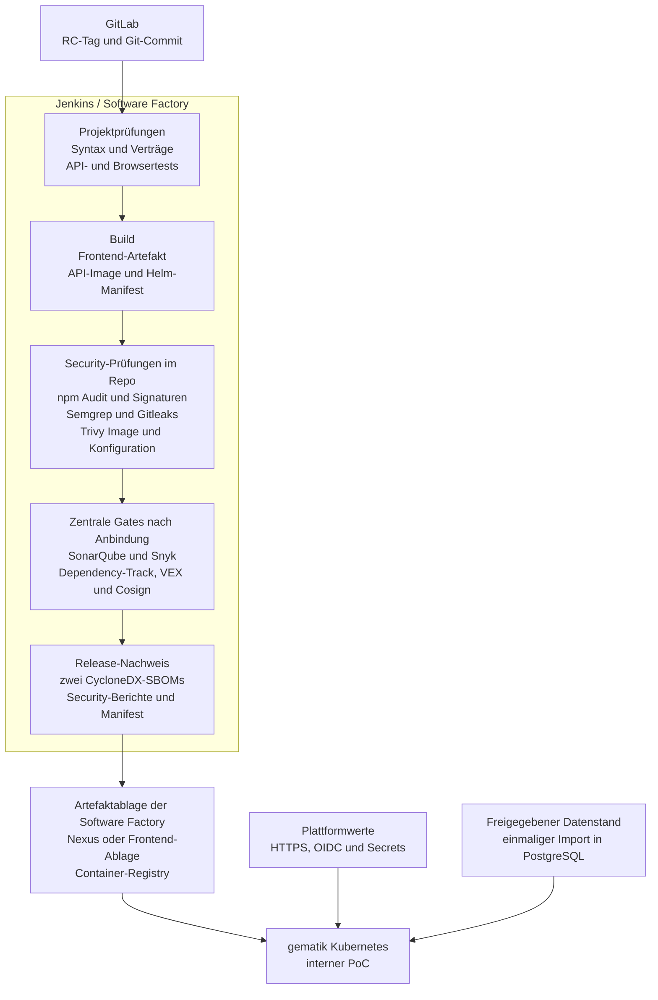

# Deployment des Gematik-PoC auf Kubernetes

Status: technisches Runbook
Stand: 23. Juli 2026

## Ziel

Dieses Runbook beschreibt den Build und die Bereitstellung eines festgelegten Release Candidates. Software, Daten und Identitäten bleiben getrennte Schritte.



GitHub Pages verwendet weiterhin `dist/pages/` und ausschließlich Demo-Daten.

Die Repo-Prüfungen sind bereits ausführbar. Die zentralen Gates benötigen die Dienste und Regeln der gematik-Software-Factory. Fehlt ihre Anbindung, werden SonarQube, Snyk, Dependency-Track und Cosign im Release-Nachweis als `not-run` ausgewiesen und nicht als bestanden dargestellt.

Das zusammenfassende JSON verknüpft die zentralen Analyse-IDs mit Commit, SBOMs und Image. Die geschützte Software-Factory-Pipeline bleibt das maßgebliche Gate und prüft eine Cosign-Signatur selbst kryptografisch.

Nexus ist eine zentrale Ablage und ein kontrollierter Zwischenspeicher für Build-Abhängigkeiten und Artefakte. Es führt die Anwendung nicht aus. Die gematik-IT legt fest, ob das Frontend-Artefakt und die Berichte in Nexus oder einer anderen Software-Factory-Ablage liegen; das API-Image gehört in die Container-Registry.

Die [Software Factory 2.0](https://code.gematik.de/tech/2026/03/09/software-factory-2-0.html) beschreibt dafür folgende zentrale Bausteine:

| Baustein | Aufgabe im PoC |
| --- | --- |
| SonarQube | zentrale Codequalität und dort festgelegte Security-Regeln |
| Snyk | zusätzliche Prüfung von Quellcode und Abhängigkeiten |
| Dependency-Track | laufende Auswertung der beiden SBOMs gegen neue Schwachstellen |
| VEX | begründete Bewertung eines konkreten SBOM-Befunds, falls erforderlich |
| Cosign | Signatur und Bestätigung des veröffentlichten Container-Images |
| Nexus | kontrollierte Quelle und Ablage für Abhängigkeiten und Build-Artefakte |

Eine VEX-Datei wird nicht pauschal erzeugt. Sie ist nur sinnvoll, wenn ein konkreter Befund fachlich und technisch bewertet wurde.

## Führende Artefakte

| Zweck | Pfad |
| --- | --- |
| Jenkins-Pipeline | [`deploy/jenkins/Jenkinsfile.gematik`](../../deploy/jenkins/Jenkinsfile.gematik) |
| Helm-Chart | [`deploy/helm/versorgungs-kompass/`](../../deploy/helm/versorgungs-kompass/) |
| PoC-Konfiguration | [`values-poc-gematik.yaml`](../../deploy/helm/versorgungs-kompass/values-poc-gematik.yaml) |
| Datenbank und Import | [`deploy/postgres/poc-gematik/`](../../deploy/postgres/poc-gematik/) |
| Target-Buildprofil | [`config/target/`](../../config/target/) |
| Security-Regeln und Nachweisformat | [`config/security/`](../../config/security/) |

## Plattformwerte

Vor dem ersten Lauf werden folgende Werte in Software Factory oder Plattformkonfiguration hinterlegt:

| Wert | Bedeutung |
| --- | --- |
| `ARTIFACT_REGISTRY`, `API_IMAGE_REPOSITORY` | Ablage des API-Images |
| `FRONTEND_BASE_URL`, `API_BASE_URL` | dieselbe interne HTTPS-Adresse; API-Pfad ist `/api` |
| `FRONTEND_TARGET` | internes Ziel für `dist/target/` |
| `K8S_NAMESPACE` | Namespace des PoC |
| `DB_HOST`, `DB_PORT`, `DB_NAME`, `DB_USER` | Verbindung zur PoC-Datenbank |
| `DB_PASSWORD_SECRET_NAME` | Referenz auf das verwaltete Datenbankpasswort |
| `OIDC_ISSUER`, `OIDC_AUDIENCE`, `OIDC_JWKS_URL` | Werte zur Prüfung der Anmeldung |
| `OIDC_EMAIL_CLAIM`, `OIDC_SUBJECT_CLAIM` | standardmäßig `email` und `sub` |
| `PROFILE_IMAGE_BUCKET`, `CONTACT_IMAGE_BUCKET` | optional private Buckets für vorhandene Bilder |
| `CONTACT_NOTE_ATTACHMENT_BUCKET`, `STAKEHOLDER_LOGO_BUCKET` | optional private Buckets für vorhandene Anhänge und Logos |

Passwörter, Tokens, private Zertifikate, Daten-Snapshots und OIDC-Subjects werden nicht in Git, Frontend-Dateien, Buildmanifesten oder Helm-Werten abgelegt.

## 1. Release Candidate festlegen

Ein Release Candidate erhält einen annotierten Tag nach dem Muster `poc-v<Version>-rc.<Nummer>`. Der Tag wird nicht verschoben. Jede Korrektur erhält einen neuen Tag.

```bash
git status --short
git checkout poc-v0.1.0-rc.2
git rev-parse HEAD
npm ci
npm run check:poc-rc
```

Der Build startet nur aus einem sauberen Checkout.

## 2. Prüfungen vor der Software Factory

Folgende Prüfungen können vorab auf einem Entwicklungsrechner oder in GitHub Actions laufen:

```bash
npm ci
npm run check:poc-rc
npm run security:audit
npm audit signatures
```

Die containerisierten Semgrep-, Gitleaks- und Trivy-Aufrufe stehen vollständig in der Jenkins-Pipeline und verwenden festgelegte Scanner-Versionen. Sie können mit Docker unverändert vorab ausgeführt werden. Dabei gelten dieselben Sperren wie später: ausgewählte Code- oder Secret-Funde, Analysefehler sowie hohe oder kritische npm-, Image- oder Konfigurationsbefunde stoppen den Lauf.

SonarQube, Snyk und Dependency-Track werden nicht durch handgeschriebene grüne Einträge ersetzt. Nach der Anbindung liefert jedes zentrale Tool eine prüfbare Analyse-ID. Cosign signiert beziehungsweise bestätigt das veröffentlichte Image erst in der Software Factory.

## 3. Frontend und API bauen

```bash
API_BASE_URL="https://<interner-origin>" \
TARGET_AUTH_MODE=oidc \
npm run build:target

node scripts/audit_target_assets.mjs --artifact-root dist/target

docker build \
  -f api/Dockerfile \
  -t "<registry>/<repository>:poc-v0.1.0-rc.2" \
  .
```

Nach dem Push werden Frontend-Manifest, Image-Digest, Tag und Commit zusammen festgehalten. Der Datenstand ist bewusst kein Buildartefakt.

## 4. Datenbank und Datenstand vorbereiten

Der PoC verwendet eine dedizierte PostgreSQL-16-Datenbank. Die API verbindet sich ausschließlich mit ihrer eingeschränkten Laufzeitrolle und führt beim Start weder Schemaänderungen noch einen Datenimport aus.

Das [PoC-Datenbank-Runbook](../../deploy/postgres/poc-gematik/README.md) beschreibt die Reihenfolge:

1. Schema und Laufzeitrolle anlegen,
2. freigegebenen Snapshot des aktuellen geschützten Bestands einmalig importieren,
3. Mengen und Prüfsumme ohne Ausgabe personenbezogener Werte abgleichen,
4. gematik-OIDC-Subjects den vorgesehenen Profilen zuordnen und
5. kurzlebige Adminzugänge wieder entfernen.

Der vorhandene Supabase-zu-GCP-Lauf dokumentiert Datenklassen und Prüfungen, ist aber kein direkt ausführbarer Import in eine beliebige gematik-Plattform. Der aktuelle schreibführende Bestand liegt in Cloud SQL. Der Zieladapter wird deshalb erst nach Kenntnis des Datenbankzugangs und des Objektspeichers festgelegt.

## 5. Helm-Konfiguration prüfen

```bash
helm lint deploy/helm/versorgungs-kompass

helm template versorgungs-kompass \
  deploy/helm/versorgungs-kompass \
  -f deploy/helm/versorgungs-kompass/values-poc-gematik.yaml \
  --namespace "<namespace>" \
  --set image.repository="<registry>/<repository>" \
  --set image.digest="sha256:<digest>"
```

Der Plattformadapter ergänzt interne Route, TLS, OIDC-Werte und Secret-Referenzen. Das Chart legt keine Datenbank an und startet keinen Import.

## 6. Bereitstellen

1. Target-Frontend mit dem protokollierten Manifest bereitstellen.
2. API-Image ausschließlich über den protokollierten Digest referenzieren.
3. Helm-Release im vereinbarten Namespace anwenden.
4. Rollout und Containerlogs prüfen.
5. Interne Route für `/` und `/api` aktivieren.

Die Referenzpipeline liegt unter [`deploy/jenkins/Jenkinsfile.gematik`](../../deploy/jenkins/Jenkinsfile.gematik). Namen von Jenkins-Libraries, Credentials und Scannern können an den Plattformstandard angepasst werden.

## 7. Smoke-Prüfung

Mindestens geprüft werden:

```text
GET /api/healthz
GET /api/readyz
GET /api/session
```

Zusätzlich:

- internes Frontend und OIDC-Anmeldung funktionieren,
- Frontend und API verwenden denselben HTTPS-Origin,
- die Anwendung lädt Daten ausschließlich über `/api`,
- eine benannte Lese- und eine Schreibrolle können den vereinbarten Kernablauf nutzen,
- unbekannte oder inaktive Identitäten werden abgewiesen und
- Logs und Nachweise enthalten keine Datensätze, Subjects oder Tokens.

## Release-Nachweis

Für jeden RC werden kompakt festgehalten:

- RC-Tag und Commit,
- Frontend-Manifest und Frontend-Digest,
- API-Image und unveränderlicher Digest,
- Bindungsnachweis zwischen Registry-Digest, lokalem Image, Trivy-Bericht und API-SBOM,
- verwendete PoC-Konfiguration,
- Schema-Digest und Datenrichtlinie,
- SBOM für API-Image und Frontend,
- `security-evidence.json` mit Status und Hash der Einzelberichte,
- JSON- beziehungsweise SARIF-Berichte von npm, Semgrep, Gitleaks und Trivy,
- Status und Analyse-ID der angebundenen zentralen Gates sowie
- Datum und Ergebnis des Smoke-Tests.

Der geschützte Importnachweis nennt separat nur Snapshot-Zeitpunkt, freigegebene Datenklassen, Mengen, Prüfsumme und Ergebnis. `main`, lokale Varianten und GitHub Pages können nach dem Tag weiterentwickelt werden; Änderungen am PoC erfolgen über einen neuen RC.
