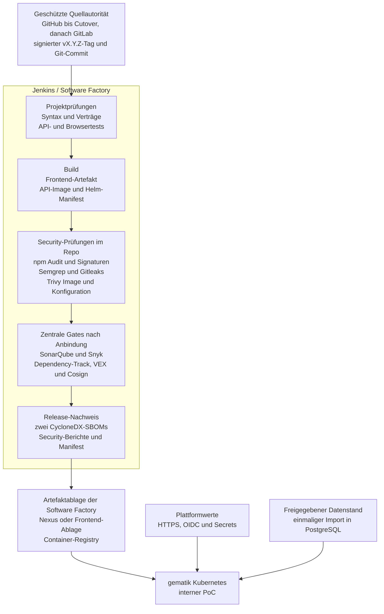

# Deployment des Gematik-PoC auf Kubernetes

Status: technisches Runbook
Stand: 4. August 2026

Die Quellübernahme und der Single-Writer-Cutover stehen im
[GitLab-/Software-Factory-Übergaberunbook](GITLAB_SOFTWARE_FACTORY_UEBERGABE.md).
Die [RC.5-Übergabenotiz](UEBERGABE_RC5_SOFTWARE_FACTORY.md) bleibt
ausschließlich historische Evidenz des damaligen Freeze.

## Ziel

Dieses Runbook beschreibt den frischen Build und die Bereitstellung eines durch
einen signierten `vX.Y.Z`-Tag festgelegten Release Candidates. Software, Daten
und Identitäten bleiben getrennte Schritte.


```mermaid
flowchart TB
  RC["Geschützte Quellautorität<br/>GitHub bis Cutover, danach GitLab<br/>signierter vX.Y.Z-Tag und Git-Commit"]

  subgraph SF["Jenkins / Software Factory"]
    direction TB
    TEST["Projektprüfungen<br/>Syntax und Verträge<br/>API- und Browsertests"]
    BUILD["Build<br/>Frontend-Artefakt<br/>API-Image und Helm-Manifest"]
    LOCAL["Security-Prüfungen im Repo<br/>npm Audit und Signaturen<br/>Semgrep und Gitleaks<br/>Trivy Image und Konfiguration"]
    CENTRAL["Zentrale Gates nach Anbindung<br/>SonarQube und Snyk<br/>Dependency-Track, VEX und Cosign"]
    EVIDENCE["Release-Nachweis<br/>zwei CycloneDX-SBOMs<br/>Security-Berichte und Manifest"]
    TEST --> BUILD --> LOCAL --> CENTRAL --> EVIDENCE
  end

  STORE["Artefaktablage der Software Factory<br/>Nexus oder Frontend-Ablage<br/>Container-Registry"]
  POC["gematik Kubernetes<br/>interner PoC"]
  PLATFORM["Plattformwerte<br/>HTTPS, OIDC und Secrets"]
  DATA["Freigegebener Datenstand<br/>einmaliger Import in PostgreSQL"]

  RC --> TEST
  EVIDENCE --> STORE --> POC
  PLATFORM --> POC
  DATA --> POC
```

GitHub Pages verwendet weiterhin `dist/pages/` und ausschließlich Demo-Daten.

Die Repo-Prüfungen sind bereits ausführbar. Bei einer lokalen Vorprüfung dürfen
noch nicht angebundene zentrale Dienste als `not-run` erscheinen; das ist
niemals eine Target-Deployment-Freigabe. Im geschützten Target-Lauf sind
SonarQube, Snyk, Dependency-Track, Cosign-Bereitschaft und die spätere
digestgebundene Cosign-Attestation verpflichtend. Ein fehlender, nicht
erfolgreicher oder widersprüchlicher Nachweis stoppt fail-closed.

Das zusammenfassende JSON verknüpft die zentralen Analyse-IDs mit Commit, SBOMs und Image. Die geschützte Software-Factory-Pipeline bleibt das maßgebliche Gate und prüft eine Cosign-Signatur selbst kryptografisch.

Nexus ist eine zentrale Ablage und ein kontrollierter Zwischenspeicher für Build-Abhängigkeiten und Artefakte. Es führt die Anwendung nicht aus. Die gematik-IT legt fest, ob das Frontend-Artefakt und die Berichte in Nexus oder einer anderen Software-Factory-Ablage liegen; das API-Image gehört in die Container-Registry.

Die [Software Factory 2.0](https://code.gematik.de/tech/2026/03/09/software-factory-2-0.html) beschreibt dafür folgende zentrale Bausteine:

| Baustein | Aufgabe im PoC |
| --- | --- |
| SonarQube | zentrale Codequalität und dort festgelegte Security-Regeln |
| Snyk | zusätzliche Prüfung von Quellcode und Abhängigkeiten |
| Dependency-Track | laufende Auswertung der beiden SBOMs gegen neue Schwachstellen |
| VEX | begründete Bewertung eines konkreten SBOM-Befunds, falls erforderlich |
| Cosign | Signatur und Bestätigung des veröffentlichten Container-Images |
| Nexus | kontrollierte Quelle und Ablage für Abhängigkeiten und Build-Artefakte |

Eine VEX-Datei wird nicht pauschal erzeugt. Sie ist nur sinnvoll, wenn ein konkreter Befund fachlich und technisch bewertet wurde.

## Führende Artefakte

| Zweck | Pfad |
| --- | --- |
| Jenkins-Pipeline | [`deploy/jenkins/Jenkinsfile.gematik`](../../deploy/jenkins/Jenkinsfile.gematik) |
| Helm-Chart | [`deploy/helm/versorgungs-kompass/`](../../deploy/helm/versorgungs-kompass/) |
| Operative Target-Konfiguration | [`values-target-gematik.yaml`](../../deploy/helm/versorgungs-kompass/values-target-gematik.yaml) |
| Historisches RC.5-/PoC-Overlay | [`values-poc-gematik.yaml`](../../deploy/helm/versorgungs-kompass/values-poc-gematik.yaml) |
| Datenbank und Import | [`deploy/postgres/poc-gematik/`](../../deploy/postgres/poc-gematik/) |
| Target-Buildprofil | [`config/target/`](../../config/target/) |
| Security-Regeln und Nachweisformat | [`config/security/`](../../config/security/) |

## Plattformwerte

Vor dem ersten Lauf werden folgende Werte in Software Factory oder Plattformkonfiguration hinterlegt:

| Wert | Bedeutung |
| --- | --- |
| `ARTIFACT_REGISTRY`, `API_IMAGE_REPOSITORY` | Ablage des API-Images |
| `FRONTEND_BASE_URL`, `API_BASE_URL` | dieselbe interne HTTPS-Adresse; API-Pfad ist `/api` |
| `FRONTEND_BUCKET_URI` | optionales unveränderliches Staging-Ziel; ohne Wert archiviert Jenkins `dist/target/` |
| `K8S_NAMESPACE` | Namespace des PoC |
| `DB_HOST`, `DB_PORT`, `DB_NAME`, `DB_USER` | Verbindung zur PoC-Datenbank |
| `DB_PASSWORD_SECRET_NAME` | Referenz auf das verwaltete Datenbankpasswort |
| `OIDC_ISSUER`, `OIDC_AUDIENCE`, `OIDC_JWKS_URL` | Werte zur Prüfung der Anmeldung |
| `OIDC_EMAIL_CLAIM`, `OIDC_SUBJECT_CLAIM` | standardmäßig `email` und `sub` |
| `PROFILE_IMAGE_BUCKET`, `CONTACT_IMAGE_BUCKET` | optional private Buckets für vorhandene Bilder |
| `CONTACT_NOTE_ATTACHMENT_BUCKET`, `STAKEHOLDER_LOGO_BUCKET` | optional private Buckets für vorhandene Anhänge und Logos |

Die geschützte Software Factory stellt außerdem folgende Bindungen bereit;
sie sind keine Repositorywerte:

| Bindung | Mindestvertrag |
| --- | --- |
| Runner-Label `versorgungs-target-deployer` | dedizierter geschützter Agent, der keine ungeschützten Jobs ausführt und Git/SSH, Docker, Node.js/npm, Helm, `kubectl`, `curl`, `jq`, GPG sowie die freigegebenen Scanner bereitstellt; bei gesetztem `FRONTEND_BUCKET_URI` zusätzlich `gcloud` |
| `versorgungs-target-source-readonly-ssh-key` | nur lesbarer SSH-Deploy-Key für die jeweils autoritative private Quelle; der Jenkins-Agent prüft deren Hostschlüssel fail-closed |
| `versorgungs-target-kubeconfig`, `versorgungs-target-kube-context` | jobgebundene reguläre Kubeconfig-Datei ohne Symlink und expliziter Zielkontext; kein impliziter Standardkontext |
| `versorgungs-target-api-allowed-cidrs-json` | JSON-Liste mit 1 bis 32 eindeutigen realen Gateway-CIDRs; weder `0.0.0.0/0`, `::/0` noch Dokumentationsnetze sind zulässig |
| `versorgungs-oidc-smoke-bearer-token` | kurzlebiges Token einer ausschließlich für die technische Abnahme bestimmten Testidentität |
| `versorgungs-oidc-smoke-profile-id`, `versorgungs-oidc-smoke-role` | erwartete serverseitige Profil- und Rollenbindung des Smoke-Tokens |

Das versionierte Target-Overlay enthält absichtlich nur fail-closed
Dokumentations-CIDRs. Jeder echte Lauf muss sie über die geschützte JSON-
Bindung ersetzen. Die Pipeline validiert alle dynamischen Helm-Skalarwerte und
verwendet `--set-string` beziehungsweise `--set-json`.
Die autoritative Quell-URL wird als SSH-Remote provisioniert; der dedizierte
Runner besitzt dafür eine vorab institutionell bestätigte `known_hosts`-
Konfiguration. `StrictHostKeyChecking=yes` verhindert eine stillschweigende
Hostschlüsselannahme.
Die Tool-Prüfung läuft vor Quell-Gate, Registry-Push und Deployment. Die HTTP-
Smokes verwenden feste Verbindungs- und Gesamtlaufzeitgrenzen, damit ein halb
offener Endpunkt den exklusiven Deploymentjob nicht unbegrenzt blockiert.

Passwörter, Tokens, private Zertifikate, Daten-Snapshots und OIDC-Subjects werden nicht in Git, Frontend-Dateien, Buildmanifesten oder Helm-Werten abgelegt.

## Identity-Gateway-Vertrag vor dem Deployment

Der aktuelle Target-Build unterstützt einen klar abgegrenzten, providerneutralen Adapter: Frontend und `/api` liegen same-origin hinter dem institutionellen Identity-Gateway. Das Frontend verwaltet selbst keine Tokens. Das Gateway entfernt vom Browser eingehende `Authorization`- und Identitätsheader und setzt zur nicht direkt erreichbaren API ausschließlich ein frisch geprüftes, signiertes JWT als `Authorization: Bearer <JWT>`. Issuer, Audience, JWKS sowie E-Mail- und Subject-Claim müssen den API-Laufzeitwerten entsprechen.

Dieser Vertrag muss vor einem Deployment von den Plattformverantwortlichen
bestätigt werden. Ein Cookie-only-Gateway oder eine browserseitige
OAuth-/PKCE-Anmeldung ist mit dem aktuellen Stand nicht abgedeckt und benötigt
einen eigenen Plattformadapter sowie eine neue Patch-Version. Kein neuer
Release Candidate ist ohne vollständigen Quellnachweis und positiven
Authentifizierungs-Smoke deployment-freigegeben.

Der positive Smoke verwendet eine benannte Testidentität und weist nach:

- `GET /api/session` liefert HTTP `200`, `authMode: "oidc"`,
  `enforcement: "server-side"`, ein Capability-Objekt und exakt die geschützt
  vorgegebene Profil-ID und Rolle,
- ein fehlender Token wird mit `302`, `401` oder `403` abgewiesen und
- Tokens und Subjects erscheinen weder in Logs noch in Build- oder Smoke-Artefakten.

Manipulierte Tokens und Header-Stripping sind ein separates Plattform-Abnahmegate. Es weist außerdem nach: Die API kann netzseitig nicht unter Umgehung des Gateways erreicht werden. Ebenso bleiben Frontend-/Login-Fluss,
zweite Rolle, synthetischer CRUD samt Bereinigung und DB-Stichprobe außerhalb
des technischen Jenkins-Smokes blockierend. Ohne das zugehörige
Abnahmeprotokoll ist der Kandidat technisch ausgerollt, aber weder vollständig
`deployed` nach Projektvertrag noch als Release freigegeben.

## 1. Release Candidate festlegen

Ein neuer Release Candidate erhält einen signierten, annotierten Quelltag
`vX.Y.Z`. Der Tag wird nicht verschoben. „Release Candidate“ ist der
GitHub-Prerelease-Status und Bestandteil des Titels, kein Tag-Suffix. Für
`v0.23.0` lautet dieser Titel `0.23.0-0 Release Candidate`; eine Korrektur
erhöht den Patchstand und heißt zum Beispiel `0.23.1 Release Candidate`.

Ein neuer Quelltag wird erst nach Integration der Korrektur und erfolgreichen
Gates auf dem nachgewiesenen autoritativen `main`-Commit erzeugt. Ein
Feature-Branch erhält keinen vorläufigen Release-Tag. Tagobjekt und Zielcommit
werden getrennt verifiziert. Die aktuelle Target-Pipeline akzeptiert keinen
operativen `poc-v…`-Tag.

Der manuell freigegebene Target-Job beginnt auf einem sauberen, frisch
geladenen Checkout des aktuellen geschützten `main` der jeweils führenden
Quellautorität: GitHub bis zum protokollierten Cutover, danach GitLab. Vor dem
Build prüft er den explizit angegebenen Tag gegen den unabhängig bestätigten
öffentlichen Schlüssel und Fingerprint:

```bash
node scripts/verify_target_release_source.mjs \
  --tag "vX.Y.Z" \
  --remote "origin" \
  --expected-repository-url "<autoritative-quell-url>" \
  --public-key-file "<extern-bestaetigter-public-key.asc>" \
  --fingerprint "<vollstaendiger-fingerprint>" \
  --output "<geschuetzter-nachweispfad>/source-tag-verification.json"
```

Der Verifier bindet Remote-URL, aktuellen `main`, Tagobjekt, Zielcommit,
Signatur, Fingerprint und zentrale Produktversion. Die Pipeline baut danach
genau den nachgewiesenen `sourceRevision` in einem frischen Checkout. Ein
lokaler Arbeitsordner, ein GitHub-Quell-ZIP oder ein früheres Pages-/GKE-
Artefakt ist kein zulässiger Build-Eingang.

## 2. Prüfungen vor der Software Factory

Folgende Prüfungen können vorab auf einem Entwicklungsrechner oder in GitHub Actions laufen:

```bash
npm ci
npm run check:target-release
npm run security:audit
npm audit signatures
```

Die containerisierten Semgrep-, Gitleaks- und Trivy-Aufrufe stehen vollständig in der Jenkins-Pipeline und verwenden festgelegte Scanner-Versionen. Sie können mit Docker unverändert vorab ausgeführt werden. Dabei gelten dieselben Sperren wie später: ausgewählte Code- oder Secret-Funde, Analysefehler sowie hohe oder kritische npm-, Image- oder Konfigurationsbefunde stoppen den Lauf.

SonarQube, Snyk und Dependency-Track werden nicht durch handgeschriebene grüne Einträge ersetzt. Nach der Anbindung liefert jedes zentrale Tool eine prüfbare Analyse-ID. Cosign signiert beziehungsweise bestätigt das veröffentlichte Image erst in der Software Factory.

## 3. Frontend und API bauen

```bash
API_BASE_URL="https://<interner-origin>" \
TARGET_AUTH_MODE=oidc \
npm run build:target

node scripts/audit_target_assets.mjs --artifact-root dist/target

PRODUCT_VERSION="$(node -e '
  const fs = require("fs");
  const config = JSON.parse(fs.readFileSync("config/release.json", "utf8"));
  const version = config.productVersion;
  if (!/^(0|[1-9][0-9]*)\.(0|[1-9][0-9]*)\.(0|[1-9][0-9]*)$/.test(version || "")) process.exit(1);
  process.stdout.write(version);
' 2>/dev/null)"
SOURCE_REVISION="$(git rev-parse --verify HEAD)"
SOURCE_URL="<durch-das-quell-gate-normalisierte-autoritative-url>"
docker build \
  --build-arg PRODUCT_VERSION="$PRODUCT_VERSION" \
  --build-arg SOURCE_REVISION="$SOURCE_REVISION" \
  --build-arg SOURCE_URL="$SOURCE_URL" \
  -f api/Dockerfile \
  -t "<registry>/<repository>:v${PRODUCT_VERSION}" \
  .
```

Produktversion, Checkout und freigegebener Tag müssen bereits durch das
Quell-Gate übereinstimmen. Es gibt keinen Versionsfallback und keinen
Legacy-Tag-Fallback. Der historische RC.5 behält seinen damaligen
Quellnachweis; er wird weder rückwirkend verändert noch als Eingang dieser
Pipeline verwendet.

Der providerneutrale OIDC-Frontend-Build benötigt nur den internen HTTPS-Origin. `OIDC_ISSUER`, `OIDC_AUDIENCE` und `OIDC_JWKS_URL` sind geschützte API-Laufzeitwerte und werden nicht in das statische Frontend geschrieben. Google Identity Platform, Firebase-Konfiguration, GCP-Projektwerte und das frühere IAP-Identity-Portal sind kein Bestandteil dieses OIDC-Artefakts. Der getrennte GCP-Pre-Integrationspfad mit `auth-mode=iap` behält sein eigenes Portal und seine eigenen Prüfungen.

Der aktuelle GKE-Stand belegt die getrennte Pre-Integration, ist aber kein
wiederverwendbares Target-Artefakt. Seine IAP-Frontend- und GCP-Image-Digests
werden weder umgetaggt noch in die gematik-Registry promotet. Die Software
Factory baut Frontend und API frisch aus dem verifizierten signierten
`vX.Y.Z`-Tag und erzeugt dafür eigene, gemeinsam nachgewiesene Digests.

### Zweiphasige externe Security-Gates

Nach Build und lokalen Scans stellt die Software Factory ihre Nachweise atomar
und danach unveränderlich unter
`EXTERNAL_SECURITY_EVIDENCE_ROOT/<BUILD_TAG>` bereit. Root, Build-Verzeichnis
und Dateien sind keine Symlinks, liegen außerhalb des Kandidaten-Workspaces und
sind für Jenkins lesbar, aber nicht schreibbar. Das Inventar muss je Phase exakt
passen; jede JSON-Datei ist zwischen 2 Byte und 1 MiB groß. Beim Import
vergleicht Jenkins den Quellhash vor und nach dem Kopieren mit dem Hash der
lokalen Kopie.

Vor dem Registry-Push enthält das Verzeichnis exakt:

- `sonarqube-gate.json`, `snyk-gate.json` und
  `dependency-track-gate.json` mit den Feldern `analysisId`, `buildId`,
  `evaluatedAt`, `imageRepository`, `policyId`, `releaseTag`, `sbomDigests`,
  `sourceRepository`, `sourceRevision`, `status` und `tool`, sowie
- `cosign-attestation-ready.json` mit den Feldern `buildId`,
  `imageRepository`, `releaseTag`, `sbomDigests`, `schemaVersion`,
  `sourceRepository`, `sourceRevision` und `status`. Das Schema lautet
  `versorgungs-kompass-cosign-readiness/v1`.

Alle drei Analyse-Gates müssen `passed`, die Cosign-Bereitschaft muss `ready`
sein. `BUILD_TAG`, Produkt-Tag, normalisierte Quell-URL, Quell-SHA,
Image-Repository und die exakten Digests beider SBOMs müssen mit dem laufenden
Build übereinstimmen. Erst danach und nach der manuellen
Deployment-Freigabe darf Jenkins das API-Image pushen.

Nach dem Push veröffentlicht die Software Factory zusätzlich
`cosign-attestation.json`. Sie enthält dieselben Gatefelder plus `subject`;
`tool` ist `cosign`, `status` ist `passed` und `subject` muss exakt
`<image-repository>@<sha256-digest>` des gerade gepushten Images sein. Jenkins
wartet nur begrenzt auf diese fünfte, unveränderliche Datei und prüft erneut
das exakte Inventar, alle Buildbindungen und beide SBOM-Digests. Erst danach
folgen Helm-Prüfung, zusammengefasster Security-Nachweis, Frontend-Staging und
Deployment.

Fehlt ein Pre-Push-Gate oder stimmt es nicht, erfolgt kein Registry-Push.
Fehlt die Post-Push-Attestation oder bindet sie einen anderen Digest, bleibt
das bereits gepushte Image ausdrücklich unfreigegeben: Es wird nicht in Helm,
Frontend-Nachweis oder Deployment übernommen. Quarantäne oder Bereinigung sind
ein getrennter Vorgang nach der Registry-Aufbewahrungsregel.

Nach erfolgreicher Post-Push-Attestation werden Frontend-Manifest,
Image-Digest, Tag und Commit zusammen festgehalten. Der Datenstand ist bewusst
kein Buildartefakt.

## 4. Datenbank und Datenstand vorbereiten

Der PoC verwendet eine dedizierte PostgreSQL-16-Datenbank. Die API verbindet sich ausschließlich mit ihrer eingeschränkten Laufzeitrolle und führt beim Start weder Schemaänderungen noch einen Datenimport aus.

Das [PoC-Datenbank-Runbook](../../deploy/postgres/poc-gematik/README.md) beschreibt die Reihenfolge:

1. Schema und Laufzeitrolle anlegen,
2. freigegebenen Snapshot des aktuellen geschützten Bestands einmalig importieren,
3. Mengen und Prüfsumme ohne Ausgabe personenbezogener Werte abgleichen,
4. gematik-OIDC-Subjects den vorgesehenen Profilen zuordnen und
5. kurzlebige Adminzugänge wieder entfernen.

Der historische Supabase-zu-GCP-Lauf dokumentiert Datenklassen und Prüfungen, ist aber weder im aktuellen Repository ausführbar noch ein Importverfahren für eine beliebige gematik-Plattform. Der alleinige aktuelle Laufzeitbestand liegt in Cloud SQL und GCS. Der Zieladapter wird deshalb erst nach Kenntnis des Datenbankzugangs und des Objektspeichers festgelegt.

## 5. Helm-Konfiguration prüfen

```bash
helm lint deploy/helm/versorgungs-kompass \
  --values deploy/helm/versorgungs-kompass/values-target-gematik.yaml \
  --set-string image.repository="<registry>/<repository>" \
  --set-string image.digest="sha256:<digest>" \
  --set-json networkPolicy.ingress.apiAllowedCidrs="$TARGET_API_ALLOWED_CIDRS_JSON"

helm template versorgungs-kompass \
  deploy/helm/versorgungs-kompass \
  -f deploy/helm/versorgungs-kompass/values-target-gematik.yaml \
  --namespace "<namespace>" \
  --set-string image.repository="<registry>/<repository>" \
  --set-string image.digest="sha256:<digest>" \
  --set-json networkPolicy.ingress.apiAllowedCidrs="$TARGET_API_ALLOWED_CIDRS_JSON"
```

`TARGET_API_ALLOWED_CIDRS_JSON` muss aus der geschützten Plattformbindung
stammen. Das Beispiel darf mit den versionierten TEST-NET-Platzhaltern nicht
als Zieldeployment verwendet werden. Der Plattformadapter ergänzt interne
Route, TLS, OIDC-Werte und Secret-Referenzen. Das Chart legt keine Datenbank an
und startet keinen Import.

## 6. Bereitstellen

1. Target-Frontend mit dem protokollierten Manifest bereitstellen.
2. API-Image ausschließlich über den protokollierten Digest referenzieren.
3. Helm-Release im vereinbarten Namespace anwenden.
4. Rollout und Containerlogs prüfen.
5. Interne Route für `/` und `/api` aktivieren.

Die Referenzpipeline liegt unter [`deploy/jenkins/Jenkinsfile.gematik`](../../deploy/jenkins/Jenkinsfile.gematik). Namen von Jenkins-Libraries, Credentials und Scannern können an den Plattformstandard angepasst werden.

Helm und `kubectl` erhalten in der Pipeline immer die geschützte Kubeconfig und
den explizit geprüften Kontext. Ein globaler Agent-Kontext oder die lokale
Standardkonfiguration des Runners ist kein zulässiger Deployment-Eingang.

## 7. Smoke-Prüfung

Mindestens geprüft werden:

```text
GET /api/healthz
GET /api/readyz
GET /api/session
```

Zusätzlich:

- internes Frontend und OIDC-Anmeldung funktionieren,
- ein anonymer `/api/session`-Aufruf wird abgewiesen,
- ein authentisierter `/api/session`-Aufruf liefert `authMode: "oidc"`,
  `enforcement: "server-side"`, das erwartete Profil, die erwartete Rolle und
  ein serverseitiges Capability-Objekt,
- Frontend und API verwenden denselben HTTPS-Origin,
- die Anwendung lädt Daten ausschließlich über `/api`,
- eine benannte Lese- und eine Schreibrolle können den vereinbarten Kernablauf nutzen,
- unbekannte oder inaktive Identitäten werden abgewiesen und
- Logs und Nachweise enthalten keine Datensätze, Subjects oder Tokens.

## Release-Nachweis

Für jeden RC werden kompakt festgehalten:

- autoritative Quell-URL (GitHub bis Cutover, danach GitLab) und geschützter
  `main`-SHA,
- vollständiger `vX.Y.Z`-Tag, Tagobjekt-SHA und Zielcommit-SHA,
- Signer-Fingerprint und erfolgreiche Tag-Signaturprüfung,
- Frontend-Manifest und Frontend-Digest,
- API-Image und unveränderlicher Digest,
- Bindungsnachweis zwischen Registry-Digest, lokalem Image, Trivy-Bericht und API-SBOM,
- verwendete Target-Konfiguration,
- Digest des gerenderten Helm-Manifests,
- Schema-Digest und Datenrichtlinie,
- SBOM für API-Image und Frontend,
- `security-evidence.json` mit Status und Hash der Einzelberichte,
- JSON- beziehungsweise SARIF-Berichte von npm, Semgrep, Gitleaks und Trivy,
- Status und Analyse-ID der angebundenen zentralen Gates sowie
- Datum und Ergebnis des Smoke-Tests.

Jenkins archiviert nach dem technischen Smoke einen an Tag, Commit,
Tagobjekt, Image-Digest, Frontend-Manifest und Helm-Manifest gebundenen
`target-deployment-evidence.json`. Dieser Nachweis kennzeichnet die umfassende
betriebliche Abnahme ausdrücklich als ausstehend. Erst das getrennte
Abnahmeprotokoll ergänzt Frontend/Login, manipulierten Token, Netzisolation,
Rollenmatrix, synthetischen CRUD mit Bereinigung und DB-Stichprobe und erlaubt
den Status `deployed`.

Der geschützte Importnachweis nennt separat nur Snapshot-Zeitpunkt,
freigegebene Datenklassen, Mengen, Prüfsumme und Ergebnis. `main`, lokale
Varianten und GitHub Pages können nach dem Tag weiterentwickelt werden;
Änderungen am PoC erfolgen über eine neue Patch-Version mit eigenem signierten
`vX.Y.Z`-Tag.
