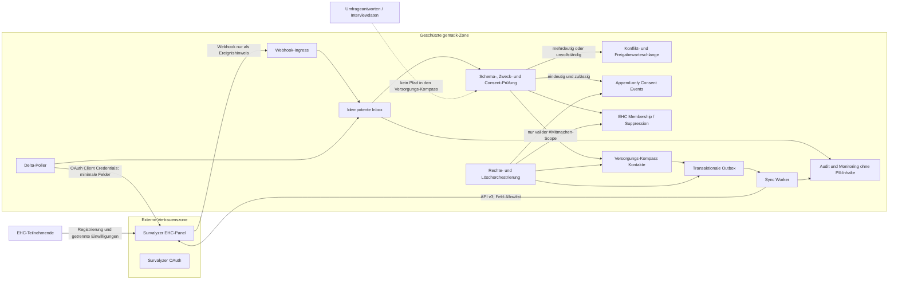

# Survalyzer-Schnittstelle: Datenschutz-, Sicherheits- und Freigabekonzept

**Systeme:** E-Health Community (EHC) in Survalyzer, #Mitmachen und Versorgungs-Kompass

**Stand:** 23. Juli 2026

**Status:** Nicht freigegebener Arbeits- und Prüfstand; Entscheidungsvorlage und Umsetzungsleitfaden, keine abschließende Rechts-, Sicherheits- oder Produktionsfreigabe

> **Prüfhinweis:** Dieses Dokument ist weder ein Freigabebeschluss noch eine Rechtsberatung oder technische Produktionsspezifikation. Annahmen, Quellenstand, Tenant- und Vertragslage sowie alle Freigabegates müssen die zuständigen gematik-Rollen vor jeder Umsetzung mit Echtdaten verifizieren und dokumentiert freigeben.

**Empfehlung:** bedingtes Go für einen eng begrenzten, stufenweisen Aufbau

## 1. Entscheidung in einem Satz

Die Anbindung ist technisch und datenschutzrechtlich vertretbar, wenn sie **nicht als Vollabgleich aller EHC-Daten**, sondern als **zweckgebundene, standardmäßig gesperrte Übernahme nachweislich für #Mitmachen eingewilligter Kontaktdaten** mit getrennten Mitgliedschafts-, Einwilligungs-, Sperr- und Löschzuständen gebaut wird.

Die überzeugende Kernbotschaft für gematik-Mitarbeitende lautet:

> Wir führen keine EHC- und CRM-Datenbestände zu einem neuen Personenprofil zusammen. Wir ersetzen fehleranfällige manuelle Übertragungen durch einen kontrollierten, protokollierten und jederzeit abschaltbaren Prozess, der nur den bereits transparent beschriebenen #Mitmachen-Zweck bedient, Widerrufe schneller durchsetzt und Umfrageantworten technisch ausschließt.

## 2. Freigabeempfehlung

### 2.1 Bedingtes Go

Ein produktiver MVP kann empfohlen werden, wenn alle folgenden Leitplanken verbindlich sind:

1. Survalyzer bleibt führend für EHC-Konto, EHC-Mitgliedschaft, Verifizierung, Panel-Opt-outs, Zustellbarkeit, Befragungen und Prämien.
2. Der Versorgungs-Kompass ist führend für den aktuellen #Mitmachen-Einwilligungsstatus, den Nachweisverlauf und die operative Kontaktpflege.
3. Ein EHC-Mitglied wird nur dann als für #Mitmachen nutzbarer Kontakt übernommen, wenn eine gesonderte, gültige und technisch belegte #Mitmachen-Einwilligung vorliegt.
4. Personen ohne #Mitmachen-Einwilligung werden nicht mit Name, E-Mail-Adresse oder EHC-Profil im allgemeinen Versorgungs-Kompass sichtbar.
5. Umfrageantworten, Freitexte, Interviewlinks, IP-Adressen, Prämienpunkte und personenbezogene Teilnahmehistorien werden nicht in den Versorgungs-Kompass übertragen.
6. Die erste Produktivstufe ist lesend beziehungsweise einseitig: Survalyzer nach Staging und nach kontrollierter Prüfung in den Versorgungs-Kompass.
7. Ausgehende Änderungen und automatische Löschungen werden erst nach bestandener Pilot- und Rechteprozess-Abnahme aktiviert.

### 2.2 Sofortige No-Go-Kriterien

Nicht freigabefähig wäre eine Lösung, die:

- alle EHC-Mitglieder pauschal in #Mitmachen oder in eine für #Mitmachen sichtbare Kontaktliste übernimmt;
- EHC-Mitgliedschaft, EHC-Double-Opt-in, einen nicht gesetzten Haken oder ein EHC-Opt-out als #Mitmachen-Einwilligung beziehungsweise -Widerruf interpretiert;
- einen bloßen Boolean wie `mitmachen=true` ohne Textversion, Zeitpunkt und Herkunft als Einwilligungsnachweis akzeptiert;
- berufliche E-Mail-Adressen ohne ausdrückliche #Mitmachen-Kanaleinwilligung anschreibt;
- personenbezogene Antworten, Freitexte oder persönliche Interviewlinks importiert;
- verknüpfbare Member- oder Interviewdaten als anonym behandelt;
- ein weitreichendes Survalyzer-Konto im Browser oder in allgemeinen Anwendungsprozessen verwendet;
- Löschungen oder Widerrufe durch einen späteren Sync wieder rückgängig machen kann;
- mit ungeprüften Unterauftragsverarbeitern, Transferketten oder eigenständigen Nutzungszwecken des Anbieters arbeitet.

### 2.3 Die vier entscheidenden Freigabegates

| Gate | Nachweis vor Echtdaten | Konsequenz bei Nichterfüllung |
| --- | --- | --- |
| Zweck und Consent | EHC und #Mitmachen sind getrennt modelliert; jeder aktive #Mitmachen-Kontakt hat Zweck, Kanal, Zeitpunkt, Quelle, Textversion/Wortlaut und Widerrufsverlauf | kein Import beziehungsweise nur gesperrtes Staging |
| Least Privilege | eigener M2M-Principal, nachweislich auf Tenant/Workspace/Panel und benötigte Operationen begrenzt oder formal akzeptierte Kompensationsmaßnahmen | kein produktiver API-Schreibzugriff |
| Ereignissicherheit | Webhooks sind nicht alleinige Wahrheit; Inbox, Idempotenz, API-Rückverifikation, Delta-Polling und Reconciliation sind getestet | nur ausgehender, lesender Poll |
| Lieferant und Betrieb | aktueller AVV, TOM, aktive Subprozessoren, Datenregionen, ISO-/Auditnachweise, Incident-SLA, RTO/RPO, Exit und Löschbestätigung sind tenantbezogen belegt | keine Produktivfreigabe |

Das ist ein **bedingtes Go**, kein Vertrauensvorschuss: Öffentlich dokumentierte Anbietermerkmale sind ein Ausgangspunkt. Freigegeben wird die konkrete Verarbeitung im konkreten gematik-Tenant und im tatsächlich unterschriebenen Vertrag.

## 3. Gegenstand und bewusst gesetzte Grenze

### 3.1 In Scope

- berufliche Stammdaten von Leistungserbringern, soweit sie für den erklärten Zweck notwendig sind;
- EHC-Mitgliedschaft als eigener, zugriffsbeschränkter Status;
- gesonderte #Mitmachen-Einwilligungsereignisse einschließlich Nachweis;
- technische Survalyzer-Member-ID und eine zufällige Integrations-ID;
- EHC-bezogene Opt-outs und Hard Bounces als getrennte Zustell- beziehungsweise Sperrinformation;
- Berichtigung, Widerruf, Einschränkung und Löschung über beide Systeme;
- serverseitiger Abgleich über die Survalyzer Public API v3.

### 3.2 Out of Scope für den MVP

- Antworten aus Befragungen;
- offene oder halboffene Freitextantworten;
- persönliche Interview- und Einladungslinks;
- IP-Adressen, Browser- oder Gerätedaten;
- Prämienpunkte, Gutscheine und Transaktionshistorien;
- personenbezogene Teilnahme-, Nichtteilnahme- oder Antwortprofile;
- Patientendaten, Sozialdaten und Daten aus Versorgungsvorgängen;
- besondere Kategorien nach Art. 9 DSGVO;
- KI-Auswertung, Scoring oder automatisierte Priorisierung von Personen;
- automatische Aufnahme bestehender #Mitmachen-Kontakte in die EHC.

Jede spätere Erweiterung um diese Daten ist ein neuer Prüfgegenstand und darf nicht als bloße Änderung des Feldmappings behandelt werden.

### 3.3 Falls auch EHC-only-Kontakte im Versorgungs-Kompass gepflegt werden sollen

Das ist als zweite, strikt getrennte Verarbeitungsspur denkbar, aber nicht Bestandteil des empfohlenen #Mitmachen-MVP. Dafür braucht es:

- einen eigenen Zweckcode `ehc-panelverwaltung`, eine eigene Rechtsgrundlagenentscheidung und eigene Aufbewahrung;
- ein zugriffsbeschränktes EHC-Modul beziehungsweise eine eigene Projektion, nicht die allgemeine #Mitmachen-Kontaktliste;
- eine separate Feld-Allowlist, die nur für Panelverwaltung erforderliche EHC-Stammdaten enthält;
- Transparenz darüber, dass der Versorgungs-Kompass als internes Verwaltungssystem eingesetzt wird;
- getrennte Membership-, Consent-, Opt-out- und Löschregeln;
- den technischen Nachweis, dass EHC-only-Daten weder für #Mitmachen-Selektion noch für allgemeine CRM-Auswertungen verwendet werden.

Damit kann ein EHC-Betriebsnutzen geschaffen werden, ohne die gesonderte #Mitmachen-Einwilligung zu entwerten. Eine Person wird erst durch ein eigenes, gültiges #Mitmachen-Ereignis in die #Mitmachen-Sicht übernommen.

## 4. Warum der Ansatz zur bereits veröffentlichten gematik-Logik passt

Die gematik beschreibt EHC und #Mitmachen öffentlich bereits als getrennte Zwecke:

- Die EHC dient der Registrierung und Teilnahme an qualitativen und quantitativen Befragungen.
- Bei der EHC-Registrierung kann zusätzlich eine **gesonderte, freiwillige #Mitmachen-Einwilligung** erteilt werden.
- Für #Mitmachen werden insbesondere Titel, Name, E-Mail-Adresse sowie gegebenenfalls Berufsgruppe und Leistungserbringerinstitution zur gezielten Einladung verwendet.
- Rechtsgrundlage für #Mitmachen ist Art. 6 Abs. 1 lit. a in Verbindung mit Art. 7 DSGVO; die E-Mail-Ansprache wird zusätzlich auf die ausdrückliche Einwilligung nach § 7 Abs. 2 Nr. 2 UWG gestützt.
- Ein #Mitmachen-Widerruf entfernt die Person aus dem #Mitmachen-Verteiler, lässt den ursprünglichen Zweck – etwa die EHC-Teilnahme – aber unberührt.

Dies ist in den aktuellen [Datenschutzhinweisen für Befragungen und die EHC](https://www.gematik.de/datenschutz/umfrage) sowie im allgemeinen Abschnitt zu [#Mitmachen](https://www.gematik.de/datenschutz) ausdrücklich beschrieben. Die EHC-Teilnahmebedingungen nennen Survalyzer als eingesetzte Software und beschreiben ein eigenes Nutzungsverhältnis für das Panel; maßgeblich bleibt die [aktuelle Fassung der Teilnahmebedingungen](https://e-health-community.gematik.de/media/ehc/251112_Allgemeine_Teilnahmebedingungen_Online-Panel.pdf).

Die Schnittstelle kann diese veröffentlichte Trennung technisch stärken. Sie darf sie nicht verwischen.

## 5. Datenschutzrechtliche Bewertung

### 5.1 Personenbezug und Schutzbedarf

Name, berufliche E-Mail-Adresse, Telefonnummer, Funktion, Berufsgruppe und Einrichtung sind personenbezogene Daten, auch wenn sie im beruflichen Kontext verwendet werden. Sie sind nicht allein deshalb besondere Kategorien nach Art. 9 DSGVO.

EHC-Antworten und Freitexte können dagegen Gesundheitsdaten, politische oder gewerkschaftliche Angaben, Informationen über Patienten oder andere sensible Inhalte enthalten. Auch Member-ID, persönlicher Interviewlink und Prämienbuchung können eine Rückbeziehbarkeit schaffen. Solche Daten sind nicht anonym, solange eine Zuordnung mit vernünftigerweise verfügbaren Mitteln möglich bleibt.

Für den MVP gilt deshalb: **Kontaktsynchronisation ja, Antwortsynchronisation nein.**

### 5.2 Rollen

Voraussichtlich ist die Rollenverteilung:

- **gematik GmbH:** Verantwortliche, weil sie Zwecke und wesentliche Mittel für EHC und #Mitmachen festlegt;
- **Survalyzer:** Auftragsverarbeiter, soweit Survalyzer ausschließlich auf dokumentierte Weisung der gematik handelt;
- **Versorgungs-Kompass:** internes Werkzeug derselben Verantwortlichen, kein eigener datenschutzrechtlicher Empfänger;
- **Hosting-, Betriebs- oder Integrationsdienstleister:** gegebenenfalls weitere Auftragsverarbeiter;
- **externe Projekt- oder Forschungspartner:** gesondert auf eigene oder gemeinsame Verantwortlichkeit prüfen, sofern sie Zwecke oder wesentliche Mittel mitbestimmen.

Die tatsächliche Funktion ist entscheidend, nicht allein die Vertragsbezeichnung. Maßgeblich sind die [EDPB-Leitlinien 07/2020 zu Verantwortlichen und Auftragsverarbeitern](https://www.edpb.europa.eu/documents/guideline/guidelines-072020-on-the-concepts-of-controller-and-processor-in-the-gdpr_de).

Der vorhandene Auftragsverarbeitungsvertrag mit Survalyzer muss darauf geprüft werden, ob der neue API-Abgleich, die betroffenen Datenkategorien, Supportzugriffe und Unterauftragsverarbeiter bereits umfasst sind. Art. 28 DSGVO ist keine eigene Rechtsgrundlage für die Verarbeitung; die Verarbeitung benötigt weiterhin eine Rechtsgrundlage für den jeweiligen Zweck.

### 5.3 Zweck- und Rechtsgrundlagenmatrix

| Verarbeitung | Führender Zweck | Ausgangspunkt der Rechtsgrundlage | Konsequenz für die Schnittstelle |
| --- | --- | --- | --- |
| EHC-Registrierung und Panelverwaltung | Teilnahme an EHC-Befragungen | aktuell laut gematik-Hinweisen Art. 6 Abs. 1 lit. a DSGVO; vertragliche Elemente der Teilnahmebedingungen durch DSB/Legal abgrenzen | keine Nutzung für #Mitmachen ohne gesonderte Einwilligung |
| #Mitmachen-Kontaktpflege | Einladung zu gematik-Beteiligungsformaten | Art. 6 Abs. 1 lit. a und Art. 7 DSGVO | nur mit nachgewiesenem Grant |
| #Mitmachen-E-Mail | Kontaktkanal E-Mail | Art. 6 Abs. 1 lit. a DSGVO und § 7 Abs. 2 Nr. 2 UWG | vorherige ausdrückliche Kanaleinwilligung; Abmeldemöglichkeit |
| Stammdatenberichtigung | Richtigkeit im fortbestehenden EHC- beziehungsweise #Mitmachen-Zweck | akzessorisch zur jeweiligen Hauptverarbeitung | nur bereits berechtigte Datensätze und Felder abgleichen |
| Dubletten- und Integritätsprüfung | Vermeidung falscher Zuordnung | akzessorisch beziehungsweise gesondert zu dokumentieren | keine automatische Zusammenführung bei Mehrdeutigkeit |
| technische Sicherheits- und Auditlogs | sicherer und nachweisbarer Betrieb | gesondert festzulegen, etwa Art. 6 Abs. 1 lit. c oder f DSGVO je nach konkreter Pflicht und Abwägung | keine Inhaltsdaten in Standardlogs; feste Fristen |
| minimaler Widerrufs- oder Löschungsnachweis | Verhinderung unzulässiger Reaktivierung und Anspruchsnachweis | nicht mehr auf die widerrufene Einwilligung stützen; gesonderte Grundlage und Frist festlegen | nur minimale, zweckgebundene Nachweisdaten |

Die [DSGVO](https://eur-lex.europa.eu/legal-content/DE/TXT/?uri=CELEX%3A32016R0679) verlangt insbesondere Zweckbindung, Datenminimierung, Richtigkeit, Speicherbegrenzung, Integrität und Rechenschaftspflicht. Für die E-Mail-Ansprache gilt zusätzlich der [aktuelle § 7 UWG](https://www.gesetze-im-internet.de/uwg_2004/__7.html). Da die gematik selbst die #Mitmachen-E-Mail auf eine Einwilligung stützt, sollte die Schnittstelle keine alternative Rechtsgrundlage konstruieren, um unklare Altfälle zu aktivieren.

### 5.4 Einwilligungsanforderungen

Ein automatisch übernommener #Mitmachen-Grant braucht mindestens:

- eindeutigen Zweckcode, zum Beispiel `mitmachen-beteiligung-v1`;
- Entscheidung `granted`, nicht lediglich ein fehlendes Opt-out;
- erlaubten Kontaktkanal, mindestens E-Mail;
- Ereigniszeitpunkt in UTC;
- Erhebungsquelle und Quellsystem;
- unveränderliche Textversion und vorzugsweise Hash des Wortlauts;
- technische Ereignis-ID;
- Information, ob und worauf sich eine DOI-Bestätigung bezog;
- Zeitpunkt und Scope eines späteren Widerrufs;
- gegebenenfalls Sprache und Formularversion.

Die Einwilligung muss freiwillig, spezifisch, informiert, granular, nachweisbar und leicht widerrufbar sein. Sie darf nicht für die EHC-Teilnahme vorausgewählt oder erzwungen werden. Die [EDPB-Leitlinien 05/2020](https://www.edpb.europa.eu/documents/guideline/guidelines-052020-on-consent-under-regulation-2016679_de) und die [DSK-Orientierungshilfe Direktwerbung](https://www.datenschutzkonferenz-online.de/media/oh/OH-Werbung_Februar%202022_final.pdf) konkretisieren diese Anforderungen.

Wichtig für den Altbestand:

- Ein EHC-Double-Opt-in beweist zunächst die E-Mail-Adresse beziehungsweise EHC-Registrierung.
- Es beweist #Mitmachen nur, wenn der dokumentierte Ablauf die konkrete #Mitmachen-Erklärung nachweisbar umfasst.
- Ein leerer optionaler Haken ist kein ausdrücklicher Widerruf einer möglicherweise an anderer Stelle erteilten Einwilligung.
- Eine unbekannte oder nicht rekonstruierbare Textversion führt zu `clarification_needed` und damit zu **kein Versand**.

### 5.5 Transparenz

Vor Go-live müssen Datenschutzhinweise, Formular und technische Umsetzung übereinstimmen. Die aktuellen Hinweise nennen bereits CRM- beziehungsweise Versanddienstleister als mögliche Auftragsverarbeiter. Ob die Formulierung den konkreten bidirektionalen Abgleich hinreichend transparent erfasst, muss DSB/Legal bestätigen.

Empfohlener zusätzlicher Inhalt der Information:

> Wenn Sie im Rahmen der E-Health Community gesondert in #Mitmachen einwilligen, übernehmen wir die für diesen Zweck erforderlichen Kontaktdaten und den Einwilligungsnachweis in unseren Versorgungs-Kompass. Änderungen der gemeinsam genutzten Stammdaten können zwischen den Systemen abgeglichen werden. Ihre EHC-Mitgliedschaft, Befragungsantworten, persönlichen Interviewlinks und Prämieninformationen werden nicht für #Mitmachen übernommen. Ein Widerruf von #Mitmachen beendet nicht Ihre EHC-Mitgliedschaft.

Dies ist ein Arbeitsmuster und muss vor Verwendung juristisch sowie redaktionell freigegeben werden.

Werden bestehende Versorgungs-Kompass-Kontakte nicht unmittelbar bei der Person für die EHC erhoben, dürfen sie nicht automatisch als EHC-Mitglieder in Survalyzer angelegt werden. Eine solche neue Verarbeitung würde eine eigene Rechtsgrundlage und gegebenenfalls Information nach Art. 14 DSGVO verlangen.

### 5.6 Betroffenenrechte und Widerruf

Ein einheitlicher Eingangskanal bei der gematik muss Prozesse in beiden Systemen auslösen:

| Anliegen | Technische Wirkung |
| --- | --- |
| Auskunft | Daten aus Versorgungs-Kompass, EHC-Mitgliedschaft, Einwilligungsereignissen, Quellen, Empfängern und relevanten Sync-Protokollen zusammenstellen |
| Berichtigung | führendes Feld ändern, Änderung kontrolliert propagieren und Abschluss dokumentieren |
| Einschränkung | Versand und nicht notwendige Weiterverarbeitung sofort sperren; Sync nur noch für die Einschränkungsdurchsetzung |
| #Mitmachen-Widerruf | #Mitmachen sofort auf `withdrawn`, aus Versandselektion entfernen; EHC-Mitgliedschaft unverändert |
| EHC-Austritt | EHC-Mitgliedschaft beenden; separate #Mitmachen-Einwilligung nicht ohne ausdrückliche Erklärung umdeuten |
| Löschung | Scope klären, beide Systeme und Backups/Retention berücksichtigen, Wiederanlage verhindern |
| Datenübertragbarkeit | prüfen, soweit Art. 20 DSGVO für automatisiert und auf Einwilligung oder Vertrag verarbeitete Daten greift |

Ein Survalyzer-Hard-Bounce bedeutet „Kanal derzeit nicht zustellbar“, nicht „Einwilligung widerrufen“. Ein Workspace- oder Account-Opt-out hat den in Survalyzer definierten Scope und darf nicht automatisch einen anderen gematik-Zweck beenden. Ebenso darf `OptOutRemoved` niemals allein eine #Mitmachen-Berechtigung reaktivieren.

### 5.7 Löschung und Aufbewahrung

Es braucht ein verabschiedetes Löschkonzept mit konkreten Fristen und Ereignissen für:

- unbestätigte EHC-Registrierungen;
- aktive und beendete EHC-Konten;
- #Mitmachen-Kontakte und Einwilligungsnachweise;
- Widerrufs- und Sperrkennzeichen;
- Integrations-Inbox, Outbox und Fehlerwarteschlange;
- Konfliktfälle und manuelle Prüfungen;
- Audit- und Sicherheitslogs;
- Backups und Wiederherstellungsstände;
- Daten bei Survalyzer und dessen Unterauftragsverarbeitern.

Survalyzer dokumentiert konfigurierbare Retention und zunächst logische Löschung mit anschließender physischer Löschung nach Frist. Diese Möglichkeit ist eine technische Funktion, aber noch kein gematik-Löschkonzept. Die konkrete Tenant-Konfiguration, Backupwirkung und Vertragszusage sind nachzuweisen. Siehe [Survalyzer Workspace Settings](https://education.survalyzer.com/knowledge-base/workspace-settings/) und [GDPR-Funktionen](https://education.survalyzer.com/knowledge-base/gdpr/).

Eine Löschanforderung darf nicht durch den nächsten Delta-Lauf zur Wiederanlage führen. Dafür ist ein eng begrenztes Löschereignis beziehungsweise ein technischer Tombstone für die externe Member- oder Ereignis-ID erforderlich. Inhalt, Rechtsgrundlage und Dauer dieses Markers müssen ausdrücklich festgelegt werden; eine unbegrenzte Schattenkopie der Kontaktdaten ist nicht zulässig.

Die Survalyzer-API bietet bei `DeleteMembers` die Option `keepInterviews`. Ob Interviews erhalten, gelöscht oder anonymisiert werden, ist eine fachliche und datenschutzrechtliche Entscheidung und darf nicht dem technischen Default überlassen werden.

#### Operativer Rechte- und Löschablauf

1. Anfrage zentral erfassen, Identität angemessen prüfen und den fachlichen Scope klären.
2. Bei Widerruf, Widerspruch oder Einschränkung sofort eine zweck- und kanalbezogene Kommunikationssperre setzen; nicht auf den nächsten Batch warten.
3. Subject-bezogenes Inventar über Kontakt, externe Links, Consent, Membership, Inbox/Outbox, Konflikte, Notizen, Anhänge, Logs und Survalyzer erzeugen.
4. Berichtigungen gemäß Feldhoheit anwenden und ihre Propagierung in beide Richtungen bestätigen.
5. Löschung beziehungsweise Anonymisierung in Survalyzer mit ausdrücklich gesetzter Interviewregel auslösen; Ergebnis oder Provider-Receipt speichern.
6. Klardaten in kurzlebigen Inbox-Payloads, Konfliktkopien, Exporten, Dateien und zulässigerweise entbehrlichen Freitextkopien entfernen.
7. Erforderliche Auditnachweise minimieren oder anonymisieren; keine Kontaktdaten nur „für alle Fälle“ unbegrenzt behalten.
8. Eng begrenzten Suppression-Key beziehungsweise Tombstone mit freigegebener Rechtsgrundlage und Frist setzen, damit der nächste Pull keine Wiederanlage bewirkt.
9. Backup-Ablauf transparent dokumentieren; nach einem Restore Suppressions und Löschereignisse vor Wiederaufnahme des Sync erneut anwenden.
10. Vorgang erst schließen, wenn alle Systemtasks erfolgreich, Teilfehler behoben und Fristen dokumentiert sind.

### 5.8 Drittland und Unterauftragsverarbeitung

Die gematik-Hinweise nennen die Survalyzer AG in Zürich und verweisen auf den Angemessenheitsbeschluss für die Schweiz. Die EU-Kommission hat 2024 bestätigt, dass die Schweiz weiterhin ein angemessenes Datenschutzniveau bietet. Siehe [Bericht der EU-Kommission](https://eur-lex.europa.eu/legal-content/EN/TXT/?uri=CELEX%3A52024DC0007).

Das löst nicht automatisch alle Transferfragen. Zu prüfen sind:

- tatsächlicher Vertragspartner;
- produktives Datenzentrum und Disaster-Recovery-Region;
- Remote-Support aus der Schweiz oder anderen Ländern;
- Unterauftragsverarbeiter für Hosting, E-Mail, SMS, WhatsApp, Adressbereinigung und Support;
- optionale Funktionen wie NeverBounce, Twilio oder KI-Analyse;
- Backups, Telemetrie und Support-Tickets.

Survalyzer veröffentlicht derzeit EU-Hosting in Amsterdam beziehungsweise „West Europe“ und Disaster Recovery in „North Europe“. Die öffentliche [Subprozessorenliste](https://education.survalyzer.com/knowledge-base/subprocessor/) ist mit Stand 22. November 2024 für eine Freigabe im Juli 2026 nicht aktuell genug. Vertragsunterlagen und eine aktuelle, tenantbezogene Liste sind daher Pflicht.

### 5.9 DSFA-Schwellenprüfung

Vor Go-live ist eine dokumentierte Schwellenprüfung nach Art. 35 DSGVO erforderlich. Eine begrenzte Kontaktsynchronisation ohne sensible Daten, Verhaltensauswertung oder automatisierte Entscheidung löst nicht zwingend eine vollständige Datenschutz-Folgenabschätzung aus. Die Entscheidung – auch gegen eine Voll-DSFA – ist zu begründen und zu dokumentieren.

Eine Voll-DSFA wird deutlich wahrscheinlicher bei:

- Zusammenführung sämtlicher EHC- und CRM-Profile;
- personenbezogener Teilnahmehistorie oder detaillierter Segmentierung;
- Import von Antworten oder Freitexten;
- besonderen Kategorien;
- Profiling, Scoring oder automatisierter Priorisierung;
- systematischer Auswertung von Verhalten;
- neuer Rückbeziehbarkeit bislang getrennter Befragungsdaten.

Die DSK beschreibt die Schwellenprüfung, die vorherige Durchführung, Wirksamkeitstests und die Pflicht zur Fortschreibung im [Kurzpapier Nr. 5 zur DSFA](https://www.datenschutzkonferenz-online.de/media/kp/dsk_kpnr_5.pdf). Verbleibt ein hohes Risiko, ist Art. 36 DSGVO zu beachten.

### 5.10 Beschäftigtendaten und Mitbestimmung

Owner-Zuordnungen, Bearbeiter-IDs, Konfliktentscheidungen und Auditlogs betreffen auch gematik-Beschäftigte. Sie dürfen nur für Betrieb, Nachvollziehbarkeit, Datenschutz und Sicherheit verwendet werden, nicht ohne gesonderte Prüfung für Leistungs- oder Verhaltensbewertung.

Zu beachten sind [§ 26 BDSG](https://www.gesetze-im-internet.de/bdsg_2018/__26.html) und gegebenenfalls die Mitbestimmung bei technischen Einrichtungen nach [§ 87 Abs. 1 Nr. 6 BetrVG](https://www.gesetze-im-internet.de/betrvg/BJNR000130972.html). Der Betriebsrat sollte frühzeitig einbezogen werden, falls bestehende Vereinbarungen die Anwendung, Protokollierung oder Auswertung erfassen.

### 5.11 TDDDG und Endgerätezugriff

Der hier empfohlene Connector arbeitet ausschließlich serverseitig. Er speichert durch den Datenaustausch selbst keine Informationen auf Endgeräten der Teilnehmenden und liest dort keine Informationen aus. Deshalb ist [§ 25 TDDDG](https://www.gesetze-im-internet.de/ttdsg/__25.html) grundsätzlich **kein eigener Erlaubnistatbestand für die Server-zu-Server-Schnittstelle**.

Davon getrennt zu prüfen bleiben Änderungen an der öffentlichen EHC- oder #Mitmachen-Oberfläche, insbesondere Cookies, Local Storage, Tracking, eingebettete Drittanbieter-Skripte und neue Client-SDKs. Die Schnittstelle darf nicht zum Anlass genommen werden, solche Endgerätezugriffe ungeprüft zu ergänzen.

### 5.12 Rechts- und Nachweismatrix

| Vorgabe | Relevanz für die Schnittstelle | Erwarteter Freigabenachweis |
| --- | --- | --- |
| Art. 5 DSGVO | Zweckbindung, Datenminimierung, Richtigkeit, Speicherbegrenzung, Sicherheit und Rechenschaft | freigegebene Zweck-/Feld-/Retention-Matrix und Testevidenz |
| Art. 6, 7 DSGVO | Rechtsgrundlage und Nachweis der gesonderten #Mitmachen-Einwilligung | versionierter Wortlaut, Grant-/Widerrufsereignisse, DOI-Scope |
| Art. 12–22 DSGVO | Information, Auskunft, Berichtigung, Löschung, Einschränkung, Übertragbarkeit und Widerspruch | End-to-End-Runbook mit Fristen, Verantwortlichen und Provider-Receipts |
| Art. 25 DSGVO | Datenschutz durch Technikgestaltung und datenschutzfreundliche Voreinstellungen | Default deny, zweistufiger Abruf, Feld-Allowlist, getrennte Sichten |
| Art. 28 DSGVO | Auftragsverarbeitung und Unterauftragskette | aktueller AVV mit konkreter Anlage, TOM, Weisungs- und Auditregeln |
| Art. 30 DSGVO | Verzeichnis von Verarbeitungstätigkeiten | aktualisierter VVT-Eintrag für beide Verarbeitungsspuren |
| Art. 32 DSGVO | dem Risiko angemessene technische und organisatorische Maßnahmen | Schutzbedarfsanalyse, Threat Model, IAM-, Verschlüsselungs-, Logging-, Backup- und Testnachweise |
| Art. 33, 34 DSGVO | Behandlung von Datenschutzverletzungen | 24/7 Incidentweg, Bewertung, Meldung, Kommunikation und Provider-SLA |
| Art. 35, 36 DSGVO | DSFA und gegebenenfalls vorherige Konsultation | dokumentierte Schwellenprüfung beziehungsweise freigegebene DSFA |
| Art. 44–49 DSGVO | Drittlandübermittlungen | Datenregionen, aktive Support-/Subprozessorpfade, Angemessenheit oder Transferinstrumente |
| § 7 Abs. 2 Nr. 2 UWG | E-Mail-Kontakt für #Mitmachen | ausdrückliche Kanaleinwilligung und einfache Abmeldung |
| § 26 BDSG, § 87 BetrVG | Owner-, Bearbeiter- und Auditdaten von Beschäftigten | Zweck-/Zugriffs-/Auswertungskonzept und gegebenenfalls Betriebsratsbeteiligung |

Die Matrix ist keine abstrakte Gesetzessammlung: Für jede Zeile muss im Freigabepaket ein konkretes, prüfbares Artefakt liegen.

## 6. Zulässiger Datenaustausch

### 6.1 Feldmatrix für den MVP

| Datenfeld oder Zustand | Führendes System | Richtung | MVP-Regel |
| --- | --- | --- | --- |
| zufällige Integrations-ID | Connector | beide | opaque UUID, keine E-Mail und möglichst nicht die interne Kontakt-ID |
| Survalyzer Tenant, Panel-ID, Member-ID | Survalyzer | nach Mapping | nur im geschützten Integrationsschema |
| Titel, Vorname, Nachname | Survalyzer bei Registrierung; später feldbezogene Regel | nach VK, später gegebenenfalls zurück | nur bei gültiger #Mitmachen-Einwilligung oder in streng getrenntem EHC-Modul |
| E-Mail-Adresse | feldbezogene Regel, EHC-Self-Service hat hohe Priorität | kontrolliert bidirektional | nie als technische Identität; Konflikte prüfen |
| Telefonnummer | Versorgungs-Kompass, sofern separat erhoben | standardmäßig nicht zu Survalyzer | nur bei nachgewiesener Erforderlichkeit und Transparenz |
| Berufsgruppe, LEI/Einrichtung, Bundesland | Survalyzer bei EHC; VK als relationales Zielmodell | nach VK | nur soweit vom #Mitmachen-Text umfasst und für Segmentierung erforderlich |
| Altersgruppe, Berufsdauer, Voll-/Teilzeit | Survalyzer | keine Übernahme | aktuelle #Mitmachen-Beschreibung nennt diese Felder nicht als Regelfall |
| #Mitmachen-Einwilligungsereignis | Quelle des Ereignisses, zentraler Ledger im VK | nach VK | Grant nur mit vollständigem Nachweis |
| EHC-Mitgliedschaft und Verifizierung | Survalyzer | nach getrenntem Membership-Modul | nicht als Kontakt- oder Einwilligungsstatus verwenden |
| EHC-Opt-out | Survalyzer | nach scoped Suppression | beendet nur den dokumentierten Survalyzer-Scope |
| Hard Bounce | Survalyzer | nach Zustellstatus | keine rechtliche Umdeutung |
| Owner, Priorität, interne Notizen, Bilder | Versorgungs-Kompass | keine Übertragung | vollständig intern |
| persönliche Interviewlinks, Antworten, Freitexte | Survalyzer | keine Übertragung | technisch blockiert |
| Punkte, Gutscheine, Transaktionen | Survalyzer | keine Übertragung | außerhalb #Mitmachen |

### 6.2 Datenminimierter zweistufiger Abruf

Der Connector sollte nicht für jede Änderung sofort den vollständigen Member-Datensatz abrufen:

1. **Discovery-Lauf:** nur Member-ID, `updatedAt`, Membership-/Sperrstatus und #Mitmachen-Einwilligungsfelder lesen.
2. **Detail-Lauf:** Name, E-Mail, Berufsgruppe und Einrichtung nur für neue oder geänderte Member mit validem #Mitmachen-Grant beziehungsweise bereits zulässigem Link lesen.

Survalyzer v3 unterstützt bei `ReadMemberList` eine Feldliste, Paging und `interviewsRequired=false`. Die produktive Allowlist darf keinen Interview- oder Freitextpfad enthalten. Offizielle Referenzen sind die [v3-Swagger-Dokumentation](https://api.survalyzer-eu.app/swagger), die [Codebeispiele](https://developer.survalyzer.com/knowledge-base/code-examples/) und [Filtering & Paging](https://developer.survalyzer.com/knowledge-base/filtering-paging/).

## 7. Technisches Zielbild

### 7.1 Architekturprinzipien

- Der Browser spricht nie direkt mit Survalyzer.
- API-Secret und Token befinden sich ausschließlich im Secret Manager beziehungsweise im Workload-Kontext des Connectors.
- Der Connector ist ein eigener technischer Principal mit eigener Datenbankrolle und minimalen Rechten.
- Ein Fachdaten-Write und sein Outbox-Eintrag erfolgen in derselben Datenbanktransaktion.
- Eingehende Ereignisse werden zuerst dauerhaft und idempotent gespeichert, dann asynchron verarbeitet.
- Fachliche Konflikte überschreiben keine Daten.
- Webhooks beschleunigen den Abgleich, ersetzen aber nicht Polling und Reconciliation.
- Ein Kill Switch kann ausgehende Writes und eingehende Anwendung getrennt stoppen, ohne Auditdaten zu verlieren.

## 8. Erforderliche Erweiterungen im Versorgungs-Kompass

### 8.1 Wiederverwendbare Kontrollen

Die vorhandene Architektur bringt gute Voraussetzungen mit:

- geschützte Realanwendung mit same-origin `/api`;
- signaturgeprüfte OIDC-/IAP-Identitäten;
- fail-closed Route-Policy;
- serverseitige Rollenprüfung;
- stabile Kontakt-IDs und Dublettenprüfung;
- strukturiertes #Mitmachen-Statusmodell;
- transaktionale Fachoperationen und Aktivitätsereignisse;
- Preview-/Apply-Muster für kontrollierte Imports;
- synthetische Testdaten und bewusste Trennung zur öffentlichen Demo.

Siehe insbesondere:

- `dokumentation/architektur/API_CONTRACT.md`
- `dokumentation/architektur/DATA_MODEL.md`
- `api/security-policy.mjs`
- `api/server.mjs`
- `deploy/postgres/pre-gematik/README.md`
- `deploy/postgres/pre-gematik/schema.sql`

Die Codeprüfung bestätigt unter anderem eine zentrale fail-closed Rollenmatrix in [`api/security-policy.mjs`](../../api/security-policy.mjs), signaturgeprüfte OIDC-/IAP-Identitäten, parametrisierte SQL-Operationen, Größen- und Feld-Allowlisten sowie datensparsame Request-Logs ohne Body und Token in [`api/request-log-privacy.mjs`](../../api/request-log-privacy.mjs). Produktive direkte PostgreSQL-Verbindungen verlangen `verify-full`; Container- und Kubernetes-Vorlagen sehen Non-Root, Read-only Root-FS, Capability-Drop und NetworkPolicy vor.

Diese vorhandenen Kontrollen reduzieren den Implementierungsaufwand. Sie ersetzen aber weder die eigene M2M-Vertrauensgrenze noch ein zweckbezogenes Integrations- und Consent-Modell.

### 8.2 Kritische Lücken

Im Repository gibt es derzeit keinen Survalyzer-Connector, keine Anbieter-Credentials, Feldabbildung, Webhook-Verarbeitung, Cursor oder Integrationstests. Die bestehende Migrationsdokumentation grenzt eine laufende Synchronisation bislang ausdrücklich aus. Außerdem bezeichnet die vorhandene [`PRE_GEMATIK_ECHTDATEN_PILOT_ENTSCHEIDUNG.md`](../betrieb-und-deployment/PRE_GEMATIK_ECHTDATEN_PILOT_ENTSCHEIDUNG.md) den aktuellen Echtdatenbetrieb als persönlichen Vor-gematik-Pilot und nicht als institutionelle Datenschutz-, Informationssicherheits- oder Betriebsfreigabe. Wiederverwendbar sind daher Kontrollen und Codebausteine, nicht eine bereits erteilte Freigabe.

Vor einer Survalyzer-Anbindung fehlen:

1. externe ID-Zuordnung und Sync-Zustand;
2. eigene EHC-Mitgliedschaft statt Überladung von `contacts.status`;
3. append-only Einwilligungsereignisse;
4. technischer Service-Actor statt erzwungenem menschlichem `recorded_by`;
5. Inbox, Outbox, Retry, Dead Letter und Reconciliation;
6. Konfliktmodell und fachliche Prüfoberfläche;
7. getrennte Suppressions für Zweck und Kanal;
8. Lösch-/Einschränkungsorchestrierung;
9. inkrementelle Connector-API beziehungsweise Worker-Zugriff;
10. strukturierte Vor- und Nachnamen;
11. feldbezogene Rechte für EHC-only-Daten;
12. getrennte DB-Rollen für Ingest, Delivery und Rechteprozesse; die heutige Runtime-Rolle besitzt fachlich zu breite CRUD-Rechte;
13. eine eingeschränkte EHC-Projektion; der allgemeine Kontakt-DTO enthält heute auch E-Mail, Telefon, Notiz und Consent-Nachweisfelder;
14. Survalyzer-Secrets, Workload Identity und zielbezogenes Egress; aktuell ist ausgehendes HTTPS nicht auf Anbieterziele beschränkt;
15. einen subject-bezogenen Auskunfts- und Löschprozess; der bestehende Gesamtexport ist kein Betroffenenrechte-Werkzeug;
16. Restore- und BCM-Regeln für Cursor, Outbox, Tombstones und bereits zugestellte Änderungen.

Besonders wichtig: Das aktive Zielschema verlangt für `granted` derzeit Zeitpunkt, Quelle und erfassende Person, aber nicht zwingend die vorhandene `mitmachen_consent_text_version`. Zudem werden Consent-Felder im aktuellen API-Update bewusst nicht als alte/neue Einzelwerte in `changes` geschrieben; das Aktivitätsereignis enthält nur die Liste geänderter Felder. Für einen importierten, revisionssicher nachvollziehbaren Einwilligungsverlauf reicht das nicht aus.

Die relevanten Stellen liegen insbesondere im Kontaktschema in [`deploy/postgres/pre-gematik/schema.sql`](../../deploy/postgres/pre-gematik/schema.sql) ab Zeile 138, in der Consent-Validierung ab Zeile 190 sowie in der Kontaktaktualisierung in [`api/server.mjs`](../../api/server.mjs) ab Zeile 7791. Die heutige Kontaktliste besitzt außerdem weder Paging noch `updated_since`; ein Connector sollte daher nicht über die allgemeinen Browser-CRUD-Endpunkte gebaut werden.

### 8.3 Rollen- und Prozessgrenze

Der Sync-Worker darf nicht als künstliches menschliches `editor`-Profil auftreten. Empfohlen sind:

- `vk_sync_ingest`: nur Inbox, Run-Zustände und technische Provider-Metadaten;
- `vk_domain_apply`: ausschließlich freigegebene Domain-Funktionen und Feld-Allowlist;
- `vk_outbox_delivery`: Outbox claimen und Zustellstatus schreiben, keine freie Kontaktmutation;
- `vk_privacy_orchestrator`: nur geprüfte Sperr-, Lösch- und Anonymisierungsfunktionen;
- append-only Consent- und Auditobjekte ohne UPDATE/DELETE-Recht für normale Runtime-Prozesse.

Ein kompromittierter Connector darf dadurch weder allgemeine CRM-Daten lesen noch Einwilligungs- oder Auditverläufe nachträglich verändern.

### 8.4 Neue Datenobjekte

Empfohlen werden mindestens:

#### `integration_subject_links`

- `id`
- `integration_subject_id` als zufällige UUID
- `provider` = `survalyzer`
- `tenant`
- `panel_id`
- `member_id`
- optional `contact_id`
- `last_external_updated_at`
- `last_seen_hash`
- `last_synced_at`
- `sync_state`
- eindeutige Constraints für beide Richtungen

#### `ehc_memberships`

- `integration_subject_link_id`
- `membership_status`
- `verified_at`
- `withdrawn_at`
- `last_source_event_at`
- keine Interviewantworten

#### `consent_texts`

- `purpose_code`
- `text_version`
- `language`
- `valid_from`
- `text_sha256`
- freigegebener Wortlaut oder unveränderliche Dokumentreferenz

#### `consent_events`

- `id`
- `contact_id`
- `purpose_code`
- `channel`
- `decision` = `granted`, `withdrawn`, `declined`, `clarification_needed`
- `occurred_at`
- `source_system`
- `source_event_id`
- `text_version`
- `text_sha256`
- `doi_confirmed_at`
- `scope`
- `recorded_actor_type`
- `recorded_actor_id`
- `received_at`
- append-only; der aktuelle Kontaktstatus wird daraus abgeleitet

#### `channel_suppressions`

- `contact_id` beziehungsweise Integration-Link
- `channel`
- `scope` = EHC Workspace, EHC Account, #Mitmachen oder globaler technischer Kanal
- `reason` = hard bounce, spam complaint, explicit opt-out, restriction
- `effective_at`
- `source_event_id`
- `cleared_at`

#### `integration_inbox`, `integration_outbox`, `integration_conflicts`, `integration_runs`

Diese Tabellen halten Event-ID, Payload-Hash, minimale verschlüsselte Nutzdaten, Versuchszähler, nächsten Versuch, Status, Fehlerklasse, Korrelations-ID und Prüfentscheidung. Rohpayloads haben eine kurze, genehmigte Frist; Dauerlogs enthalten keine Namen oder E-Mail-Adressen.

## 9. Synchronisationsregeln

### 9.1 Technische Identität

Die E-Mail-Adresse ist kein Schlüssel. Sie kann sich ändern, fehlerhaft sein oder in mehreren Kontexten vorkommen.

Verwendet werden:

- Survalyzer-Schlüssel `(tenant, panel_id, member_id)`;
- zufällige, semantisch leere `integration_subject_id`;
- lokale `contact_id` ausschließlich in der geschützten Mappingtabelle.

Ein Survalyzer-Custom-Feld kann die zufällige Integrations-ID tragen. Es sollte nicht zwingend die interne Kontakt-ID offenlegen.

### 9.2 Upsert

1. Mapping über externe Member-ID oder Integrations-ID suchen.
2. Bei eindeutigem Link aktualisieren.
3. Ohne Link kontrollierte Dublettenprüfung durchführen.
4. Eindeutigen Treffer nur nach festgelegten Regeln verknüpfen.
5. Mehrdeutige E-Mail-, Namens- oder Organisationsübereinstimmung in die Konfliktwarteschlange stellen.
6. Ohne gültigen #Mitmachen-Nachweis keinen aktiven Kontakt erzeugen.
7. Keine automatische Zusammenführung allein anhand der E-Mail-Adresse.

### 9.3 Konflikte

- Nur eine Seite seit dem letzten Sync geändert: Änderung übernehmen, wenn die Feldhoheit passt.
- Unterschiedliche Felder geändert: zusammenführen, sofern keine Zweck- oder Sperrregel entgegensteht.
- Dasselbe Feld auf beiden Seiten geändert: manuelle Prüfung.
- Consent, Widerruf, Einschränkung und Löschung: niemals normales „Last write wins“.
- Ereignisse außerhalb der Reihenfolge: Quellzeit, Ereignis-ID und bisherige Consent-Historie auswerten.

### 9.4 Delta und Reconciliation

Survalyzer unterstützt Filter auf `CreatedAt` und `UpdatedAt` sowie Paging. Empfohlen:

- Delta-Poll alle 30 bis 60 Minuten mit überlappendem Zeitfenster;
- Cursor erst nach dauerhafter Verarbeitung fortschreiben;
- täglicher ID- und Status-Vollabgleich;
- regelmäßige stichprobenartige Feld-Reconciliation;
- Alarm bei Count-Abweichung, altem Cursor, Fehlerwarteschlange oder FUP-Nähe.

Die Standard-Fair-Use-Grenze ist öffentlich mit 500 API-Aufrufen und 500 MB empfangenen Daten pro Tenant und Tag angegeben. Sie ist in der Planung zu berücksichtigen und vertraglich zu bestätigen. Siehe [Survalyzer Fair Use Policy](https://developer.survalyzer.com/fair-use-policy/).

## 10. API- und Webhook-Sicherheit

### 10.1 Ausgehende API-Zugriffe

Survalyzer dokumentiert OAuth und einen Client-Credentials-Flow mit **Account-Rechten**; Access Tokens sind 30 Minuten gültig. Das ist funktional geeignet, aber aus Least-Privilege-Sicht ein wesentlicher Prüfpunkt. Siehe [Survalyzer Authentication](https://developer.survalyzer.com/knowledge-base/authentication/).

Mindestanforderungen:

- dedizierte M2M-Credentials für die Integration;
- wenn möglich eigener technischer Account oder auf EHC-Workspace/Panel und Operationen begrenzter Scope;
- keine Wiederverwendung eines menschlichen Admin-Kontos;
- Secret nur über Workload Identity und Secret Manager;
- Rotation nach gematik-Richtlinie sowie sofort bei Verdacht, Personal- oder Anbieterwechsel;
- Egress-Allowlist für Auth- und API-Endpunkte des bestätigten Datenzentrums;
- TLS-Zertifikatsprüfung;
- harte Tenant-, Workspace- und Panel-Allowlist im Code und in der Konfiguration;
- nur die benötigten Endpunkte;
- Batchgrößen, Timeout und Retry begrenzen;
- keine Token oder Payloads in Logs.

Die Integration nutzt ausschließlich Public API v3. V1 und v2 sind laut Anbieter seit Ende 2024 abgekündigt.

### 10.2 Eingehende Webhooks

Survalyzer dokumentiert nicht nur Bearer- oder Basic-Authentisierung, sondern auch „Security by obscurity“ beziehungsweise Secrets in URLs. Diese Varianten sind für den gematik-Betrieb nicht gleichwertig:

- kein Geheimnis in Pfad oder Query;
- kein Basic Auth, wenn ein stärkerer Mechanismus verfügbar ist;
- mindestens hochentropischer Bearer im Header, getrennt vom API-Secret;
- idealerweise zusätzlich mTLS, Body-Signatur mit Zeitstempel oder vertraglich bestätigte Source-IP-Allowlist.

Die öffentliche Dokumentation beschreibt keine kryptografische Body-Signatur mit Replay-Zeitstempel. Deshalb gilt ein Webhook zunächst nur als **untrusted event hint**:

1. TLS, Token, Methode, Content Type, Größenlimit und Rate Limit prüfen.
2. Tenant/Panel/Eventtyp gegen Allowlist prüfen.
3. Payload-Hash und Ereigniskennung deduplizieren.
4. schnell `2xx` antworten und asynchron verarbeiten.
5. Kritische Statusänderungen gegebenenfalls per authentisiertem API-Read verifizieren.
6. Regelmäßiges Polling als Vollständigkeitsschutz beibehalten.

Survalyzer versucht fehlgeschlagene Webhooks laut Dokumentation nur fünfmal und gibt danach auf. Siehe [Survalyzer Webhooks](https://developer.survalyzer.com/knowledge-base/webhooks/). Webhooks allein sind daher keine belastbare Zustellgarantie.

## 11. Informationssicherheit aus gematik-IT-Sicht

### 11.1 Schutzbedarfs- und Lieferantenprüfung

Vor Beschaffung beziehungsweise Erweiterung ist eine dokumentierte Datenkategorisierung, Schutzbedarfsfeststellung und Risikoanalyse durchzuführen. Der [BSI-Mindeststandard zur Nutzung externer Cloud-Dienste](https://www.bsi.bund.de/DE/Themen/Oeffentliche-Verwaltung/Mindeststandards/Externe_Cloud-Dienste/Externe_Cloud-Dienste.html) und der C5-Kriterienkatalog können als Prüfraster dienen, auch wenn ihre konkrete Verbindlichkeit für die gematik intern festzulegen ist.

Ein veröffentlichtes ISO-27001-Zertifikat des Anbieters ist ein positives Signal, aber kein Ersatz für:

- aktuelle Gültigkeit und Zertifizierungsumfang;
- Statement of Applicability;
- tenantbezogene Architektur und Verantwortungsabgrenzung;
- Penetrationstest- beziehungsweise Auditnachweise;
- Subprozessor- und Transferprüfung;
- konkrete Lösch-, Incident- und Wiederherstellungszusagen.

### 11.2 Öffentlich belegte Herstellerlage und verbleibende Freigabelücke

Die folgende Bewertung trennt bewusst zwischen **öffentlich belegter Plattforminformation** und **tenantbezogenem Freigabenachweis**. Stand ist der 23. Juli 2026.

| Bereich | Öffentlich belegter Stand | Was die gematik noch nachweisen lassen muss |
| --- | --- | --- |
| ISO 27001 | Das veröffentlichte [TÜV-SÜD-Zertifikat](https://survalyzer.atlassian.net/wiki/rest/api/content/1023901753/child/attachment/att1025212494/download) nennt ISO/IEC 27001:2022, Survalyzer AG, Scope Entwicklung, Betrieb und Vertrieb der Survey-Software sowie eine Gültigkeit vom 11.03.2024 bis 10.03.2027; die SoA ist dort als Version 1.3 vom 01.11.2023 bezeichnet. Die [Compliance-Seite](https://survalyzer.atlassian.net/wiki/spaces/Compliance/pages/1023901753/Certification+and+Public+Security+and+Compliance+Assessments) verlinkt weitere Nachweise. | aktuelle SoA, letzter Surveillance-Bericht, Scope-Abdeckung von EU Public API, Auth, Webhooks und Support sowie Status offener Abweichungen |
| Datenregion | Für EU-Kunden nennt Survalyzer Amsterdam beziehungsweise Azure West Europe als Primärregion und North Europe als DR-Region; für die Schweiz Switzerland North/West. Ohne ausdrückliche Zustimmung sollen keine Kundendaten in regionsunabhängige Dienste oder andere Regionen übertragen werden. Siehe [Data Center](https://education.survalyzer.com/knowledge-base/data-center/). | schriftliche Bestätigung des konkreten EHC-Tenants, Backup-/Telemetrie-/Supportpfade und technische Deaktivierung nicht freigegebener Regionen |
| Verschlüsselung und Überwachung | Die öffentliche [Security Policy, Version 1.6](https://files.survalyzer.com/dl/1VtTBlYM9q) beschreibt unter anderem tenantbezogene SQL-Datenbanken, TDE, AES-256 für Blob Storage, mindestens TLS 1.2, Key Vault und Azure Sentinel. | aktuelle TOM-Anlage, tatsächliche Tenant-Isolation für Blob-Daten, Maskierung von Request/Response-Logs, Schlüssel- und privilegierte Zugriffsprozesse sowie aktive WAF-/DDoS-Stufe |
| API-Rechte | `client_credentials` ist als „Machine to Machine, Account rights“ mit 30 Minuten Access-Token dokumentiert. Öffentliche, granulare Read-/Write-/Panel-Scopes sind nicht belegt. Siehe [Authentication](https://developer.survalyzer.com/knowledge-base/authentication/). | separater Service Principal mit nachgewiesenem Panel-/Workspace-/Methodenscope; andernfalls dokumentierte CISO-/DSB-Risikoakzeptanz und starke Kompensationsmaßnahmen |
| Webhooks | Öffentlich dokumentiert sind unerratbare URL, Basic, statischer Bearer oder URL-Security-Key; nach fünf Fehlversuchen wird nicht weiter zugestellt. Eine Body-HMAC mit Timestamp/Nonce ist öffentlich nicht beschrieben. Siehe [Webhooks](https://developer.survalyzer.com/knowledge-base/webhooks/). | verbindliche Aussage zu Signatur, Replay-Schutz, Source IPs, Event-ID, Reihenfolge, Rotation und Audit; unabhängig davon Polling/Reconciliation |
| Aufbewahrung | Account- und Workspace-Einstellungen unterstützen Retention; gelöschte Objekte bleiben zunächst logisch in der Datenbank und werden nach konfigurierter Frist physisch entfernt. Siehe [Account Management](https://education.survalyzer.com/knowledge-base/account-management/) und [Workspace Settings](https://education.survalyzer.com/knowledge-base/workspace-settings/). | konkrete EHC-Konfiguration, Löschfristen je Datenklasse, Wirkung auf Interviews/Logs/Backups und maschinenlesbare Löschbestätigung |
| Unterauftragsverarbeiter | Die öffentliche Liste nennt unter anderem Microsoft, Survalyzer NL/CH, AWS Frankfurt sowie optionale HORISEN-, Twilio- und NeverBounce-Dienste. Ihr Stand 22.11.2024 ist für eine Freigabe 2026 zu alt. | aktuelle tenantbezogene Aktivliste, Länder, Zwecke, Supportzugriffe, Transferinstrumente, Änderungsvorlauf und bestätigte Deaktivierung nicht benötigter Dienste |
| Benutzerzugang | MFA ist vorhanden, laut [Account Management](https://education.survalyzer.com/knowledge-base/account-management/) jedoch standardmäßig aus und von der jeweiligen Konfiguration abhängig; SSO ist lizenzabhängig. | tenantweite Erzwingung von SSO/MFA, Umgang mit lokalem Login-Fallback, Adminrezertifizierung, JIT/PAM und Break-glass-Prozess |
| SLA und Recovery | Öffentlich auffindbare Aussagen sind nicht als konkreter gematik-Vertrag belastbar. Das [Extended-SLA-Muster vom 17.03.2026](https://survalyzer.atlassian.net/wiki/rest/api/content/1025048633/child/attachment/att2138701827/download) nennt 99 Prozent, Messung pro Kalenderjahr, bis zu vier Stunden angekündigte Wartung pro Monat und zwölf Stunden Recovery für Severity 1. | tatsächlich unterschriebenes, widerspruchsfreies SLA für API, Auth und Webhooks; 24/7 Security-/Privacy-Kanal, verbindliche RTO/RPO, Restore-Nachweis, Update-Takt, RCA und Exit |

Die Herstellerlage spricht damit **für die Prüfbarkeit**, nicht für eine automatische Freigabe. Die größten technischen Restfragen sind der Blast Radius der accountweiten API-Rechte, die schwache öffentlich dokumentierte Webhook-Authentisierung sowie die fehlende öffentliche Evidenz für tenantbezogene Audit-, Recovery- und Incident-Zusagen.

### 11.3 STRIDE-orientiertes Risikobild

| Bedrohung | Beispiel | Erforderliche Kontrolle |
| --- | --- | --- |
| Spoofing | gefälschter Webhook oder gestohlenes API-Secret | getrennte Credentials, Header-Authentisierung, Rotation, API-Rückverifikation |
| Tampering | manipulierte Member-, Consent- oder Löschdaten | TLS, Schema-Allowlist, Hash, append-only Events, Out-of-order-Prüfung |
| Repudiation | unklar, wer Consent importiert oder Konflikt entschieden hat | Service-Actor, Korrelations-ID, unveränderliches Audit, Vier-Augen-Prüfung bei kritischen Fällen |
| Information Disclosure | E-Mail oder Umfrageinhalt in Logs/DLQ | PII-freie Logs, Verschlüsselung, kurze Payload-Retention, Feld-Allowlist |
| Denial of Service | Webhook-Flood, API-FUP, Survalyzer-Ausfall | Rate Limit, Queue, Backoff, Circuit Breaker, Call-Budget, degradierter Betrieb |
| Elevation of Privilege | Account-weites M2M-Token missbraucht | eigener Principal, minimaler Scope, egress- und panelbezogene Policy, Secret-Zugriff nur für Workload |

### 11.4 Protokollierung

Zu protokollieren sind:

- Korrelations-ID;
- Quelle, Ziel, Operation und technische Objekt-ID;
- Regel- beziehungsweise Mapping-Version;
- Ergebnis, Fehlerklasse und Retry;
- Consent-Ereignis-ID ohne Einwilligungswortlaut im Standardlog;
- manuelle Freigabe mit berechtigtem Actor;
- Cursor- und Reconciliation-Stand.

Nicht in Standardlogs gehören Name, E-Mail, Telefonnummer, Antworten, Access Token, Client Secret oder vollständige Webhook-Payloads. Zugriffe auf Auditdaten sind selbst zu protokollieren. Das BSI beschreibt restriktive Zugriffe, Integrität und bei erhöhtem Schutzbedarf verschlüsselte beziehungsweise signierte Protokollierung im Baustein [OPS.1.1.5 Protokollierung](https://www.bsi.bund.de/SharedDocs/Downloads/DE/BSI/Grundschutz/IT-GS-Kompendium/Archiv/Kompendium_Einzel_PDFs_2020/04_OPS_Betrieb/OPS_1_1_5_Protokollierung_Edition_2020.pdf?__blob=publicationFile&v=1).

### 11.5 Betrieb und Notfall

Erforderliche Runbooks:

- API- oder Survalyzer-Ausfall;
- überalterter Sync-Cursor;
- steigende Dead-Letter-Queue;
- falsche Massenänderung;
- vermuteter Secret-Abfluss;
- Datenschutzverletzung;
- Widerruf oder Löschung hängt fest;
- Survalyzer-Tenant- oder Panelwechsel;
- Abschalten und Wiederanlauf;
- Vertragsende und Datenrückgabe/-löschung.

Der Auftragsverarbeiter muss Datenschutzverletzungen ohne unangemessene Verzögerung melden. Vertraglich sollte eine operative Frist vereinbart werden, die der gematik noch Bewertung und gegebenenfalls Meldung innerhalb der gesetzlichen Fristen ermöglicht.

Der Versorgungs-Kompass muss bei einem Survalyzer-Ausfall fachlich weiter lesbar und bearbeitbar bleiben; der Anbieterstatus gehört nicht in die Readiness der Fach-API. Inbox und Outbox wachsen begrenzt und alarmiert, jede Richtung besitzt einen eigenen Kill Switch. Nach einem Restore werden Zustellbelege, Cursor und Lösch-Tombstones reconciliiert, bevor der Versand wieder startet, damit weder Doppelsendungen noch die Reaktivierung gelöschter Kontakte entstehen.

## 12. Lieferanten-Due-Diligence: an Survalyzer zu stellen

### 12.1 Datenschutz und Vertrag

1. Welche Gesellschaft ist Vertragspartner und Auftragsverarbeiter, und welche AVV-, TOM- und SLA-Version ist für die gematik tatsächlich unterschrieben?
2. Deckt der AVV API-Synchronisation, Kontaktmanagement, Support, Betroffenenrechte und alle Datenkategorien mit konkreter Anlage zu Art, Zweck, Betroffenen und Fristen ab?
3. Sind eigene Nutzungszwecke, Produktverbesserung, Telemetrie oder KI-Training mit Kundendaten vollständig ausgeschlossen?
4. Welche aktuelle und tatsächlich aktive Subprozessorenliste gilt für genau den EHC-Tenant, einschließlich Funktion, Datenkategorie, Region und Supportzugriff?
5. Wie werden Änderungen angekündigt und welche Einspruchsrechte bestehen?
6. Welche Länder können Hosting, Support, Backup, E-Mail-Versand und Fehleranalyse berühren?
7. Sind AWS-Mailversand, NeverBounce, Twilio, HORISEN, KI-Funktionen und Drittanbieter-Skripte im EHC-Tenant aktiv, und wie wird ihre Deaktivierung technisch sowie vertraglich belegt?
8. Wie unterstützt Survalyzer Auskunft, Berichtigung, Einschränkung, Löschung und Export?
9. Was wird bei `DeleteMembers` mit `keepInterviews=true/false`, Logs und Backups genau gelöscht?
10. Welche maximale Frist gilt für aktive Daten, Soft Deletes und Backups, und wie wird die vollständige Löschung nach Vertragsende oder Einzelanfrage bestätigt?
11. Darf Survalyzer besondere Kategorien oder Patientendaten im Integrationsscope technisch und vertraglich ausschließen?
12. Welche Transferinstrumente und Transfer-Folgenabschätzungen gelten für jeden nicht im EWR verarbeiteten Teilprozess?

### 12.2 Informationssicherheit

1. Aktuelles ISO/IEC-27001-Zertifikat, Scope, Gültigkeit, SoA und letzter Surveillance-Bericht?
2. C5-, SOC- oder vergleichbarer Prüfbericht verfügbar?
3. Management Summary des letzten unabhängigen Penetrationstests, Scope, Datum und Remediationstatus aller High/Critical Findings?
4. Verschlüsselung at rest und in transit, Schlüsselverwaltung und Tenant-Isolation?
5. RTO, RPO, Backupfristen, Restore-Tests und Disaster-Recovery-Region?
6. Incident- und Breach-SLA mit 24/7-Kontakt, maximaler Erstmeldefrist, Update-Takt, RCA und forensischer Unterstützung?
7. Auditlogs für API-, Admin-, Support- und Datenexportzugriffe: Inhalt, Maskierung, Integrität, Retention und SIEM-Export?
8. Können SSO und MFA tenantweit erzwungen sowie ein lokaler Login-Fallback deaktiviert oder separat abgesichert werden?
9. Wie werden privilegierte Supportzugriffe durch JIT/PAM, MFA, Vier-Augen-Prinzip, Rezertifizierung und Break-glass kontrolliert?
10. Welche WAF- und DDoS-Stufe ist für den EHC-Tenant tatsächlich aktiv, und umfasst sie Auth-, Public-API- und Webhook-Endpunkte?
11. Welche Patch- und Vulnerability-SLAs gelten je Kritikalität, und werden SBOM beziehungsweise Dependency-Scanning eingesetzt?
12. Wie häufig werden Restore und Disaster Recovery getestet, und wann war der letzte erfolgreiche Test mit welchem Ergebnis?

### 12.3 API

1. Kann Client Credentials auf Tenant, Workspace, Panel und konkrete Read-/Write-Operationen beschränkt werden, und welche Token-Claims beweisen dies?
2. Gibt es IP-Allowlisting oder mTLS für die API?
3. Gibt es Body-Signaturen, Timestamp und Replay-Schutz für Webhooks?
4. Welche stabilen Source IPs haben Webhooks?
5. Wie werden Secrets rotiert, ohne Ereignisverlust zu erzeugen?
6. Welche Batch-, Paging-, Timeout-, Rate- und Tagesgrenzen gelten vertraglich?
7. Welche Idempotenzgarantien bestehen bei `CreateMembers` und `UpdateMembers`?
8. Wie behandeln Updates ausgelassene Felder, `null` und leere Strings?
9. Welche Versionierungs- und Abkündigungsfristen gelten, gibt es mindestens zwölf Monate Parallelbetrieb und einen maschinenlesbaren Changelog?
10. Gibt es einen getrennten Testtenant mit synthetischen Daten?
11. Welche API-Auditdaten stehen kundenseitig bereit, und lassen sie Credential, Operation, Objekt-ID, Zeitpunkt und Ergebnis ohne Payload-PII nachvollziehen?
12. Können Credentials sofort widerrufen und ohne Ausfall überlappend rotiert werden?

### 12.4 SLA, BCM und Exit

1. Deckt das SLA ausdrücklich Runtime, EU Public API, Authentisierung und Webhooks ab?
2. Wie werden Verfügbarkeit und Wartung gemessen, welche Komponenten und Ausschlüsse gelten, und welches Rechtsmittel besteht bei Unterschreitung?
3. Welche 24/7 Response-, Recovery-, RTO- und RPO-Werte gelten für Security/Privacy sowie Severity 1?
4. Wie werden verlorene Webhook-Ereignisse erkannt und nachgeliefert?
5. Welcher strukturierte Export steht bei Vertragsende vollständig und ohne proprietäre Bindung bereit?
6. Welche Übergangsfrist, Unterstützungsleistung, Löschfrist für aktive Daten und Backups sowie Löschbestätigung gelten beim Exit?

## 13. Vorgehensmodell mit Freigabegates

### Phase 0 – Mandat und Scope

**Ergebnisse**

- Product Owner für EHC und #Mitmachen benennen;
- Ziel und Nicht-Ziele schriftlich festhalten;
- Umfang auf Kontakte und Consent-Nachweis begrenzen;
- keine Antwort- oder Freitextdaten;
- RACI und Entscheidungsweg festlegen.

**Gate 0**

- Fachbereich, Datenschutz, Informationssicherheit und Architektur bestätigen den Scope.

### Phase 1 – Ist-Aufnahme

**Aufgaben**

- konkreten Survalyzer-Tenant, Workspace, Panel, Lizenz und Datenzentrum feststellen;
- Panel-Schema und alle Custom-Felder exportieren;
- live verwendete EHC- und #Mitmachen-Texte samt Versionen sichern;
- DOI-Ablauf dokumentieren;
- Opt-out-Scope und Self-Service prüfen;
- Volumen und Änderungsrate ermitteln;
- bestehende Verträge und Betriebsdokumente zusammentragen.

**Nur lesende API-Aufrufe**

- `ReadWorkspaceList`
- `ReadPanelList`
- `ReadPanel`
- minimiertes `ReadMemberList`
- `ReadOptOutList`
- `ReadBounceList`
- `ReadWebHookList`

**Gate 1**

- Keine produktiven Writes.
- Einwilligungsnachweis ist technisch nachvollziehbar.
- Alle unbekannten Felder und Transferwege sind klassifiziert.

### Phase 2 – Datenschutz- und Sicherheitsdesign

**Artefakte**

- Verzeichnis der Verarbeitungstätigkeiten aktualisieren;
- Zweck-/Rechtsgrundlagen-/Feldmatrix;
- Datenfluss- und Trust-Boundary-Diagramm;
- AVV-/Subprozessor-/Transferprüfung;
- TOM-Matrix;
- DSFA-Schwellenprüfung, gegebenenfalls Voll-DSFA;
- Lösch- und Aufbewahrungskonzept;
- Betroffenenrechte-Runbook;
- Beschäftigtendaten- und Mitbestimmungsprüfung;
- aktualisierte Datenschutzhinweise und Einwilligungstexte.

**Gate 2**

- DSB, Legal, ISB, Architektur und Vendor Management erteilen dokumentierte Freigabe beziehungsweise benennen erfüllbare Auflagen.

### Phase 3 – Technischer PoC mit synthetischen Daten

**Aufgaben**

- Connector und Testtenant;
- M2M-Authentisierung;
- Mapping, Inbox, Outbox, Cursor und Audit;
- Consent-Validator;
- Fehlersimulationen;
- keine echten Kontakte.

**Gate 3**

- Secrets nicht im Code, Artefakt oder Log;
- falscher Tenant/Panel wird geblockt;
- Replay und Dublette sind idempotent;
- Payload-Allowlist verhindert Antworten/Freitext;
- Kill Switch funktioniert.

### Phase 4 – Read-only-Pilot

**Aufgaben**

- initialen Import ausschließlich in Staging;
- Preview mit Mengen, Dubletten, unbekannten Versionen und fehlenden Nachweisen;
- zufällige Stichprobe gegen Survalyzer;
- keine automatische Aktivierung.

**Gate 4**

- 100 Prozent der aktivierbaren Kontakte besitzen vollständigen Nachweis;
- unklare Fälle sind gesperrt;
- keine EHC-only-Person ist für allgemeine #Mitmachen-Nutzer sichtbar;
- keine nicht erlaubte Datenkategorie wurde übernommen.

### Phase 5 – Kontrollierter Inbound-MVP

**Aufgaben**

- neue Grants und Stammdatenänderungen übernehmen;
- Konflikte manuell prüfen;
- EHC-Status und Suppression getrennt führen;
- Delta-Poll und täglichen Vollabgleich betreiben.

**Gate 5**

- Widerruf, Einschränkung, EHC-Austritt und Hard Bounce wirken jeweils korrekt;
- Fehlerevents werden alarmiert;
- Fach- und Datenschutz-Owner bestätigen Pilotbericht.

### Phase 6 – Selektiver Outbound

**Aufgaben**

- nur notwendige Korrekturen bereits aktiver EHC-Mitglieder zurückschreiben;
- Outbox, Retry und Konfliktprüfung;
- keine automatische EHC-Neuanlage aus dem CRM;
- keine internen CRM-Felder exportieren.

**Gate 6**

- Teilfehler, Timeouts und Paralleländerungen getestet;
- kein Loop und kein stilles Überschreiben;
- Datenabgleich vollständig rekonstruierbar.

### Phase 7 – Webhooks und Optimierung

Webhooks erst als Beschleuniger ergänzen. Polling und Reconciliation bleiben bestehen.

**Gate 7**

- Authentisierung, Replay-Schutz beziehungsweise API-Rückverifikation, Rate Limit und Retry-Test bestanden;
- dokumentierter Umgang mit den begrenzten Survalyzer-Retries.

### Phase 8 – Produktivfreigabe und Regelbetrieb

**Pflichtnachweise**

- keine offenen P0- oder P1-Befunde; verbleibende niedrigere Risiken haben Owner, Frist und formale Akzeptanz;
- unterschriebener Gate-Bericht;
- vollständige Testevidenz;
- offener-Risiken-Liste mit Owner und Termin;
- Runbooks, On-Call und Eskalationsweg;
- aktueller AVV und Lieferantennachweise;
- freigegebene Datenschutztexte;
- Restore-, Lösch- und Rechteprozesstest;
- bestandene Negativmatrix für API-, Datenbank- und Benutzerrechte;
- nachgewiesene Secret-Rotation und funktionierender Kill Switch je Richtung;
- Change-/Release-Freigabe.

## 14. Abnahmefälle

### 14.1 Datenschutz und Fachlichkeit

1. Gültiger Grant mit Textversion wird übernommen.
2. Grant ohne Textversion wird nicht aktiviert.
3. EHC-Anmeldung ohne #Mitmachen bleibt unsichtbar für #Mitmachen.
4. Nicht gesetzter optionaler Haken überschreibt keinen älteren Grant.
5. Expliziter #Mitmachen-Widerruf stoppt Versand sofort, EHC bleibt aktiv.
6. EHC-Austritt beendet nur EHC.
7. Hard Bounce sperrt E-Mail, ändert Consent nicht.
8. `OptOutRemoved` reaktiviert Consent nicht.
9. Spätere ausdrückliche Re-Einwilligung wird als neues Ereignis verarbeitet.
10. Auskunft, Berichtigung, Einschränkung und Löschung funktionieren systemübergreifend.
11. Gelöschter Datensatz wird nicht ungewollt wieder angelegt.
12. Interviewantworten und Freitexte fehlen nachweislich in Datenbank, Queue, Export und Logs.

### 14.2 Sicherheit

1. Falsches oder abgelaufenes API-Token.
2. Falscher Tenant, Workspace oder Panel.
3. Gefälschter, wiederholter, zu großer oder formal ungültiger Webhook.
4. Secret-Rotation während laufender Synchronisation.
5. Rechteüberschreitung des Connector-DB-Users.
6. Netzwerkzugriff auf nicht erlaubte Ziele.
7. Survalyzer-Timeout, Rate Limit und Teilfehler im Batch.
8. Manipulierte Zeitstempel und Ereignisse außerhalb der Reihenfolge.
9. PII-Scan der Anwendungs-, Infrastruktur- und Fehlerlogs.
10. Zugriff auf Auditdaten durch unberechtigte Nutzer.

### 14.3 Betrieb und Resilienz

1. Polling-Ausfall und nachträgliches Aufholen.
2. Webhook-Ausfall über alle fünf Anbieter-Retries hinaus.
3. Dead-Letter-Reprocessing.
4. täglicher Count- und ID-Abgleich.
5. Connector-Kill-Switch.
6. Backup-Restore ohne Wiederbelebung gelöschter oder widerrufener Zustände.
7. Vertragsende und vollständige Datenlöschung.

## 15. Vorläufige Risikomatrix

| Risiko | Ohne Maßnahmen | Zentrale Maßnahme | Freigaberest |
| --- | --- | --- | --- |
| Zweckvermischung EHC/#Mitmachen | kritisch | getrennte Entitäten, Default deny, Consent-Ledger und RBAC | niedrig bis mittel |
| unzureichender Einwilligungsnachweis | kritisch | Textversion, Hash, Ereigniszeit, Quelle, DOI-Scope | niedrig |
| Übernahme von Antworten/Freitext | kritisch | API-Feld-Allowlist, eigener Test, keine Interview-Endpunkte | niedrig |
| falsche Person verknüpft | hoch | externe ID, keine E-Mail als Schlüssel, manuelle Konflikte | mittel |
| Widerruf oder Löschung wird rückgängig | kritisch | append-only Event, Outbox, Tombstone, Reconciliation-Test | niedrig bis mittel |
| Account-weites API-Secret | hoch | dedizierter Principal, Vendor-Scope, Secret Manager, Egress-/Panel-Policy | mittel |
| gefälschter oder verlorener Webhook | hoch | Bearer, Inbox, API-Rückverifikation, Polling | niedrig bis mittel |
| ungeprüfte Subprozessoren/Transfers | hoch | AVV, aktuelle Liste, Feature-Deaktivierung, Vertragsgate | niedrig bis mittel |
| PII in Logs oder DLQ | hoch | PII-freie Logs, Verschlüsselung, kurze Retention, Zugriffskontrolle | niedrig |
| Mitarbeiterüberwachung durch Auditdaten | mittel | Zweckbindung, Rollen, Auswertungsverbot, Betriebsrat | niedrig |
| Anbieter- oder API-Ausfall | mittel | Queue, Backoff, Reconciliation, Runbook, SLA | niedrig bis mittel |
| unklare SLA-/Recovery-Zusagen | hoch | unterzeichnetes komponentenbezogenes SLA, RTO/RPO, Restore- und Incident-Nachweis | niedrig bis mittel |

Restrisiken sind durch die jeweils zuständigen Owner zu akzeptieren, nicht allein durch das Entwicklungsteam.

## 16. Governance und RACI

| Rolle | Verantwortung |
| --- | --- |
| EHC Product Owner | Panelprozess, EHC-Felder, Membership- und Opt-out-Semantik |
| #Mitmachen Product Owner | Zweck, Kanäle, Selektionsregeln und Consent-Wortlaut |
| Datenschutzbeauftragte/r | Rechtsgrundlagen, Transparenz, DSFA, Rechte- und Löschprozess |
| Legal | Einwilligung/UWG, AVV, Drittland, Haftung und Vertragsänderung |
| Informationssicherheitsbeauftragte/r | Schutzbedarf, Threat Model, TOM und Restrisiko |
| IT-Architektur | Zielarchitektur, Trust Boundaries und Integrationsstandards |
| Betrieb/SRE | Secrets, Monitoring, Incident, Backup, Restore und Runbooks |
| Vendor Management/Einkauf | Lizenz, SLA, Nachweise, Subprozessoren und Auditrecht |
| Betriebsrat | Beschäftigtendaten und technische Überwachung, soweit einschlägig |
| Fachliche Datenverantwortliche | Dubletten, Konflikte und Feldhoheit |
| Entwicklung/QA | Implementierung und reproduzierbare Testevidenz |
| Change Authority | formale Produktivfreigabe |

## 17. Argumentationshilfe für interne Entscheider

### „Warum brauchen wir überhaupt eine Schnittstelle?“

Eine kontrollierte Schnittstelle reduziert manuelle Exporte, doppelte Pflege und verzögerte Widerrufe. Der Nutzen ist nicht „mehr Daten“, sondern bessere Datenqualität, schnellere Sperrwirkung und ein nachvollziehbarer Nachweis.

### „Entsteht damit ein zentraler Datenpool?“

Nicht im empfohlenen Modell. EHC-only-Profile und Umfrageinhalte bleiben in Survalyzer. Im Versorgungs-Kompass landet nur der für #Mitmachen legitimierte Ausschnitt; technische Mappingdaten liegen in einem getrennten Integrationsschema.

### „Dürfen wir berufliche Kontaktdaten nicht ohnehin verwenden?“

Berufliche Kontaktdaten bleiben personenbezogen. Zudem stützt die gematik die #Mitmachen-E-Mail selbst auf eine ausdrückliche Einwilligung nach DSGVO und UWG. Die Schnittstelle setzt diese bestehende Entscheidung um.

### „Warum keine vollständige bidirektionale Synchronisation?“

Weil Symmetrie fachlich falsch wäre. EHC-Mitgliedschaft, Befragung, Consent, Zustellbarkeit, CRM-Priorität und interne Notizen sind unterschiedliche Sachverhalte mit unterschiedlichen Verantwortlichkeiten. Feldhoheit und zweckbezogene Richtungen sind sicherer und leichter prüfbar.

### „Reicht ISO 27001 bei Survalyzer nicht aus?“

Ein Zertifikat belegt einen ISMS-Rahmen im zertifizierten Scope. Es beantwortet nicht automatisch Tenant-Konfiguration, API-Berechtigung, Löschwirkung, Supportländer, Subprozessoren oder Incident-SLA. Diese Punkte müssen tenant- und vertragsbezogen geprüft werden.

### „Warum zusätzlich Polling, wenn es Webhooks gibt?“

Survalyzer stellt Webhook-Zustellung nach fünf erfolglosen Retries ein. Außerdem ist in der öffentlichen Dokumentation keine Body-Signatur mit Replay-Timestamp beschrieben. Polling und Reconciliation stellen Vollständigkeit und Verifikation sicher.

### „Ist das nicht zu aufwendig?“

Der Aufwand konzentriert sich auf Kontrollen, die bei personenbezogenen Kontakten ohnehin benötigt werden: Einwilligungsnachweis, Löschung, Rollen, Audit und Lieferantensteuerung. Ein enges, einseitiges MVP verhindert, dass alle Risiken gleichzeitig gelöst werden müssen.

## 18. Empfohlener Entscheidungstext

> Die gematik gibt die Entwicklung eines begrenzten Survalyzer-Connector-Piloten frei. Der Pilot verarbeitet ausschließlich synthetische Daten und danach eine kleine, nachweislich für #Mitmachen eingewilligte Teilmenge. Survalyzer bleibt führend für EHC-Mitgliedschaft und Befragungen; der Versorgungs-Kompass verwaltet #Mitmachen-Kontakte und Einwilligungsnachweise. EHC-only-Profile, Antworten, Freitexte, Interviewlinks und Incentive-Daten sind ausgeschlossen. Produktive Schreibzugriffe, Webhooks und automatische Löschungen werden jeweils erst nach den dokumentierten Datenschutz-, Informationssicherheits-, Vertrags- und Abnahmegates aktiviert.

## 19. Konkrete nächste Schritte

1. EHC- und #Mitmachen-Owner zu einem 90-minütigen Scope-Workshop einladen.
2. Survalyzer-Tenant, Panel-Schema, Lizenz und aktuelle Vertragsunterlagen beschaffen.
3. tatsächlichen #Mitmachen-Wortlaut, Textversionen und DOI-Ablauf aus Survalyzer exportieren.
4. eine Feldmatrix mit „Zweck, Rechtsgrundlage, Quelle, Ziel, Sichtbarkeit, Retention“ freigeben.
5. Survalyzer-Fragenkatalog aus Abschnitt 12 versenden.
6. DSB-Schwellenprüfung und ISB-Schutzbedarfsanalyse starten.
7. technische Spezifikation für Mapping, Membership, Consent Events, Inbox/Outbox und Service-Actor erstellen.
8. PoC ausschließlich mit synthetischen Daten aufsetzen.
9. Read-only-Preview des echten Bestands mit Mengen- und Nachweisbericht durchführen.
10. erst danach über den eingeschränkten Inbound-MVP entscheiden.

## 20. Quellen und Nachweisstand

### Recht und Aufsicht

- [DSGVO, amtlicher Text](https://eur-lex.europa.eu/legal-content/DE/TXT/?uri=CELEX%3A32016R0679)
- [§ 7 UWG](https://www.gesetze-im-internet.de/uwg_2004/__7.html)
- [§ 25 TDDDG](https://www.gesetze-im-internet.de/ttdsg/__25.html)
- [§ 26 BDSG](https://www.gesetze-im-internet.de/bdsg_2018/__26.html)
- [§ 87 BetrVG](https://www.gesetze-im-internet.de/betrvg/BJNR000130972.html)
- [EDPB Guidelines 05/2020 – Einwilligung](https://www.edpb.europa.eu/documents/guideline/guidelines-052020-on-consent-under-regulation-2016679_de)
- [EDPB Guidelines 07/2020 – Verantwortliche und Auftragsverarbeiter](https://www.edpb.europa.eu/documents/guideline/guidelines-072020-on-the-concepts-of-controller-and-processor-in-the-gdpr_de)
- [EDPB Opinion 22/2024 – Pflichten in Auftragsverarbeiterketten](https://www.edpb.europa.eu/documents/opinion-of-the-board-art-64/opinion-222024-on-certain-obligations-following-from-the_de)
- [DSK Orientierungshilfe Direktwerbung](https://www.datenschutzkonferenz-online.de/media/oh/OH-Werbung_Februar%202022_final.pdf)
- [DSK Kurzpapier Nr. 5 – Datenschutz-Folgenabschätzung](https://www.datenschutzkonferenz-online.de/media/kp/dsk_kpnr_5.pdf)
- [EU-Kommission – Fortgeltende Angemessenheit der Schweiz](https://eur-lex.europa.eu/legal-content/EN/TXT/?uri=CELEX%3A52024DC0007)
- [BSI-Mindeststandard externe Cloud-Dienste](https://www.bsi.bund.de/DE/Themen/Oeffentliche-Verwaltung/Mindeststandards/Externe_Cloud-Dienste/Externe_Cloud-Dienste.html)

### gematik

- [Allgemeine Datenschutzhinweise und #Mitmachen](https://www.gematik.de/datenschutz)
- [Datenschutzhinweise Befragungen und EHC](https://www.gematik.de/datenschutz/umfrage)
- [E-Health Community](https://e-health-community.gematik.de/)
- [EHC-Teilnahmebedingungen, Version 2.0 vom 12.11.2025](https://e-health-community.gematik.de/media/ehc/251112_Allgemeine_Teilnahmebedingungen_Online-Panel.pdf)

### Survalyzer

- [Public API v3 EU](https://api.survalyzer-eu.app/swagger)
- [Authentifizierung](https://developer.survalyzer.com/knowledge-base/authentication/)
- [Codebeispiele](https://developer.survalyzer.com/knowledge-base/code-examples/)
- [Filtering und Paging](https://developer.survalyzer.com/knowledge-base/filtering-paging/)
- [Webhooks](https://developer.survalyzer.com/knowledge-base/webhooks/)
- [Fair Use Policy](https://developer.survalyzer.com/fair-use-policy/)
- [Datenzentrum](https://education.survalyzer.com/knowledge-base/data-center/)
- [Subprozessoren](https://education.survalyzer.com/knowledge-base/subprocessor/)
- [Account Management, MFA und Retention](https://education.survalyzer.com/knowledge-base/account-management/)
- [Workspace Settings und Retention](https://education.survalyzer.com/knowledge-base/workspace-settings/)
- [Panel Synchronization](https://education.survalyzer.com/knowledge-base/panel-synchronization/)
- [Preise und Funktionsumfang](https://survalyzer.com/pricing/)
- [Certification and Public Security and Compliance Assessments](https://survalyzer.atlassian.net/wiki/spaces/Compliance/pages/1023901753/Certification+and+Public+Security+and+Compliance+Assessments)
- [ISO/IEC-27001:2022-Zertifikat](https://survalyzer.atlassian.net/wiki/rest/api/content/1023901753/child/attachment/att1025212494/download)
- [Security Policy, Version 1.6](https://files.survalyzer.com/dl/1VtTBlYM9q)
- [Extended-SLA-Muster vom 17.03.2026](https://survalyzer.atlassian.net/wiki/rest/api/content/1025048633/child/attachment/att2138701827/download)

## 21. Grenzen dieser Prüfung

Nicht eingesehen wurden:

- der konkrete gematik-Survalyzer-Vertrag und AVV;
- nicht öffentliche TOM, Auditberichte und Penetrationstests;
- das tatsächlich unterschriebene gematik-SLA; geprüft wurde nur das öffentliche Muster;
- die aktuelle produktive Tenant-Konfiguration;
- der exakte live verwendete #Mitmachen-Checkboxtext und sein technischer Nachweis;
- interne gematik-Richtlinien, Schutzbedarfsfeststellungen, Betriebsvereinbarungen und Löschfristen;
- tatsächliche Datenmengen und Altdatenqualität.

Die Aussage lautet deshalb nicht „rechtlich freigegeben“, sondern: **mit dem beschriebenen engen Scope und nach Bestehen der Gates besteht ein nachvollziehbarer Weg zur Freigabe**.

Die Recherche und Strukturierung dieses Dokuments wurden KI-gestützt durchgeführt. Rechts- und Sicherheitsentscheidungen müssen von den zuständigen gematik-Rollen geprüft und freigegeben werden.
